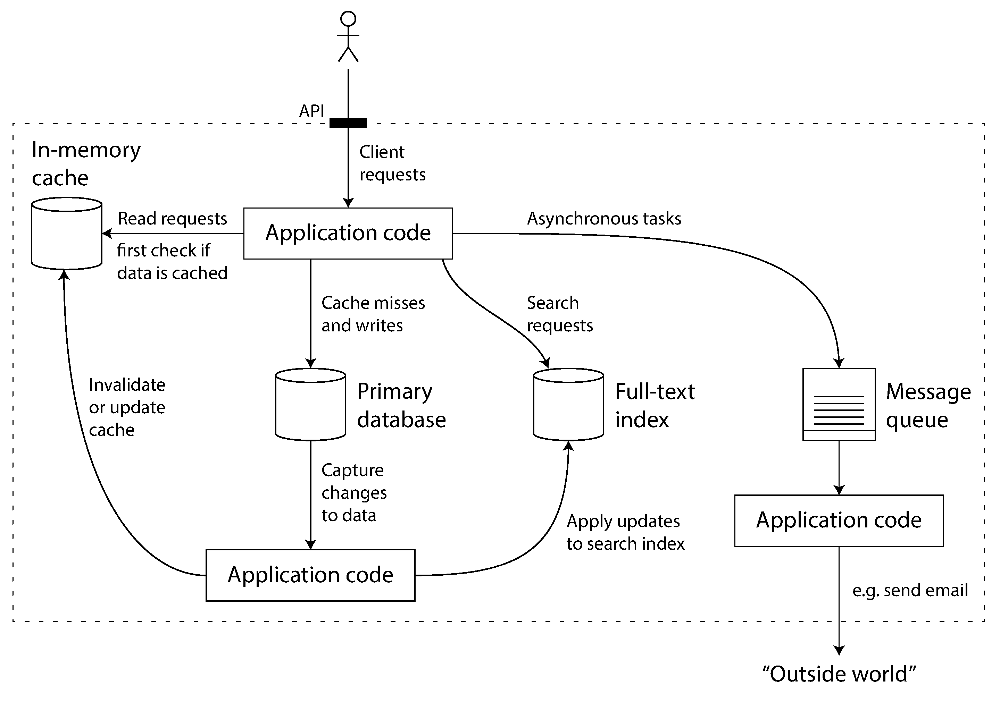
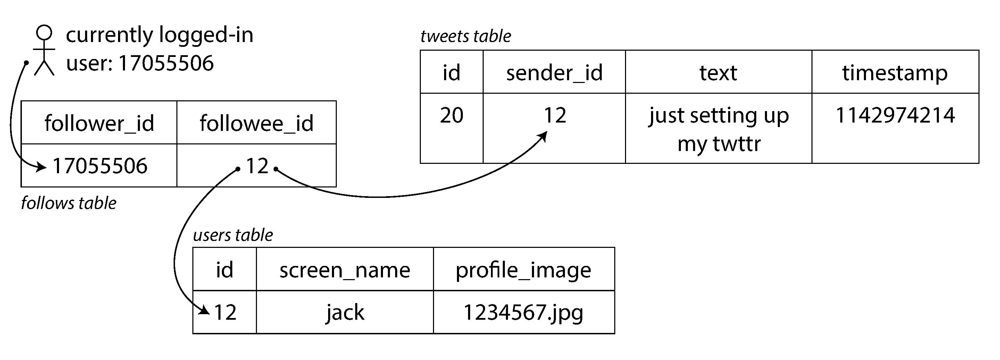
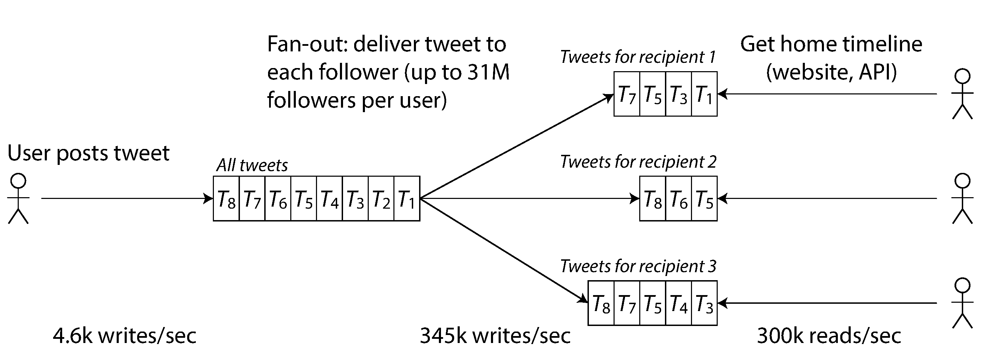
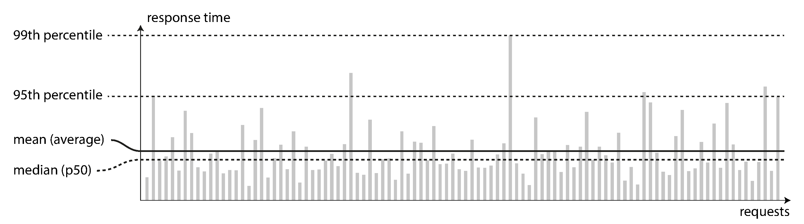
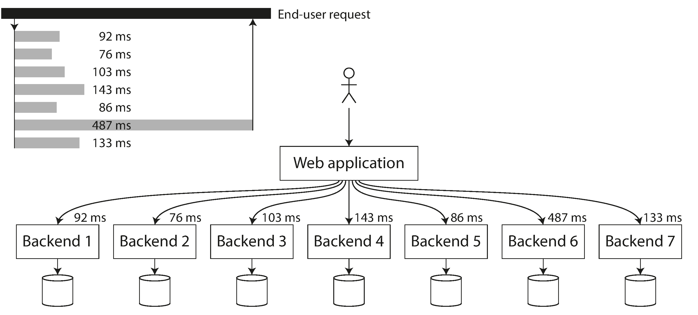

## Designing Data-Intensive Applications

### 1장. Reliable, Scalable, and Maintainable Applications

데이터 중심 애플리케이션은 CPU 계산보다 데이터의 양, 복잡도, 변화 속도가 더 큰 문제가 되는 시스템을 말함

현대 애플리케이션은 보통 여러 데이터 시스템을 조합해서 만들어짐

- 데이터를 저장하고 다시 찾기 위한 database
- 비싼 연산 결과를 재사용하기 위한 cache
- 키워드나 조건으로 찾기 위한 search index
- 비동기 처리를 위한 stream processing
- 누적된 데이터를 주기적으로 처리하기 위한 batch processing

중요한 점은 개별 도구를 쓰는 것에서 끝나지 않는다는 것임

여러 도구를 조합하면 애플리케이션 개발자는 사실상 새로운 data system을 설계하는 사람이 됨

 

### Thinking About Data Systems

database, queue, cache는 서로 다른 도구처럼 보이지만 모두 데이터를 저장하거나 이동시키는 시스템임

최근의 데이터 시스템은 전통적인 분류에 깔끔하게 들어맞지 않음

예를 들어 어떤 datastore는 message queue처럼 쓰이고, 어떤 message queue는 database처럼 durability를 제공함

또한 하나의 도구만으로 모든 요구사항을 만족시키기 어려운 경우가 많음

이때 application code가 database, cache, search index, queue를 묶고, 외부 client에게는 하나의 API처럼 보이게 함

 

이 조합 시스템에서는 다음 질문이 중요함

- 내부에서 문제가 생겨도 데이터가 정확하고 완전하게 유지되는가
- 일부 구성 요소가 느려지거나 장애가 나도 client에게 일관된 성능을 제공하는가
- load가 늘어날 때 어떻게 확장할 수 있는가
- 좋은 service API는 어떤 형태여야 하는가

이 장은 대부분의 소프트웨어 시스템에 공통으로 중요한 세 가지 관심사를 다룸

- reliability
- scalability
- maintainability

 

### Reliability

reliability는 문제가 발생해도 시스템이 계속 올바르게 동작하는 성질임

여기서 올바르게 동작한다는 것은 기능, 성능, 보안, 사용자의 실수에 대한 내성을 포함함

fault와 failure는 구분해야 함

- fault: 시스템의 일부 component가 기대한 동작에서 벗어나는 상태
- failure: 시스템 전체가 사용자에게 필요한 서비스를 제공하지 못하는 상태

fault를 0으로 만들 수는 없음

따라서 중요한 것은 fault가 failure로 번지지 않도록 설계하는 것임

 

### Hardware Faults

hardware fault는 disk, memory, power, network cable 같은 물리적 구성 요소에서 발생함

전통적인 대응은 redundancy임

- RAID
- dual power supply
- hot-swappable component
- backup power

단일 장비의 부품 장애는 redundancy로 어느 정도 다룰 수 있음

하지만 데이터 양과 계산 요구가 커지면 더 많은 장비를 쓰게 되고, 그만큼 장비 단위의 장애 가능성도 커짐

그래서 현대 시스템은 개별 부품 redundancy뿐 아니라 machine 전체의 손실을 견디는 software fault-tolerance를 함께 고려해야 함

 

### Software Errors

software fault는 hardware fault보다 예측하기 어려움

특히 같은 bug가 여러 node에서 동시에 발생할 수 있으므로, 독립적인 hardware fault보다 더 큰 failure로 번질 수 있음

대표적인 예는 다음과 같음

- 특정 입력에서 모든 application server가 crash함
- runaway process가 CPU, memory, disk, network를 소진함
- 의존 service가 느려지거나 잘못된 응답을 반환함
- 작은 fault가 다른 component로 퍼지는 cascading failure가 발생함

이 문제에 빠른 해결책은 없음

가정과 상호작용을 신중하게 검토하고, 충분히 테스트하고, process isolation을 적용하고, crash 후 restart 가능하게 만들고, production behavior를 monitoring해야 함

 

### Human Errors

시스템을 설계하고 운영하는 사람도 실수함

따라서 좋은 시스템은 사람의 실수를 완전히 없애려 하기보다, 실수가 failure로 이어질 가능성을 줄여야 함

주요 접근은 다음과 같음

- 올바른 작업을 쉽게 하고 잘못된 작업을 어렵게 하는 abstraction, API, admin interface 제공
- production과 분리된 sandbox 환경 제공
- unit test, integration test, manual test를 포함한 충분한 검증
- 설정 변경 rollback, gradual rollout, data recomputation 같은 빠른 복구 수단 제공
- performance metric, error rate 등 명확한 monitoring 제공
- 운영 지식과 절차를 유지하는 management practice 제공

reliability는 중요한 산업 시스템에만 필요한 것이 아님

일반적인 business application, ecommerce, 사진 저장 서비스도 사용자에게는 충분히 중요함

비용 때문에 reliability를 의도적으로 낮출 수는 있지만, 그 결정은 명확하게 인식하고 해야 함

 

### Scalability

scalability는 load가 증가해도 성능을 유지할 수 있는 전략을 갖는 것임

어떤 시스템을 단순히 "scalable하다"고 말하는 것은 충분하지 않음

다음 질문으로 구체화해야 함

- load가 어떤 방식으로 증가하는가
- 그 증가에 대응하는 선택지는 무엇인가
- 성능을 유지하려면 어떤 resource를 얼마나 늘려야 하는가

 

### Describing Load

load를 논의하려면 먼저 load parameter를 정의해야 함

적절한 parameter는 시스템에 따라 다름

- web server의 requests per second
- database의 read/write ratio
- chat room의 active user 수
- cache hit rate
- 극단적인 소수 case가 만드는 bottleneck

책은 Twitter home timeline을 예시로 사용함

책의 수치는 2012년 11월 발표 사례 기준이며, 현재 서비스 상태를 설명하는 값은 아님

 

tweet을 읽는 방식에는 크게 두 가지가 있음

- read time에 사용자가 follow하는 사람들의 tweet을 찾아 merge함
- write time에 각 follower의 home timeline cache에 미리 fan-out함

 

read가 write보다 훨씬 많다면 write time에 더 많은 일을 해서 read를 싸게 만드는 방식이 유리할 수 있음

하지만 follower가 매우 많은 사용자는 단일 tweet 하나가 큰 fan-out을 만들 수 있음

그래서 실제 확장성 논의에서는 평균뿐 아니라 분포와 극단값을 봐야 함

 

### Describing Performance

load가 증가할 때 성능을 보는 방식은 두 가지임

- resource를 그대로 두고 load parameter를 늘리면 성능이 어떻게 변하는가
- 성능을 그대로 유지하려면 resource를 얼마나 늘려야 하는가

batch processing에서는 보통 throughput이 중요함

online system에서는 보통 response time이 중요함

response time과 latency는 같지 않음

- response time: client가 요청을 보내고 응답을 받을 때까지 보는 전체 시간
- latency: 요청이 처리되기를 기다리는 시간

response time은 단일 숫자가 아니라 분포로 봐야 함

평균은 전형적인 사용자 경험을 잘 설명하지 못할 수 있음

 

percentile은 response time 분포를 설명하는 더 좋은 방법임

- p50: 절반의 요청이 이 값보다 빠르게 처리됨
- p95: 95%의 요청이 이 값보다 빠르게 처리됨
- p99: 99%의 요청이 이 값보다 빠르게 처리됨
- p999: 99.9%의 요청이 이 값보다 빠르게 처리됨

높은 percentile은 tail latency를 보여주므로 중요함

사용자가 여러 backend call을 거쳐 응답을 받는 경우, 일부 backend call만 느려도 전체 요청이 느려짐

 

따라서 backend service에서는 high percentile을 더 중요하게 봐야 함

percentile을 여러 machine이나 시간 구간에서 단순 평균내는 것은 의미가 없음

올바르게 합치려면 histogram을 합쳐야 함

 

### Approaches for Coping with Load

load에 대응하는 방식은 보통 scale up과 scale out으로 나뉨

- scale up: 더 강한 machine을 사용함
- scale out: 여러 machine으로 load를 분산함

실제 좋은 architecture는 둘 중 하나만 고르는 것이 아니라 상황에 맞는 조합을 사용함

stateless service를 여러 machine으로 분산하는 것은 비교적 단순함

반대로 stateful data system을 distributed system으로 바꾸면 복잡도가 크게 증가함

확장 가능한 architecture는 generic하지 않음

읽기량, 쓰기량, 저장 데이터량, 데이터 복잡도, response time 요구사항, access pattern에 따라 달라짐

초기 제품에서는 가상의 미래 load보다 빠른 학습과 product iteration이 더 중요할 수 있음

 

### Maintainability

software 비용의 큰 부분은 최초 개발이 아니라 유지보수에서 발생함

유지보수에는 bug fix, 운영, 장애 조사, platform 변화 대응, 요구사항 변경, technical debt 상환, feature 추가가 포함됨

이 장은 maintainability를 세 가지 관점으로 나눔

- operability
- simplicity
- evolvability

 

### Operability

operability는 운영팀이 시스템을 안정적으로 굴리기 쉽게 만드는 성질임

좋은 운영팀은 다음 일을 수행함

- system health monitoring
- 장애와 성능 저하의 원인 분석
- software와 platform update
- system 간 영향 추적
- capacity planning
- deployment와 configuration management
- migration 같은 복잡한 maintenance 수행
- security 유지
- 안정적인 production process 정의
- 조직 내 system knowledge 보존

좋은 data system은 routine task를 쉽게 만들어야 함

이를 위해 runtime behavior에 대한 visibility, monitoring, automation 지원, 명확한 operational model, 좋은 default, manual override, predictable behavior가 필요함

 

### Simplicity

시스템이 커질수록 complexity는 유지보수를 어렵게 만듦

복잡도는 다음 형태로 나타날 수 있음

- state space 폭발
- module 간 tight coupling
- 얽힌 dependency
- 일관되지 않은 naming과 terminology
- 성능 문제를 우회하기 위한 hack
- 특수 case 증가

목표는 기능을 줄이는 것이 아니라 accidental complexity를 줄이는 것임

좋은 abstraction은 implementation detail을 숨기고, 이해하기 쉬운 model을 제공함

SQL이 disk structure, memory structure, concurrent request, crash recovery 같은 세부사항을 숨기는 것이 대표적인 예임

 

### Evolvability

requirement는 계속 바뀜

새로운 사용 사례가 생기고, business priority가 바뀌고, platform이 교체되고, 법적 요구사항이 생기고, 성장 때문에 architecture도 바뀜

evolvability는 이런 변화에 시스템을 쉽게 맞출 수 있는 성질임

작은 코드 단위에서는 refactoring이나 TDD 같은 기법이 도움됨

이 책은 더 큰 data system 수준에서 변화에 강한 구조를 고민함

evolvability는 simplicity와 abstraction에 강하게 연결됨

단순하고 이해하기 쉬운 시스템일수록 변경하기 쉬움

 

### Summary

1장은 data-intensive application을 바라보는 기본 관점을 제시함

애플리케이션 요구사항은 크게 functional requirement와 nonfunctional requirement로 나눌 수 있음

이 장은 그중 reliability, scalability, maintainability를 집중적으로 다룸

- reliability는 hardware, software, human fault가 있어도 시스템이 올바르게 동작하게 만드는 것임
- scalability는 load 증가에도 성능을 유지하기 위해 load와 performance를 정량적으로 설명하고 resource를 조정하는 것임
- maintainability는 운영과 개발자가 시스템을 계속 이해하고, 운영하고, 변경할 수 있게 만드는 것임

세 속성에는 쉬운 해결책이 없음

대신 여러 데이터 시스템에서 반복적으로 등장하는 pattern과 technique을 이해하고, 상황에 맞게 조합해야 함
