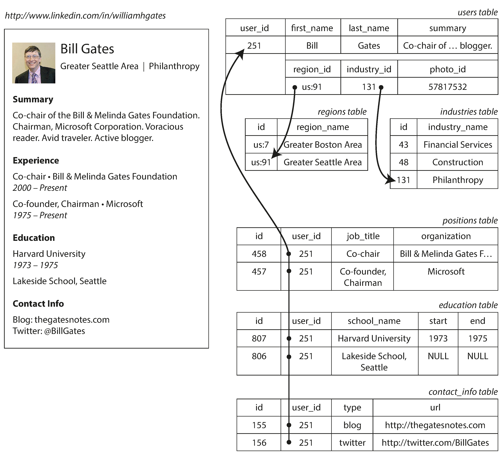
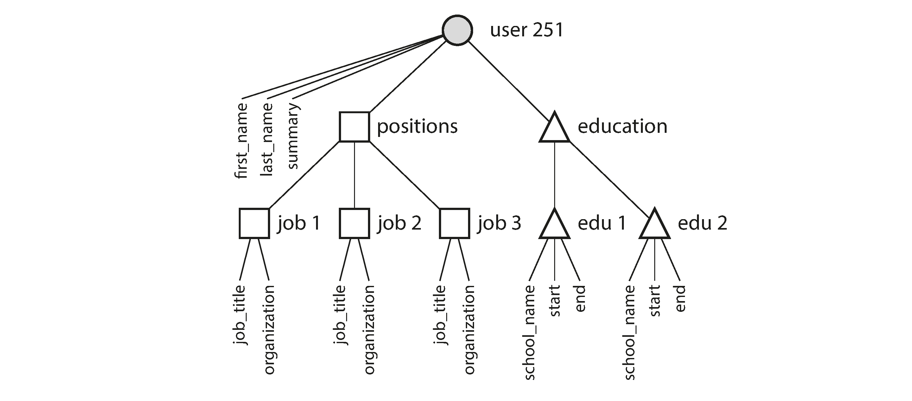
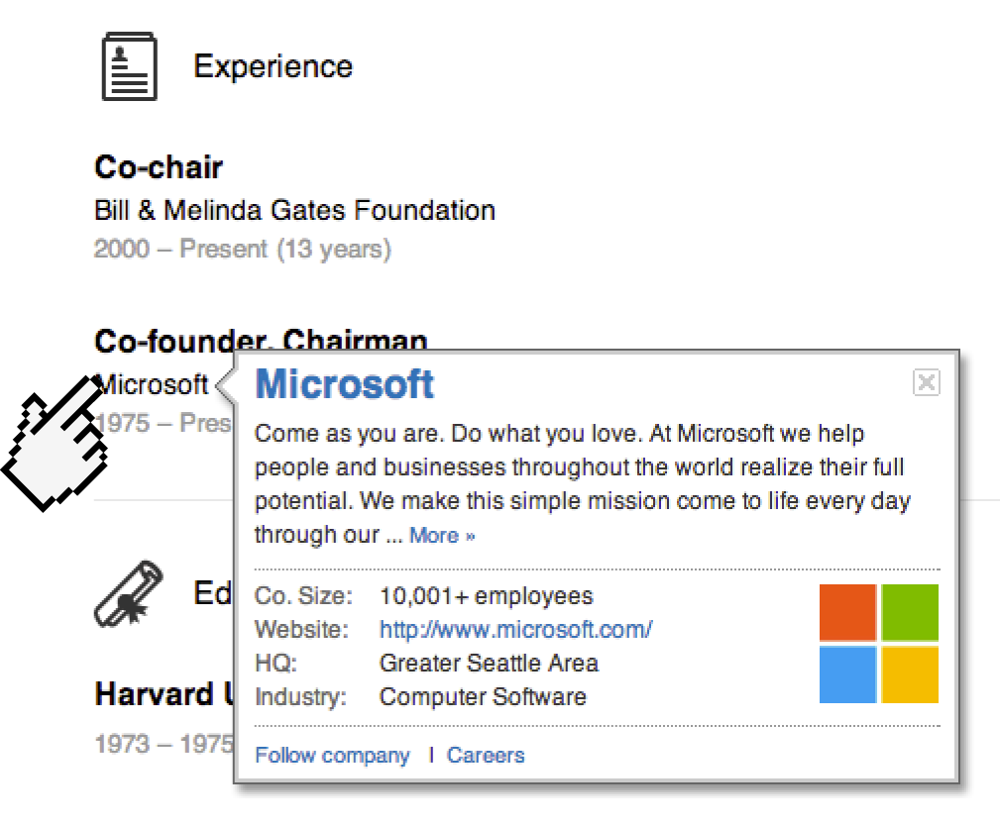
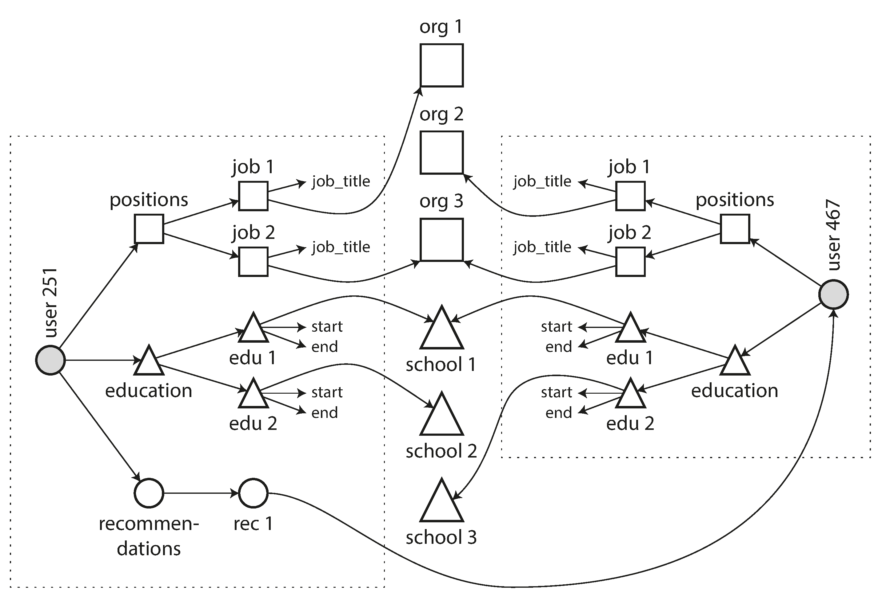
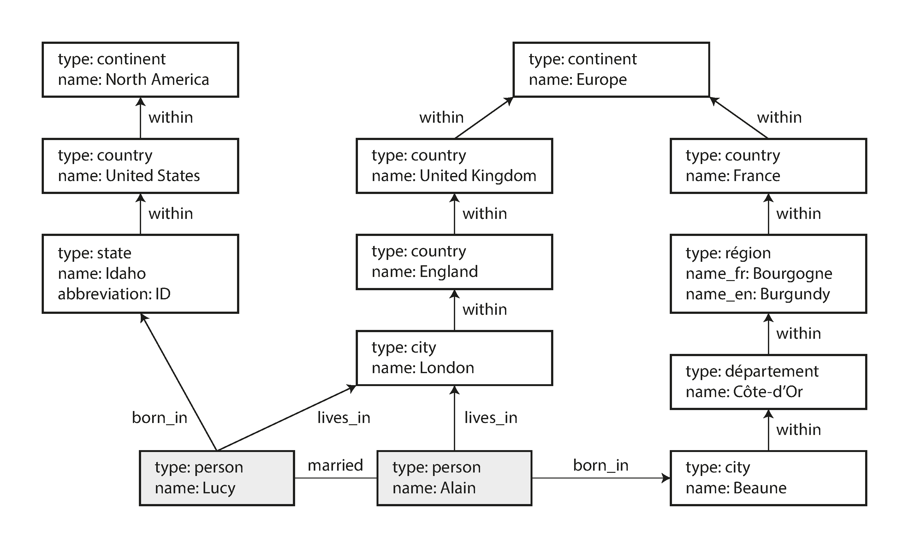
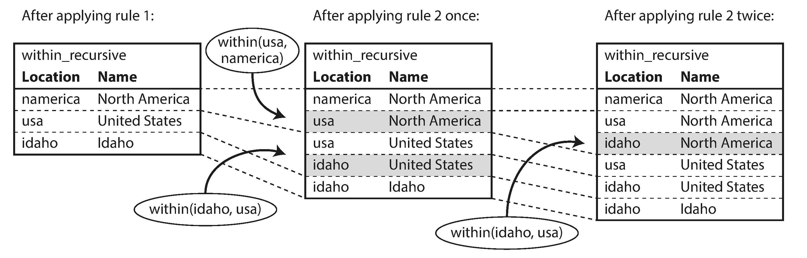

## Designing Data-Intensive Applications

### 2장. Data Models and Query Languages

data model은 소프트웨어가 문제를 바라보는 방식 자체에 영향을 줌

애플리케이션은 보통 여러 data model을 층층이 쌓아 만듦

- 현실 세계를 application object와 API로 표현
- application data를 JSON, XML, relational table, graph 같은 저장 모델로 표현
- database engine은 그 모델을 memory, disk, network byte로 표현
- hardware는 byte를 전기, 빛, 자기 신호로 표현

각 layer는 아래 layer의 복잡도를 숨기고, 위 layer가 다룰 수 있는 추상화를 제공함

따라서 data model 선택은 단순한 저장 형식 선택이 아니라, application code의 구조와 사고방식을 결정하는 선택임

 

### Relational Model Versus Document Model

relational model은 SQL의 기반이 되는 모델임

data는 relation, 즉 table에 저장되고 table은 tuple, 즉 row의 모음으로 구성됨

relational database는 초기에 business data processing에서 출발했지만, 이후 다양한 web application에도 널리 사용됨

relational model의 핵심 장점은 database 내부 표현을 application developer가 직접 신경 쓰지 않아도 된다는 점임

 

### The Birth of NoSQL

NoSQL은 특정 기술 하나를 가리키는 이름이 아님

원래는 open source, distributed, non-relational database를 논의하기 위한 짧은 이름이었고, 이후 Not Only SQL로 재해석됨

NoSQL이 등장한 배경은 다음과 같음

- relational database보다 더 큰 scalability가 필요
- commercial database보다 open source software를 선호
- relational model이 잘 지원하지 않는 specialized query 필요
- 고정 schema의 제약을 피하고 더 동적인 data model을 원함

중요한 결론은 하나의 모델이 모든 use case를 이기지 않는다는 것임

application 요구사항에 따라 relational database와 non-relational datastore가 함께 쓰이는 polyglot persistence가 자연스러운 선택이 될 수 있음

 

### The Object-Relational Mismatch

object-oriented application code와 relational table 사이에는 변환 비용이 있음

application object를 table, row, column으로 나누어 저장해야 하기 때문임

ORM은 이 boilerplate를 줄이지만 두 모델의 차이를 완전히 숨기지는 못함

예를 들어 이력서와 같은 profile data는 한 사용자에 대해 여러 position, education, contact info를 가질 수 있음

relational model에서는 이런 one-to-many 관계를 여러 table로 나누고 foreign key로 연결하는 방식이 자연스러움

 

document model에서는 같은 데이터를 하나의 JSON document 안에 넣을 수 있음

이 방식은 profile 전체를 한 번에 읽는 경우 locality가 좋고, application object와도 더 비슷하게 보임

 

하지만 document model이 항상 더 단순한 것은 아님

document 내부의 tree 구조는 one-to-many 관계에는 잘 맞지만, many-to-one이나 many-to-many 관계에는 약함

 

### Many-to-One and Many-to-Many Relationships

중복을 줄이려면 사람이 읽는 문자열을 여러 곳에 복사하지 않고 ID로 참조하는 편이 유리함

예를 들어 지역명이나 업종명을 문자열로 직접 저장하면 이름 변경, localization, search consistency를 맞추기 어려움

ID를 쓰면 의미 있는 정보는 한 곳에만 저장되고 여러 record는 그 ID를 참조함

이것이 normalization의 핵심임

하지만 normalization은 many-to-one 관계를 만들고, document database에서는 이런 참조를 읽을 때 join이나 후속 query로 해결해야 함

초기에는 document 하나로 충분해 보이는 application도 기능이 늘어나면 데이터 연결이 많아짐

예를 들어 회사와 학교를 별도 entity로 만들거나, 사용자 간 recommendation을 추가하면 many-to-many 관계가 생김

 

 

결국 document model은 nested tree에는 강하지만, graph처럼 얽힌 관계가 많아질수록 application code가 join을 대신 떠안게 됨

 

### Are Document Databases Repeating History

document database가 겪는 문제는 새로운 문제가 아님

1960-70년대 hierarchical model도 tree 구조에는 잘 맞았지만 many-to-many 관계와 join에는 약했음

IMS는 nested record tree를 사용했고, 이는 오늘날 JSON document model과 닮은 점이 있음

당시 한계에 대응하기 위해 network model과 relational model이 경쟁했음

 

### The Network Model

network model은 hierarchical model을 확장해 한 record가 여러 parent를 가질 수 있게 한 모델임

many-to-many 관계를 표현할 수 있었지만, record에 접근하려면 root에서 pointer chain을 따라가는 access path를 알아야 했음

application code는 어떤 경로로 데이터를 찾아갈지 직접 관리해야 했고, data model이 바뀌면 query code도 대량으로 바뀌기 쉬웠음

즉, hardware 자원이 제한적이던 시기에는 효율적일 수 있었지만 application 변경에는 취약했음

 

### The Relational Model

relational model은 access path를 application code에서 제거함

application은 원하는 조건과 결과를 선언하고, database query optimizer가 어떤 index와 join 순서를 쓸지 결정함

새로운 방식으로 query하고 싶다면 query를 바꾸거나 index를 추가하면 되고, application code가 pointer path를 직접 따라갈 필요가 없음

이 점이 relational model이 장기적으로 이긴 중요한 이유임

query optimizer는 복잡하지만 한 번 database 안에 구현되면 모든 application이 그 이득을 공유함

 

### Comparison to Document Databases

document database는 nested one-to-many 관계를 parent document 안에 저장한다는 점에서 hierarchical model로 돌아간 면이 있음

하지만 many-to-one, many-to-many 관계에서는 relational model과 본질적으로 비슷하게 ID 참조를 사용함

차이는 그 참조를 database join으로 해결하느냐, application의 추가 query로 해결하느냐에 있음

 

### Relational Versus Document Databases Today

document model의 장점은 schema flexibility, locality, application object와의 유사성임

relational model의 장점은 join과 many-to-one, many-to-many 관계 지원임

어떤 모델이 더 단순한 application code를 만드는지는 data relationship에 따라 달라짐

- document-like tree data는 document model이 자연스러움
- 단순한 many-to-many 관계는 relational model이 적합함
- 매우 복잡하게 연결된 data는 graph model이 더 자연스러움

 

### Schema Flexibility in the Document Model

document database는 보통 schema를 database가 강제하지 않음

이를 schemaless라고 부르기도 하지만, 실제로는 application code가 암묵적인 구조를 기대함

더 정확한 구분은 schema-on-read와 schema-on-write임

- schema-on-read: 읽을 때 application이 data structure를 해석함
- schema-on-write: 쓸 때 database가 schema를 강제함

schema-on-read는 외부 시스템이 만드는 heterogeneous data나 구조가 자주 바뀌는 data에 유리할 수 있음

반대로 모든 record가 같은 구조를 가져야 한다면 schema는 documentation과 validation 역할을 함

책의 특정 database version별 JSON, XML, join 지원 언급은 당시 문서 기준이므로 현재 운영 판단에는 각 제품 공식 문서 확인이 필요함

 

### Data Locality for Queries

document model은 관련 데이터를 하나의 document로 묶어 저장하므로 전체 document를 자주 읽는 경우 locality 이점이 있음

profile page처럼 한 번에 대부분의 field를 읽는 경우 multiple table lookup보다 효율적일 수 있음

하지만 document의 일부만 자주 읽는다면 전체 document를 읽어야 하므로 낭비가 생김

또한 document update는 보통 document 전체 rewrite로 이어질 수 있으므로, 큰 document나 자주 커지는 document에는 불리함

locality는 document database만의 개념이 아님

relational database나 column-family model도 관련 데이터를 함께 배치하는 기능을 제공할 수 있음

 

### Convergence of Document and Relational Databases

relational database는 XML, JSON document를 다루는 기능을 점점 추가해 왔음

document database도 join에 가까운 기능이나 client-side reference resolution을 제공하기도 함

두 모델은 서로의 장점을 일부 흡수하는 방향으로 가까워지고 있음

좋은 방향은 application이 document-like data와 relational query를 모두 필요에 맞게 사용할 수 있는 hybrid model임

 

### Query Languages for Data

query language는 imperative 방식과 declarative 방식으로 나눌 수 있음

imperative language는 어떤 순서로 무엇을 수행할지 자세히 지시함

declarative query language는 원하는 data pattern과 결과 조건을 선언하고, 실행 방법은 query optimizer가 정함

SQL은 declarative query language의 대표 예임

declarative 방식의 장점은 다음과 같음

- query가 짧고 이해하기 쉬움
- database engine의 내부 구현을 숨김
- optimizer가 index와 join 전략을 바꿀 수 있음
- 병렬 실행으로 개선될 여지가 큼

 

### Declarative Queries on the Web

declarative 방식의 장점은 database에만 있는 것이 아님

CSS selector나 XPath도 원하는 pattern을 선언하고, browser나 engine이 적용 방식을 결정함

반대로 DOM을 JavaScript로 직접 순회하며 style을 바꾸면 code가 길고 상태 변화에 취약해짐

database에서도 같은 원리가 적용됨

SQL처럼 결과 조건을 선언하는 방식은 database가 내부 최적화를 바꿀 여지를 남김

 

### MapReduce Querying

MapReduce는 많은 machine에서 대량 데이터를 batch 처리하기 위한 programming model임

일부 NoSQL datastore는 read-only query나 집계에 MapReduce 형태를 제공했음

MapReduce는 declarative query language도 아니고 완전한 imperative API도 아닌 중간 형태임

map과 reduce function을 작성하고 framework가 이를 여러 document에 반복 적용함

장점은 custom code를 query 중간에 넣을 수 있다는 점임

하지만 사용성 측면에서는 두 함수를 조심스럽게 맞춰 작성해야 하므로 단일 declarative query보다 어렵고, optimizer가 개입할 여지도 적음

그래서 MongoDB는 aggregation pipeline처럼 더 선언적인 query 방식을 추가함

NoSQL system도 복잡한 query가 필요해지면 SQL과 비슷한 개념을 다시 발명하게 될 수 있음

 

### Graph-Like Data Models

many-to-many 관계가 아주 많아지면 graph model이 자연스러움

graph는 vertex와 edge로 구성됨

- vertex: node 또는 entity
- edge: relationship 또는 arc

대표적인 graph 예시는 다음과 같음

- social graph
- web graph
- road 또는 rail network

graph는 같은 종류의 entity만 다루는 데 그치지 않고, 서로 다른 종류의 entity와 relationship을 하나의 model에 함께 담을 수 있음

 

### Property Graphs

property graph model에서 vertex는 다음을 가짐

- unique identifier
- outgoing edges
- incoming edges
- properties

edge는 다음을 가짐

- unique identifier
- tail vertex
- head vertex
- relationship label
- properties

중요한 특징은 어떤 vertex도 다른 vertex와 연결될 수 있고, incoming edge와 outgoing edge를 모두 효율적으로 찾을 수 있다는 점임

relationship label을 다르게 두면 여러 종류의 정보를 하나의 graph에 넣으면서도 깨끗한 model을 유지할 수 있음

graph는 application feature가 늘어나면서 새로운 종류의 entity와 relationship을 추가하기 쉬우므로 evolvability가 좋음

 

### The Cypher Query Language

Cypher는 property graph를 위한 declarative query language임

vertex와 edge pattern을 화살표 형태로 표현해 graph traversal을 간결하게 쓸 수 있음

예를 들어 어떤 사람이 미국 안의 location에서 태어났고, 유럽 안의 location에 살고 있는지를 pattern으로 표현할 수 있음

중요한 점은 query writer가 traversal 실행 전략을 직접 지정하지 않는다는 것임

query optimizer가 어디서 시작해 어떤 edge를 따라갈지 선택함

 

### Graph Queries in SQL

graph data도 relational table로 표현할 수 있음

하지만 graph query는 몇 번 join해야 하는지 미리 정해지지 않는 경우가 많음

예를 들어 어떤 location이 더 큰 location 안에 있고, 그 상위 location이 다시 다른 location 안에 있는 구조는 깊이가 일정하지 않음

SQL:1999의 recursive common table expression으로 이런 variable-length traversal을 표현할 수 있음

다만 Cypher의 짧은 graph pattern에 비해 SQL syntax는 훨씬 장황해질 수 있음

이 차이는 data model과 query language가 특정 use case에 맞게 설계된다는 사실을 보여줌

 

### Triple-Stores and SPARQL

triple-store는 property graph와 비슷하지만 정보를 `(subject, predicate, object)` 형태의 triple로 저장함

subject는 graph의 vertex에 해당함

object는 primitive value일 수도 있고, 다른 vertex일 수도 있음

- `(lucy, age, 33)`은 lucy vertex의 property처럼 볼 수 있음
- `(lucy, marriedTo, alain)`은 lucy에서 alain으로 향하는 edge처럼 볼 수 있음

RDF는 triple을 internet-wide data exchange에 쓰기 위해 URI 기반 namespace를 사용함

semantic web은 machine-readable web data를 만들려는 시도였지만, 그 hype와 별개로 triple model 자체는 application 내부 data model로 유용할 수 있음

SPARQL은 RDF triple-store를 query하기 위한 declarative language임

Cypher와 비슷하게 graph pattern을 표현하지만, property와 edge를 모두 predicate로 다룬다는 차이가 있음

 

### Graph Databases Compared to the Network Model

graph database는 겉보기에는 CODASYL network model과 비슷해 보일 수 있음

하지만 중요한 차이가 있음

- graph database는 어떤 vertex든 어떤 vertex와도 edge를 가질 수 있음
- unique ID나 index로 vertex를 직접 찾을 수 있음
- vertex와 edge 자체는 ordered set이 아님
- imperative traversal뿐 아니라 Cypher, SPARQL 같은 declarative query도 지원함

따라서 graph database는 access path에 application code가 묶였던 network model과 다름

 

### The Foundation: Datalog

Datalog은 Cypher나 SPARQL보다 오래된 query language임

data model은 triple-store와 비슷하지만, triple을 `predicate(subject, object)` 형태로 표현함

Datalog은 query를 한 번에 크게 쓰기보다 rule을 작은 단계로 정의함

rule은 database에 저장된 fact나 다른 rule에서 새로운 predicate를 도출함

 

Datalog은 simple one-off query에는 덜 편할 수 있음

하지만 complex data에서 rule을 조합하고 재사용해야 할 때 강력함

 

### Summary

2장은 data model과 query language의 선택 기준을 비교함

역사적으로 hierarchical model은 tree data에는 잘 맞았지만 many-to-many 관계에는 약했고, relational model은 그 문제를 해결하기 위해 등장함

최근의 NoSQL datastore는 크게 두 방향으로 갈라짐

- document database는 self-contained document와 드문 관계에 적합
- graph database는 모든 것이 서로 연결될 수 있는 data에 적합

relational, document, graph model은 모두 오늘날 널리 쓰이며 각자의 적합한 영역이 있음

하나의 model로 다른 model을 흉내낼 수는 있지만, 그 결과는 종종 어색함

따라서 중요한 것은 단일 정답을 찾는 것이 아니라 application의 relationship 구조와 query pattern에 맞는 model을 고르는 것임

query language도 마찬가지임

SQL, aggregation pipeline, Cypher, SPARQL, Datalog은 각각 다른 model과 use case에 맞춰 설계됨

좋은 data system 설계는 data shape, relationship, query pattern, evolution 가능성을 함께 보고 결정해야 함
