## Designing Data-Intensive Applications

### 3장. Storage and Retrieval

database의 가장 기본 역할은 데이터를 저장하고, 나중에 다시 요청하면 찾아주는 것임

2장이 application developer가 보는 data model과 query language를 다뤘다면, 3장은 database 내부에서 그 데이터를 어떻게 저장하고 검색하는지 다룸

application developer가 직접 storage engine을 만들 가능성은 낮음

하지만 workload에 맞는 database와 storage engine을 고르고 tuning하려면 내부 동작의 큰 흐름은 알아야 함

이 장은 크게 두 종류의 workload를 구분함

- transaction processing에 최적화된 storage engine
- analytics에 최적화된 storage engine

먼저 OLTP 계열에서 자주 쓰이는 log-structured storage와 B-tree를 살펴보고, 이후 OLAP 계열의 column-oriented storage를 다룸

 

### Data Structures That Power Your Database

가장 단순한 key-value database는 file 끝에 key-value pair를 append하는 방식으로 만들 수 있음

write는 매우 빠름

파일 끝에 한 줄을 추가하면 되기 때문임

하지만 read는 느림

특정 key의 최신 값을 찾으려면 file 전체를 처음부터 끝까지 scan해야 하기 때문임

이 문제를 해결하기 위해 index가 필요함

index는 primary data에서 파생된 추가 구조임

query가 원하는 data 위치를 빠르게 찾도록 도와주는 signpost 역할을 함

중요한 trade-off는 다음과 같음

- index는 read query를 빠르게 함
- index는 write 시 함께 갱신되어야 하므로 write를 느리게 함
- 모든 것을 index하지 않고 query pattern에 맞는 index를 선택해야 함

 

### Hash Indexes

가장 단순한 key-value index는 in-memory hash map임

hash map은 각 key를 data file 안의 byte offset에 매핑함

write할 때는 log file에 append하고, hash map에 최신 offset을 기록함

read할 때는 hash map에서 offset을 찾고, 해당 위치로 seek해 value를 읽음

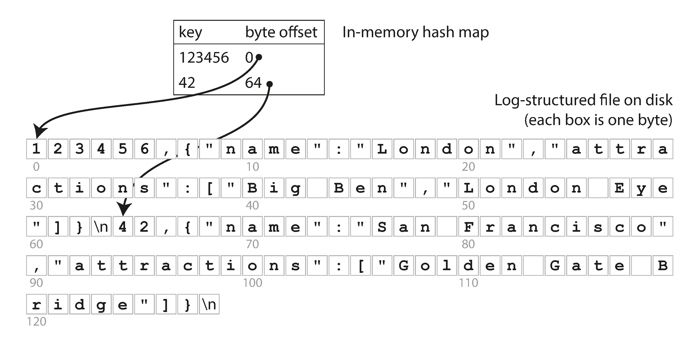
 

이 방식은 key 전체가 memory에 들어갈 수 있고, key별 value가 자주 갱신되는 workload에 잘 맞음

하지만 append-only log는 계속 커지므로 segment와 compaction이 필요함

compaction은 같은 key의 오래된 값을 버리고 최신 값만 남기는 과정임

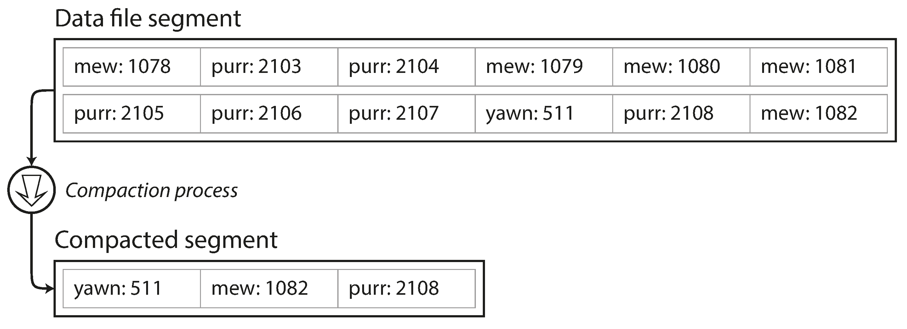
 

여러 segment를 compaction과 동시에 merge할 수도 있음

기존 segment는 immutable하게 두고, merge 결과를 새 segment로 쓴 뒤 read 경로를 새 segment로 바꾸면 됨

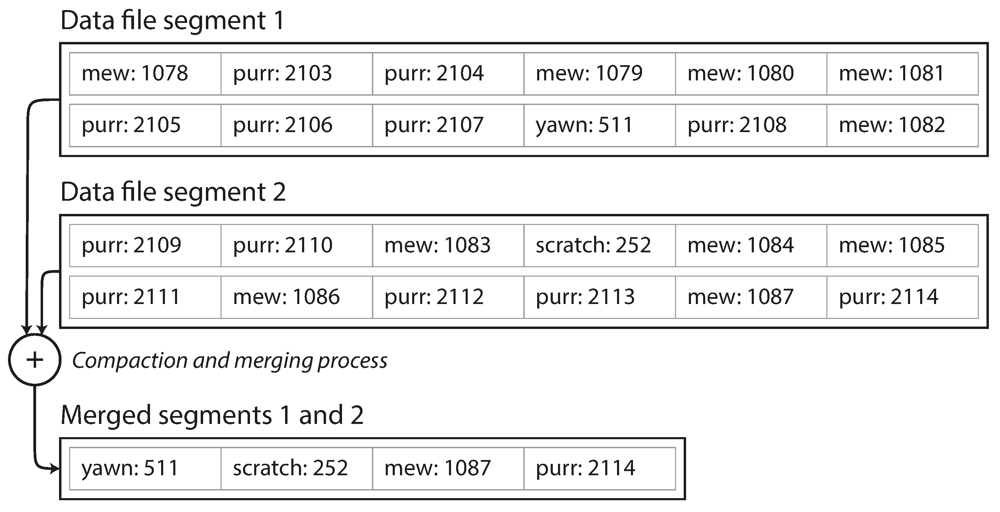
 

append-only design의 장점은 다음과 같음

- sequential write가 random write보다 빠름
- immutable segment는 crash recovery와 concurrency control을 단순하게 함
- segment merge가 fragmentation을 줄임

단점도 명확함

- 모든 key가 memory에 들어가야 함
- range query가 비효율적임
- 삭제는 tombstone 같은 특별한 record로 표현해야 함

 

### SSTables and LSM-Trees

SSTable은 Sorted String Table의 줄임말임

segment 안의 key-value pair를 key 순서로 정렬하고, 각 key가 segment 안에 한 번만 나타나게 함

정렬된 segment는 hash index log보다 몇 가지 장점이 있음

첫째, 여러 segment를 merge하기 쉬움

각 input segment를 순서대로 읽으며 가장 작은 key부터 output segment에 쓰면 됨

같은 key가 여러 segment에 있으면 더 최신 segment의 값을 유지함

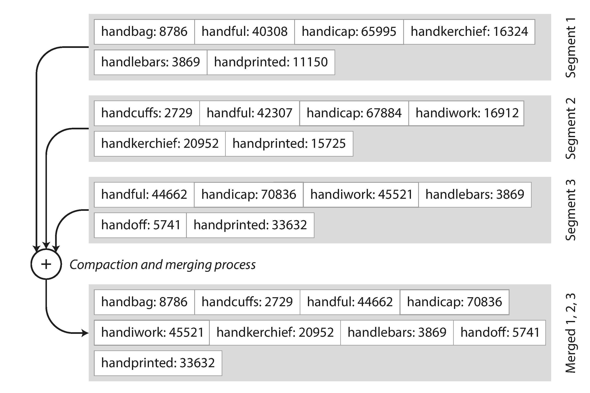
 

둘째, 모든 key를 memory index에 보관할 필요가 없음

정렬되어 있으므로 sparse index만 있어도 가까운 offset으로 이동한 뒤 조금 scan하면 됨

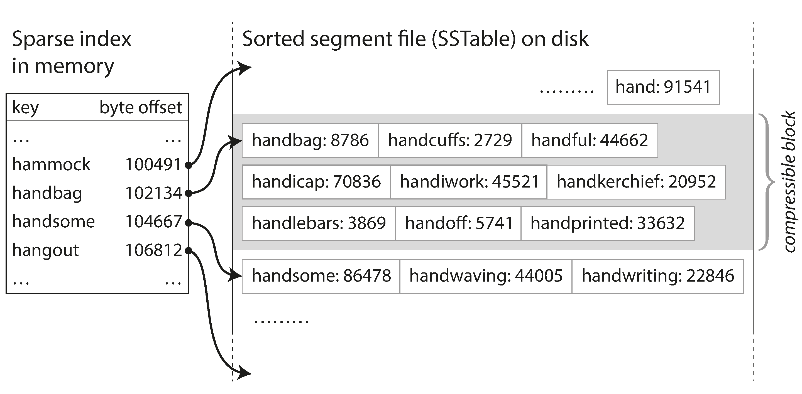
 

셋째, range scan과 compression에 유리함

인접 key들이 정렬되어 있고 block 단위로 압축할 수 있기 때문임

 

### Constructing and Maintaining SSTables

incoming write는 정렬된 순서로 들어오지 않음

따라서 먼저 memory 안의 balanced tree에 write를 넣음

이 in-memory tree를 memtable이라고 부름

기본 흐름은 다음과 같음

- write가 들어오면 memtable에 추가
- memtable이 threshold보다 커지면 sorted SSTable로 disk에 flush
- read는 memtable, 최신 SSTable, 오래된 SSTable 순서로 조회
- background compaction이 SSTable들을 merge하고 오래된 값을 제거

crash 시 memtable의 최신 write가 사라질 수 있음

이를 막기 위해 모든 write를 별도 append-only log에 먼저 기록하고, memtable 복구에 사용함

memtable이 SSTable로 flush되면 해당 log는 버릴 수 있음

 

### Making an LSM-Tree out of SSTables

SSTable을 여러 level로 유지하고 background에서 merge, compaction하는 구조를 LSM-tree라고 부름

LevelDB, RocksDB, Cassandra, HBase 등은 이 계열 아이디어를 사용함

Lucene도 full-text term dictionary를 SSTable과 비슷한 sorted file 구조로 유지함

LSM-tree의 핵심은 random write를 sequential write로 바꾸는 것임

write는 memory와 append-only log에 빠르게 들어가고, disk 정리는 background compaction으로 처리함

실제 구현에서는 Bloom filter와 compaction strategy가 성능에 큰 영향을 줌

책의 특정 storage engine 사례와 compaction 설정은 원문 당시 기준이므로, 실제 운영 판단에는 각 제품의 현재 공식 문서를 확인해야 함

 

### B-Trees

B-tree는 가장 널리 쓰이는 index 구조임

대부분의 relational database와 많은 non-relational database에서 사용됨

B-tree도 key-value pair를 key 순서로 유지하므로 key lookup과 range query를 효율적으로 지원함

하지만 log-structured index와 설계 철학이 다름

LSM 계열은 variable-size segment를 sequential하게 쓰는 반면, B-tree는 fixed-size page를 읽고 씀

각 page는 다른 page를 가리키는 reference를 가질 수 있고, 이 page들이 tree를 구성함

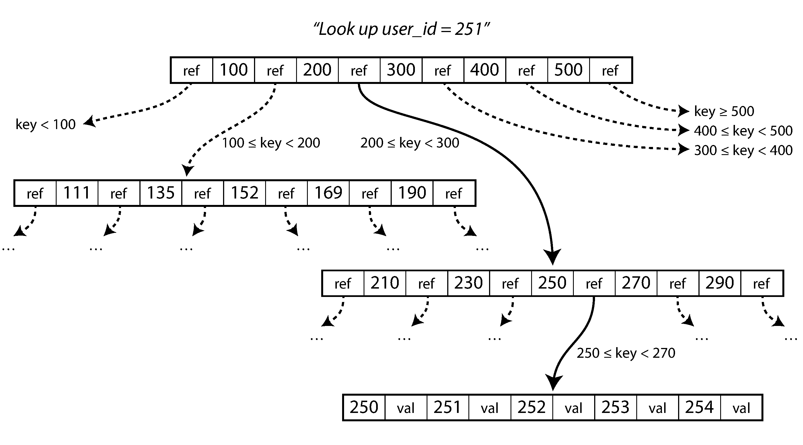
 

lookup은 root page에서 시작해 key range에 맞는 child page를 따라 내려감

마지막 leaf page에 value나 value 위치가 있음

새 key를 넣을 때 page에 공간이 부족하면 page를 split하고 parent page를 갱신함

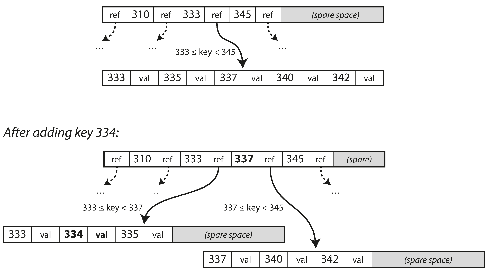
 

B-tree는 balance를 유지하므로 대부분의 lookup은 적은 page traversal로 끝남

 

### Making B-Trees Reliable

B-tree의 기본 write는 disk page를 제자리에서 overwrite하는 것임

여러 page를 갱신하는 도중 crash가 나면 index가 깨질 수 있음

이를 막기 위해 B-tree 구현은 보통 write-ahead log를 사용함

WAL은 tree page를 바꾸기 전에 변경 내용을 append-only log에 먼저 기록함

crash 후 database가 다시 시작되면 WAL을 이용해 B-tree를 consistent state로 복구함

또한 여러 thread가 동시에 tree에 접근하면 inconsistent state를 볼 수 있으므로 latch 같은 lightweight lock이 필요함

 

### B-Tree Optimizations

B-tree는 오래 쓰인 구조라 다양한 최적화가 있음

- overwrite와 WAL 대신 copy-on-write를 사용하는 방식
- key 전체가 아니라 range boundary에 필요한 만큼만 저장하는 key abbreviation
- leaf page를 disk에서 가능한 순서대로 배치해 range scan을 빠르게 하는 방식
- leaf page끼리 sibling pointer를 둬 parent로 되돌아가지 않고 순서대로 scan하는 방식
- log-structured 아이디어를 일부 차용하는 variant

핵심은 B-tree가 random read/write에 맞춰 page 단위로 관리되는 구조라는 점임

 

### Comparing B-Trees and LSM-Trees

B-tree와 LSM-tree 중 어느 쪽이 항상 낫다고 말할 수 없음

workload와 implementation detail에 따라 결과가 달라짐

대략적인 경향은 다음과 같음

- LSM-tree는 write throughput에 강한 경우가 많음
- B-tree는 read latency가 더 예측 가능한 경우가 많음
- LSM-tree read는 여러 memtable과 SSTable을 확인해야 할 수 있음
- B-tree는 key가 index 안의 한 위치에 있으므로 transaction isolation과 range lock에 유리함

LSM-tree의 장점은 sequential write와 compact storage임

write amplification은 양쪽 모두에서 중요함

B-tree는 WAL과 page write 때문에 같은 data를 여러 번 쓸 수 있고, LSM-tree도 compaction 때문에 data를 여러 번 쓸 수 있음

LSM-tree의 단점은 compaction이 read/write 성능에 영향을 줄 수 있다는 점임

compaction이 incoming write 속도를 따라가지 못하면 segment가 쌓이고 read가 느려지며 disk space도 압박받음

따라서 storage engine 선택은 benchmark와 production monitoring을 기반으로 해야 함

 

### Other Indexing Structures

지금까지는 primary key처럼 key 하나로 record를 찾는 index를 다룸

실제 database에는 secondary index도 중요함

secondary index는 같은 key에 여러 row가 매핑될 수 있음

이를 위해 index value를 matching row identifier list로 두거나, key 뒤에 row identifier를 붙여 unique하게 만들 수 있음

B-tree와 log-structured index 모두 secondary index로 사용할 수 있음

 

### Storing Values Within the Index

index의 value는 실제 row일 수도 있고, row가 저장된 heap file 위치일 수도 있음

heap file 방식은 여러 secondary index가 있을 때 row data 중복을 피할 수 있음

하지만 index에서 heap file로 한 번 더 찾아가야 하므로 read cost가 생김

clustered index는 row 자체를 index 안에 저장함

covering index는 query에 필요한 일부 column을 index에 포함해 heap lookup 없이 query를 처리할 수 있게 함

이 방식들은 read를 빠르게 하지만 storage와 write overhead를 늘림

 

### Multi-Column Indexes

single-column index만으로는 여러 column 조건을 동시에 잘 처리하기 어려움

가장 흔한 방식은 concatenated index임

여러 column을 정해진 순서로 이어붙여 하나의 key로 만드는 방식임

예를 들어 `(last_name, first_name)` index는 last name 검색과 full name 검색에 유리하지만 first name 단독 검색에는 거의 도움이 되지 않음

geospatial query처럼 여러 차원의 range를 동시에 다뤄야 하는 경우에는 multi-dimensional index가 필요함

대표적인 예는 R-tree 같은 spatial index임

 

### Full-Text Search and Fuzzy Indexes

일반 index는 정확한 key나 정렬 가능한 range를 찾는 데 적합함

하지만 비슷한 단어, 오타, 형태 변화, synonym 같은 fuzzy search는 다른 기법이 필요함

full-text search engine은 linguistic analysis, edit distance, term dictionary 같은 구조를 사용함

Lucene은 term dictionary를 SSTable과 유사한 sorted file 구조로 저장하고, fuzzy query에는 automaton 기반 기법을 사용함

 

### Keeping Everything in Memory

disk 기반 storage structure는 disk의 한계에 맞춘 설계임

disk는 durable하고 RAM보다 저렴하지만, read/write layout을 신중히 설계해야 함

RAM 가격이 낮아지면서 dataset 전체를 memory에 올리는 in-memory database도 현실적인 선택이 됨

in-memory database도 durability를 위해 disk log, snapshot, replication을 사용할 수 있음

중요한 점은 disk를 read path가 아니라 durability log로 사용한다는 점임

성능 이점은 단순히 disk를 읽지 않아서만 생기는 것이 아님

disk에 맞는 encoding과 page 구조를 유지하지 않아도 되기 때문에 더 단순하고 빠른 in-memory data structure를 사용할 수 있음

 

### Transaction Processing or Analytics

database workload는 크게 OLTP와 OLAP로 나눌 수 있음

OLTP는 user-facing transaction processing에 가까움

작은 수의 record를 key로 빠르게 읽고 쓰는 것이 중요함

OLAP는 analytics workload에 가까움

많은 record를 scan하고 일부 column만 읽어 aggregate를 계산하는 것이 중요함

대표적인 차이는 다음과 같음

- OLTP read는 작은 record 집합을 key로 조회
- OLTP write는 user input 기반의 low-latency random write
- OLAP read는 많은 row를 scan하고 aggregate 계산
- OLAP write는 ETL이나 event stream을 통한 bulk import
- OLTP는 최신 상태를 다루고, OLAP는 시간에 따른 event history를 다룸

 

### Data Warehousing

large enterprise에는 여러 OLTP system이 존재함

customer-facing site, inventory, route planning, supplier, employee system 등이 서로 다른 database를 가질 수 있음

이 OLTP database는 business operation에 중요하므로 analyst의 무거운 ad hoc query를 직접 실행하기 어렵고 위험함

data warehouse는 OLTP system에서 data를 가져와 analysis-friendly schema로 정리한 별도 database임

이 과정은 Extract-Transform-Load, 즉 ETL이라고 부름

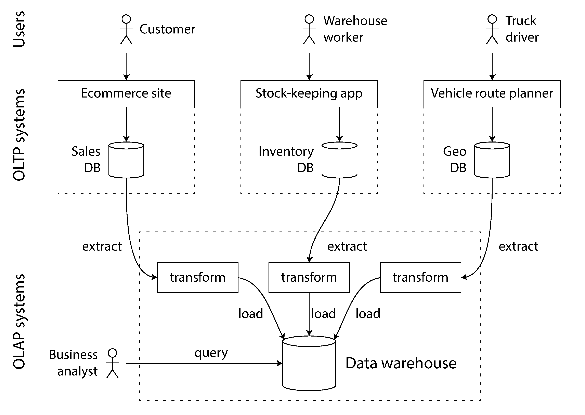
 

data warehouse의 장점은 OLTP operation에 영향을 주지 않고 analytics query에 맞게 storage와 query engine을 최적화할 수 있다는 점임

겉으로는 둘 다 SQL interface를 제공할 수 있지만 내부 storage engine은 매우 다를 수 있음

 

### Stars and Snowflakes: Schemas for Analytics

analytics에서는 transaction processing보다 data model 다양성이 작음

많은 data warehouse는 star schema 또는 dimensional modeling을 사용함

star schema의 중심에는 fact table이 있음

fact table의 각 row는 특정 시점에 발생한 event를 나타냄

fact table 주변에는 dimension table이 있음

dimension은 event의 who, what, where, when, how, why를 설명함

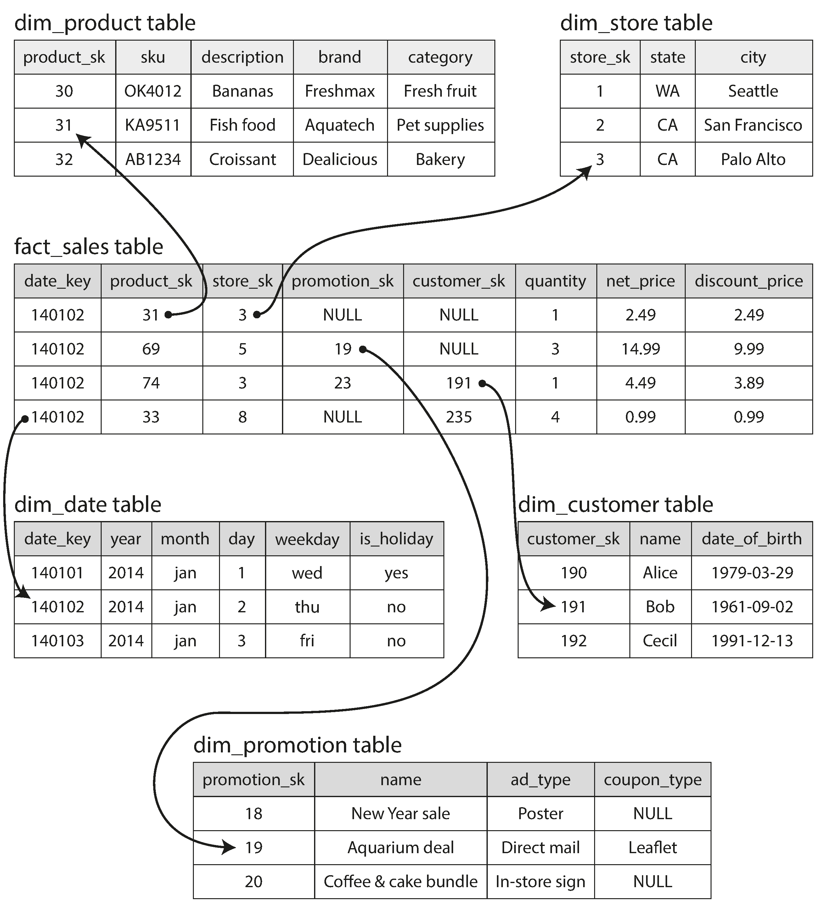
 

snowflake schema는 dimension을 더 작은 subdimension으로 normalize한 형태임

하지만 analyst가 이해하고 쓰기에는 star schema가 더 단순한 경우가 많음

fact table은 매우 크고 wide할 수 있으며, dimension table도 분석에 필요한 metadata를 많이 포함할 수 있음

 

### Column-Oriented Storage

analytics query는 보통 많은 row를 scan하지만 필요한 column은 일부임

row-oriented storage는 한 row의 모든 column을 함께 저장하므로, query에 필요 없는 column까지 읽어야 할 수 있음

column-oriented storage는 같은 column의 값을 함께 저장함

query가 필요한 column만 읽으면 되므로 disk I/O와 parsing 비용을 크게 줄일 수 있음

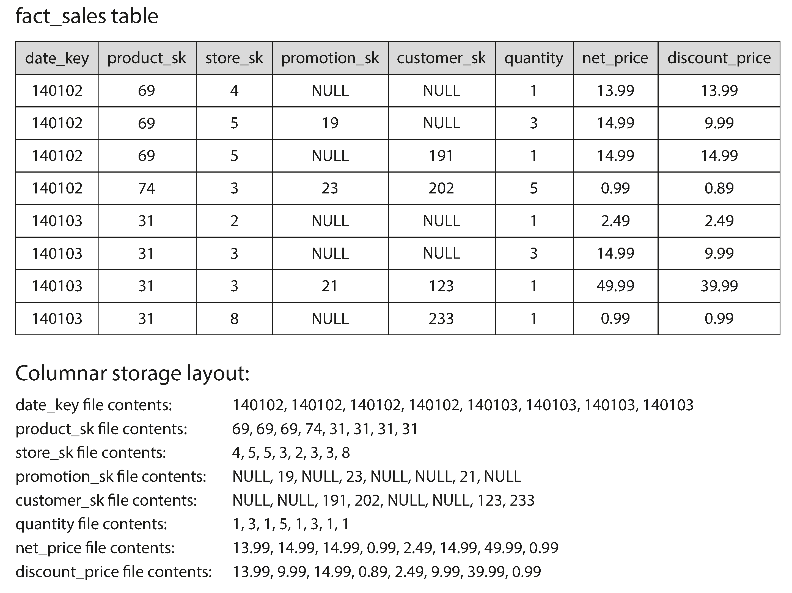
 

각 column file은 row 순서가 같아야 함

그래야 각 column의 k번째 value를 모아 원래 row를 재구성할 수 있음

 

### Column Compression

column-oriented storage는 compression에도 유리함

같은 column에는 비슷하거나 반복되는 값이 많기 때문임

data warehouse에서 자주 쓰이는 기법 중 하나는 bitmap encoding임

distinct value마다 bitmap을 만들고, 각 row가 그 value를 가지면 bit를 1로 표시함

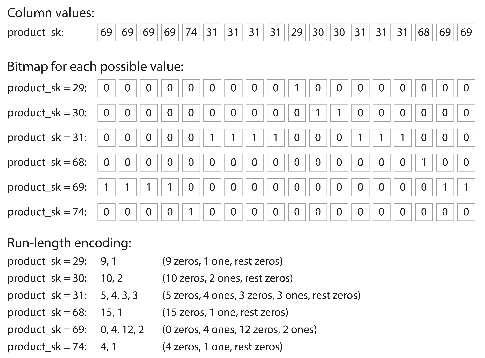
 

bitmap은 bitwise AND, OR로 filtering을 빠르게 처리할 수 있음

distinct value가 많아 bitmap이 sparse해지면 run-length encoding 같은 압축을 함께 사용할 수 있음

column compression은 disk I/O를 줄일 뿐 아니라 CPU cache와 vectorized processing에도 유리함

 

### Sort Order in Column Storage

column store에서도 row의 순서를 정할 수 있음

각 column을 독립적으로 sort하면 row를 재구성할 수 없으므로, 전체 row 단위로 같은 sort order를 유지해야 함

자주 쓰는 query pattern을 기준으로 sort key를 고르면 scan 범위를 줄일 수 있음

예를 들어 date range query가 많다면 `date_key`를 첫 sort key로 둘 수 있음

sort order는 compression에도 도움됨

같은 값이 연속해서 나타나면 run-length encoding이 잘 먹히기 때문임

여러 replica를 서로 다른 sort order로 저장하면 query pattern별로 더 적합한 replica를 사용할 수도 있음

 

### Writing to Column-Oriented Storage

column-oriented storage, compression, sorting은 read-heavy analytics에 유리하지만 write는 복잡하게 만듦

압축된 column 중간에 row를 삽입하려면 여러 column file을 함께 다시 써야 할 수 있음

해결책은 앞에서 본 LSM-tree 접근과 비슷함

write는 먼저 in-memory store에 받고, 충분히 쌓이면 disk의 column file과 bulk merge해 새 file로 씀

query optimizer는 memory의 최신 write와 disk의 column data를 함께 읽는 복잡성을 사용자에게 숨김

 

### Aggregation: Data Cubes and Materialized Views

data warehouse query는 `COUNT`, `SUM`, `AVG`, `MIN`, `MAX` 같은 aggregate를 자주 사용함

같은 aggregate를 여러 query가 반복해서 계산한다면 매번 raw data를 scan하는 것은 낭비임

materialized view는 query 결과를 실제로 disk에 저장한 copy임

virtual view가 query shortcut이라면, materialized view는 precomputed result임

underlying data가 바뀌면 materialized view도 갱신되어야 하므로 write cost가 증가함

그래서 OLTP보다는 read-heavy data warehouse에서 더 적합할 수 있음

data cube 또는 OLAP cube는 materialized view의 특수한 형태임

dimension별 aggregate를 미리 계산해 grid 형태로 저장함

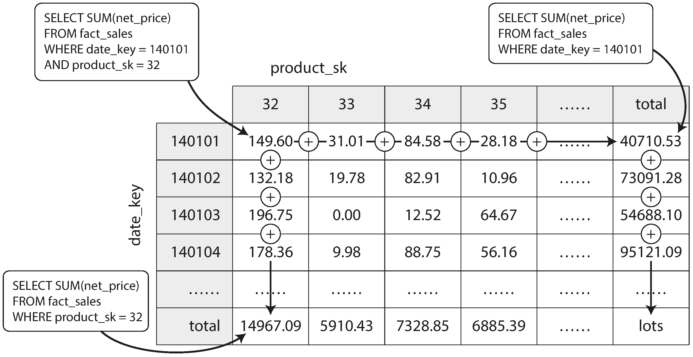
 

data cube는 특정 query를 매우 빠르게 만들지만 raw data query만큼 flexible하지 않음

따라서 대부분의 warehouse는 raw data를 유지하면서, 자주 쓰는 aggregate만 성능 보조 용도로 materialize함

 

### Summary

3장은 database가 data를 저장하고 다시 찾는 내부 방식을 다룸

큰 구분은 OLTP와 OLAP임

OLTP는 많은 user-facing request를 처리하고, query마다 작은 record 집합을 빠르게 찾는 것이 중요함

OLAP는 query 수는 적지만 한 query가 많은 row를 scan하고 aggregate를 계산함

OLTP storage engine에는 두 흐름이 있음

- log-structured storage는 append와 immutable segment를 중심으로 random write를 sequential write로 바꿈
- B-tree는 fixed-size page를 update-in-place하며 오래된 database architecture의 중심 index로 쓰임

index는 read를 빠르게 하지만 write overhead를 만든다는 trade-off가 있음

analytics에서는 index보다 compact encoding과 sequential scan 효율이 더 중요해짐

column-oriented storage는 필요한 column만 읽고 잘 압축할 수 있어 data warehouse workload에 적합함

storage engine을 이해하면 database 선택, index 설계, tuning parameter의 효과를 더 논리적으로 판단할 수 있음
