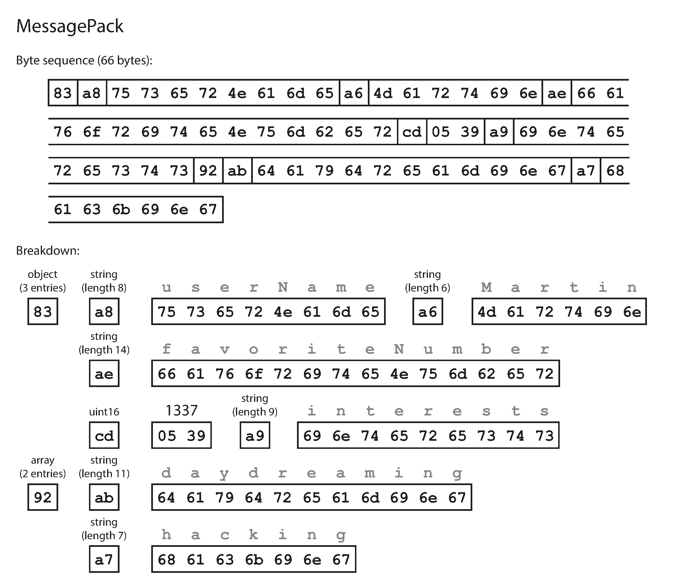
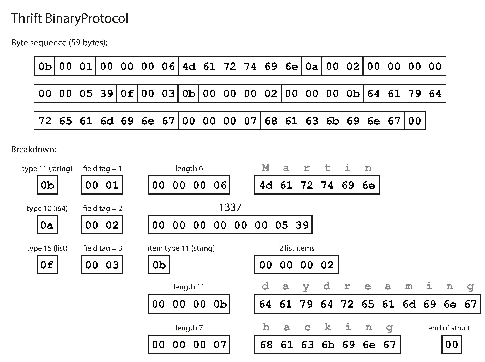
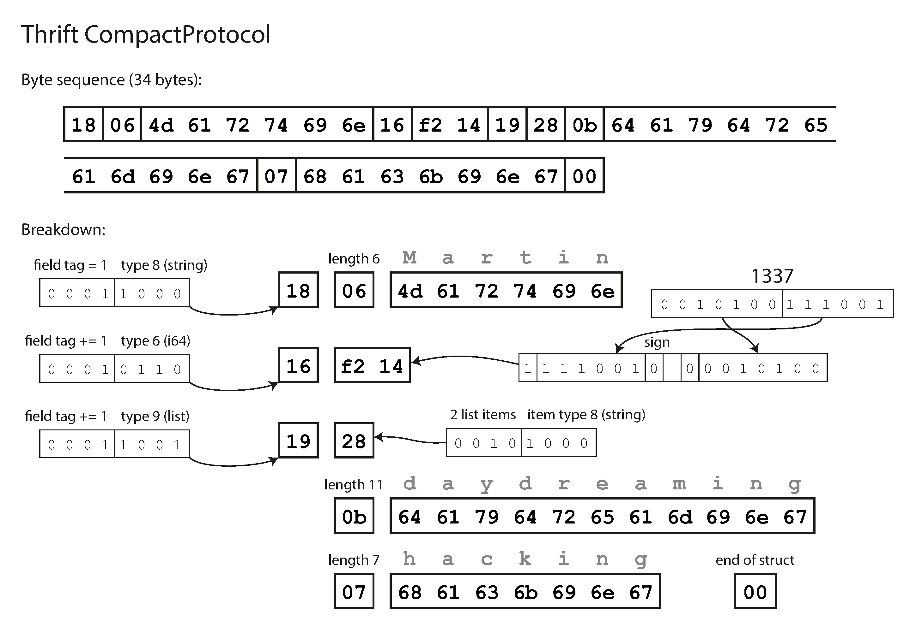
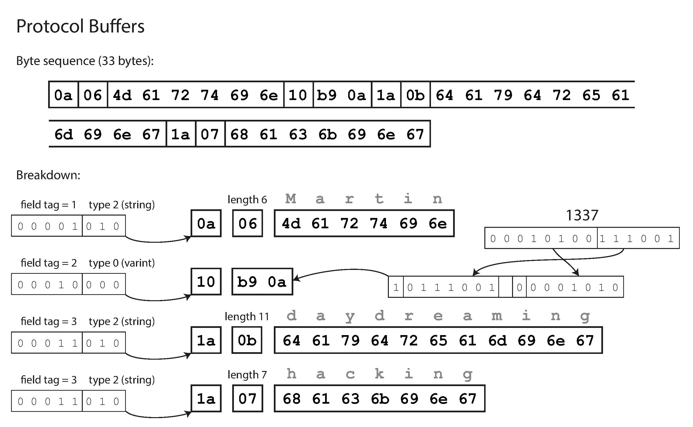
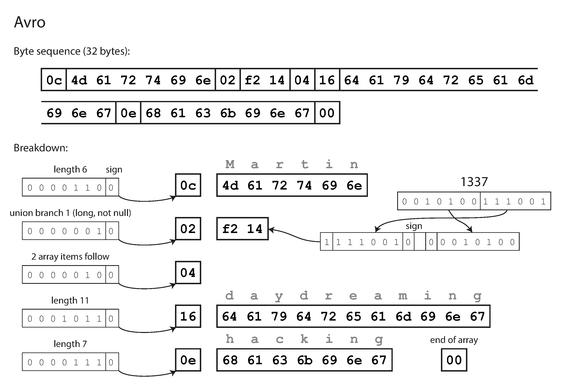
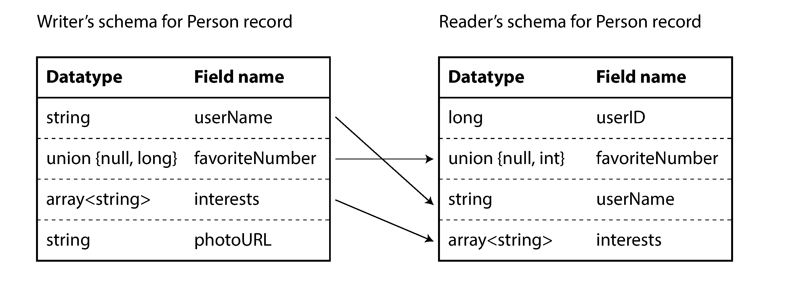
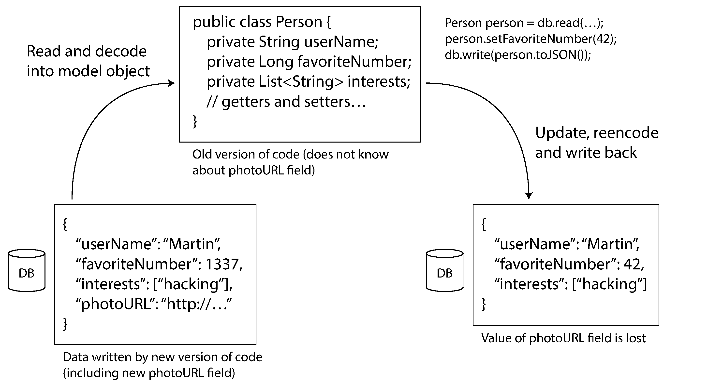

## Designing Data-Intensive Applications

### 4장. Encoding and Evolution

application은 시간이 지나며 계속 바뀜

새 기능이 추가되고, 요구사항이 더 잘 이해되고, business 상황도 변하기 때문임

application feature가 바뀌면 저장하는 data의 형태도 함께 바뀌는 경우가 많음

예를 들어 record에 field가 추가되거나, 기존 data를 다른 방식으로 보여줘야 할 수 있음

문제는 code와 data format이 한 번에 모두 바뀌지 않는다는 점임

server-side application은 rolling upgrade로 일부 node부터 순차적으로 배포될 수 있음

client-side application은 사용자가 update를 늦게 설치할 수 있음

따라서 old code, new code, old data format, new data format이 동시에 존재할 수 있음

이때 compatibility가 중요함

- backward compatibility: new code가 old code가 쓴 data를 읽을 수 있음
- forward compatibility: old code가 new code가 쓴 data를 읽을 수 있음

backward compatibility는 보통 새 code가 old format을 알고 있으므로 비교적 다루기 쉬움

forward compatibility는 old code가 미래에 추가될 field를 알 수 없으므로 더 까다로움

이 장은 data encoding format이 schema change를 어떻게 다루는지, 그리고 database, service, message queue 같은 dataflow에서 compatibility가 왜 필요한지 설명함

 

### Formats for Encoding Data

program은 보통 data를 두 가지 형태로 다룸

- memory 안에서는 object, struct, list, hash table, tree 같은 구조로 표현함
- file에 쓰거나 network로 보낼 때는 self-contained byte sequence로 표현함

memory representation은 pointer와 CPU 접근 효율에 맞춰져 있음

반면 byte sequence는 다른 process나 다른 machine도 이해할 수 있어야 함

따라서 두 표현 사이를 변환해야 함

- encoding: memory representation을 byte sequence로 바꿈
- decoding: byte sequence를 다시 memory representation으로 바꿈

serialization, marshalling, parsing, deserialization 같은 용어도 쓰이지만, 이 책에서는 transaction의 serialization과 구분하기 위해 encoding이라는 표현을 주로 사용함

 

### Language-Specific Formats

많은 language는 object를 byte sequence로 저장하는 built-in encoding 기능을 제공함

예를 들어 Java의 `Serializable`, Ruby의 `Marshal`, Python의 `pickle` 같은 방식이 있음

이 방식은 code를 적게 쓰고 object를 저장하고 복원할 수 있어 편리함

하지만 장기 저장이나 system 간 통신에는 문제가 큼

- 특정 programming language에 강하게 묶임
- 다른 language에서 읽기 어려움
- decoding 과정에서 임의 class를 만들 수 있어 security risk가 생김
- forward compatibility와 backward compatibility가 약한 경우가 많음
- encoded size나 encoding speed가 핵심 목표가 아닌 경우가 많음

따라서 language built-in encoding은 짧게 쓰고 버리는 data가 아니라면 조심해야 함

특히 외부에서 온 byte sequence를 그대로 decode하는 방식은 보안상 위험할 수 있음

 

### JSON, XML, and CSV

JSON, XML, CSV는 language-independent textual format임

사람이 어느 정도 읽을 수 있고, 여러 language와 tool에서 널리 지원됨

그래서 조직 간 data interchange에는 여전히 많이 사용됨

하지만 모호한 부분도 있음

- XML과 CSV는 schema 없이는 number와 digit string을 구분하기 어려움
- JSON은 number와 string은 구분하지만 integer와 floating-point number를 명확히 구분하지 않음
- 큰 integer는 JavaScript 같은 환경에서 precision 문제가 생길 수 있음
- JSON과 XML은 Unicode string은 잘 지원하지만 raw binary string은 직접 표현하지 못함
- binary data는 보통 Base64로 우회하지만 data size가 증가함
- CSV는 schema가 없고 row, column 의미를 application이 직접 관리해야 함

JSON과 XML에는 schema language가 있지만 복잡도가 있고, 모든 도구가 schema를 적극적으로 사용하지는 않음

결국 textual format은 완벽해서 쓰이는 것이 아니라, 충분히 널리 합의되어 있고 다루기 쉽기 때문에 쓰임

 

### Binary Encoding

조직 내부에서만 쓰는 data라면 사람이 읽기 쉬운 형식보다 compact하고 빠른 format을 선택할 수 있음

JSON보다 작은 binary JSON variant로 MessagePack, BSON, BJSON, UBJSON, BISON, Smile 같은 format이 있음

XML에도 WBXML, Fast Infoset 같은 binary variant가 있음

다만 schema가 없으면 field name을 encoded data 안에 계속 포함해야 함

그래서 binary format이라고 해도 항상 큰 절약이 되는 것은 아님

 

Figure 4-1은 같은 record를 MessagePack으로 encoding한 예시임

JSON text보다 약간 작지만, field name이 그대로 들어가기 때문에 절감 폭은 제한적임

더 큰 절감은 schema를 사용해 field name을 data 밖으로 빼낼 때 가능함

 

### Thrift and Protocol Buffers

Thrift와 Protocol Buffers는 schema를 기반으로 하는 binary encoding library임

두 방식 모두 data를 encoding하기 전에 field의 type과 tag number를 schema로 정의함

encoded data에는 field name 대신 tag number가 들어감

이 덕분에 field name을 매번 기록하지 않아도 되어 더 compact한 encoding이 가능함

 

 

 

중요한 점은 tag number가 compatibility의 기준이 된다는 것임

field name은 바꿀 수 있지만 tag number는 바꾸면 안 됨

old code는 모르는 tag를 보면 무시할 수 있으므로 new field 추가는 비교적 안전함

new code는 old data에 없는 field를 default value나 null로 처리할 수 있음

하지만 `required` field를 나중에 추가하면 old data에는 그 field가 없으므로 backward compatibility가 깨질 수 있음

따라서 schema evolution을 고려하면 새 field는 optional하게 추가하는 편이 안전함

field를 제거할 때도 tag number를 재사용하면 안 됨

old data나 old code가 같은 tag number를 다른 의미로 해석할 수 있기 때문임

datatype 변경도 주의해야 함

예를 들어 integer width를 줄이면 값이 잘리거나 precision이 손실될 수 있음

compatibility는 schema 문법만 맞는 문제가 아니라, 실제 값의 의미가 보존되는지도 함께 봐야 함

 

### Avro

Avro도 schema를 사용하는 binary encoding format임

하지만 Thrift나 Protocol Buffers와 달리 encoded data에 tag number를 기록하지 않음

대신 writer schema와 reader schema를 함께 사용함

- writer schema: data를 쓴 code가 사용한 schema
- reader schema: data를 읽는 code가 기대하는 schema

reader는 두 schema를 비교해 field를 matching함

field 순서가 달라도 이름으로 matching할 수 있고, reader schema에만 있는 field는 default value를 사용할 수 있음

 

Avro binary encoding은 schema 정보를 data 안에 반복해서 넣지 않으므로 매우 compact함

대신 reader가 writer schema를 알아야 함

이를 위해 상황별로 다른 방식이 사용됨

- 큰 file에는 writer schema를 file header에 한 번 저장할 수 있음
- database record에는 schema version을 함께 저장하고 schema registry에서 찾을 수 있음
- network connection에서는 연결을 시작할 때 schema를 협상할 수 있음

 

Avro는 dynamically generated schema에 잘 맞음

예를 들어 relational database table에서 column 목록을 읽어 Avro schema를 만들 수 있음

이 경우 column이 추가되거나 제거되어도 schema를 자동으로 반영하기 쉬움

code generation은 statically typed language에서는 유용하지만, dynamically typed language에서는 필수는 아님

 

### The Merits of Schemas

Thrift, Protocol Buffers, Avro 같은 schema-based binary encoding은 textual JSON이나 XML보다 몇 가지 장점이 있음

- field name을 반복하지 않아 encoded data가 작음
- schema가 documentation 역할을 함
- schema database를 사용하면 compatibility를 배포 전에 확인할 수 있음
- statically typed language에서는 generated code로 type check와 IDE 지원을 받을 수 있음

schema를 쓴다고 해서 변화가 어려워지는 것은 아님

오히려 schema evolution 규칙이 명확하면 rolling upgrade와 long-lived data를 더 안정적으로 다룰 수 있음

핵심은 schema를 고정된 계약으로만 보는 것이 아니라, compatibility를 유지하며 바꾸는 대상으로 보는 것임

 

### Modes of Dataflow

encoding format은 data가 어디로 흘러가는지와 함께 봐야 함

이 장은 대표적인 dataflow를 세 가지로 나눔

- database를 통한 dataflow
- service call을 통한 dataflow
- asynchronous message passing을 통한 dataflow

각 방식은 old code와 new code가 만나는 위치가 다름

따라서 compatibility를 깨뜨리는 방식도 다름

 

### Dataflow Through Databases

database는 한 process가 쓴 data를 나중에 다른 process가 읽는 dataflow임

이때 writer와 reader가 같은 application의 다른 version일 수도 있음

new code가 새 field를 써도 old code가 그 record를 읽을 수 있어야 함

또한 old code가 record를 다시 저장할 때 모르는 field를 잃어버리지 않는 것이 중요함

 

Figure 4-7은 old application version이 new field를 포함한 record를 읽고 다시 저장하는 상황을 보여줌

old code가 모르는 field를 보존하지 않으면 new code가 쓴 정보가 사라질 수 있음

따라서 database schema evolution에서는 읽기뿐 아니라 read-modify-write 경로도 확인해야 함

backup, archive, data export도 같은 문제를 가짐

오래된 snapshot을 나중에 읽을 수 있어야 하므로, 장기 저장 format은 schema history와 함께 관리되어야 함

 

### Dataflow Through Services

service는 server가 API를 제공하고 client가 그 API를 호출하는 구조임

client와 server가 서로 다른 process, machine, team, organization에 있을 수 있음

web browser와 web server, mobile app과 backend, microservice 간 호출이 모두 여기에 해당함

REST는 HTTP의 method, URL, content negotiation, caching, authentication 같은 web 원칙을 활용하는 API style임

SOAP은 XML 기반 protocol과 WSDL을 사용하는 방식임

RPC는 remote call을 local function call처럼 보이게 하려는 접근임

하지만 network call은 local function call과 다름

- network request는 timeout되거나 일부만 실패할 수 있음
- latency가 훨씬 크고 변동성이 큼
- retry가 duplicate effect를 만들 수 있음
- argument와 return value는 byte sequence로 encoding되어야 함

RPC framework는 같은 조직 내부 service 간 통신에는 유용할 수 있음

반면 public API나 browser 기반 client에는 HTTP와 REST style이 더 널리 맞는 경우가 많음

책의 특정 framework, API, product 예시는 원문 당시 기준이므로 실제 운영 판단에는 현재 공식 문서를 확인해야 함

service compatibility에서는 server와 client가 독립적으로 배포될 수 있다는 점이 핵심임

server를 먼저 바꿔도 old client가 동작해야 하고, client를 먼저 바꿔도 old server와의 관계를 고려해야 함

 

### Message-Passing Dataflow

message-passing은 client request와 database write 사이의 중간 형태임

sender는 message를 broker나 queue에 보내고, receiver는 나중에 message를 가져가 처리함

대표적인 장점은 다음과 같음

- receiver가 일시적으로 unavailable해도 message를 buffer할 수 있음
- receiver가 과부하이면 queue가 backpressure 역할을 할 수 있음
- process가 crash해도 message를 다시 전달할 수 있음
- sender가 receiver의 network address를 몰라도 됨
- 하나의 message를 여러 receiver로 전달할 수 있음
- sender와 receiver의 실행 시점을 분리할 수 있음

message broker는 보통 특정 encoding schema를 강제하지 않음

따라서 message payload의 compatibility는 application이 선택한 encoding format과 schema evolution 규칙에 달려 있음

actor framework에서도 비슷한 문제가 있음

rolling upgrade 중에는 old actor와 new actor가 같은 system 안에서 message를 주고받을 수 있기 때문임

결국 message-passing에서도 forward compatibility와 backward compatibility를 유지해야 함

 

### Summary

data encoding은 단순히 object를 byte로 바꾸는 문제가 아님

application이 진화하는 동안 old code와 new code가 같은 data를 읽고 써야 하므로 compatibility가 핵심임

이 장의 핵심 정리는 다음과 같음

- language-specific encoding은 편리하지만 장기 저장과 system 간 통신에는 위험함
- JSON, XML, CSV는 널리 쓰이지만 type과 binary data 표현에 한계가 있음
- schema 없는 binary JSON variant는 compact해도 field name 반복 문제를 완전히 해결하지 못함
- Thrift와 Protocol Buffers는 tag number 기반 schema로 compact한 encoding과 schema evolution을 지원함
- Avro는 writer schema와 reader schema를 비교해 evolution을 처리함
- database, service, message queue 모두 old/new code가 공존할 수 있으므로 compatibility가 필요함

evolvability는 새로운 기능을 빠르게 넣는 능력만 뜻하지 않음

기존 data와 기존 client를 깨뜨리지 않으면서 system을 바꿀 수 있는 능력까지 포함함
