## Designing Data-Intensive Applications

### 5장. Replication

replication은 같은 data의 copy를 network로 연결된 여러 machine에 유지하는 것임

replication을 사용하는 이유는 보통 세 가지임

- user와 가까운 곳에 data를 두어 latency를 줄임
- 일부 node나 datacenter가 실패해도 system이 계속 동작하게 함
- read query를 여러 machine으로 분산해 read throughput을 높임

이 장에서는 각 machine이 전체 dataset의 copy를 가질 수 있다고 가정함

너무 큰 dataset을 여러 machine에 나누는 partitioning은 6장에서 다룸

data가 변하지 않는다면 replication은 단순한 copy 문제임

하지만 실제 database는 계속 write가 발생하므로, replication의 어려움은 변경을 여러 replica에 어떻게 전파하느냐에 있음

이 장은 세 가지 replication 방식을 다룸

- single-leader replication
- multi-leader replication
- leaderless replication

각 방식은 availability, latency, consistency, conflict handling에서 서로 다른 trade-off를 가짐

책의 특정 database version, product 설정, replication option 예시는 원문 당시 기준이므로 실제 운영 판단에는 현재 공식 문서를 확인해야 함

 

### Leaders and Followers

replica는 database copy를 저장하는 node를 말함

여러 replica가 있을 때 핵심 질문은 모든 write를 어떻게 모든 replica에 반영하느냐임

가장 흔한 방식은 leader-based replication임

이 방식에서는 replica 중 하나를 leader로 지정함

client의 write는 leader로만 전달되고, leader는 write를 local storage에 반영한 뒤 follower에게 replication log나 change stream으로 전달함

follower는 leader가 처리한 write 순서대로 자신의 copy를 갱신함

read는 leader나 follower에서 처리할 수 있지만, write는 leader만 받음

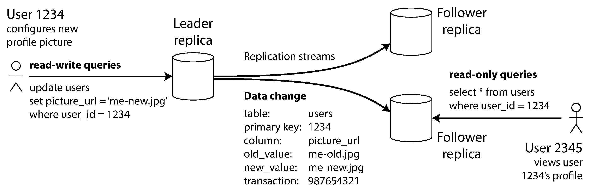
 

leader-based replication은 이해하기 쉽고 conflict resolution 부담이 작음

모든 write가 하나의 leader를 통과하므로 write ordering이 leader에서 결정되기 때문임

하지만 leader에 write가 집중되고, leader 장애 시 failover가 필요함

 

### Synchronous Versus Asynchronous Replication

replication은 synchronous일 수도 있고 asynchronous일 수도 있음

synchronous replication에서는 leader가 follower의 확인을 받은 뒤 client에게 성공을 응답함

asynchronous replication에서는 leader가 follower의 확인을 기다리지 않고 성공을 응답함

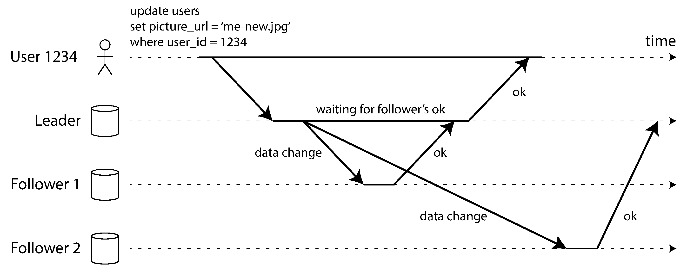
 

synchronous replication의 장점은 follower가 leader와 같은 최신 data를 갖는다는 점임

leader가 갑자기 실패해도 최신 copy가 다른 node에 남아 있을 가능성이 높음

단점은 synchronous follower가 느리거나 죽으면 write가 막힌다는 점임

모든 follower를 synchronous로 만들면 follower 하나의 장애가 전체 write availability를 떨어뜨릴 수 있음

그래서 실제 system은 하나의 synchronous follower와 여러 asynchronous follower를 섞는 semi-synchronous 구성을 쓰기도 함

fully asynchronous replication은 leader가 빠르게 write를 처리할 수 있음

하지만 leader가 실패하기 전에 follower로 복제되지 않은 write는 사라질 수 있음

client에게 성공을 응답했더라도 durability가 완전히 보장되지 않을 수 있다는 뜻임

 

### Setting Up New Followers

새 follower를 추가하려면 leader의 data를 일관된 상태로 복사해야 함

단순 file copy는 충분하지 않음

copy 중에도 client write가 계속 발생하므로, file의 일부는 과거 시점이고 다른 일부는 더 나중 시점일 수 있음

일반적인 절차는 다음과 같음

- leader database의 consistent snapshot을 만듦
- snapshot을 새 follower node로 복사함
- snapshot 시점의 replication log position을 확인함
- follower가 leader에 연결해 snapshot 이후의 변경분을 받아 적용함
- backlog를 모두 처리하면 follower가 catch up한 상태가 됨

이 절차는 database마다 다르지만 핵심은 snapshot과 log position을 함께 맞추는 것임

 

### Handling Node Outages

replication system은 planned maintenance와 unexpected fault를 모두 고려해야 함

개별 node를 reboot하거나 교체해도 system 전체가 계속 동작하는 것이 운영상 중요함

follower failure는 비교적 단순함

follower는 자신이 마지막으로 처리한 replication log position을 알고 있음

다시 시작하면 leader에 연결해 빠진 변경분을 요청하고 catch up할 수 있음

leader failure는 더 어렵고 failover가 필요함

failover는 보통 다음 흐름으로 진행됨

- leader가 실패했는지 판단함
- 가장 최신 data를 가진 follower를 새 leader로 선택함
- client write가 새 leader로 가도록 routing을 바꿈
- 기존 leader가 돌아오면 follower로 내려가도록 정리함

automatic failover는 편리하지만 위험한 edge case가 많음

asynchronous replication에서는 새 leader가 old leader의 모든 write를 받지 못했을 수 있음

old leader가 다시 돌아오면 서로 다른 write history가 생길 수 있음

두 node가 동시에 leader라고 믿는 split brain도 위험함

timeout이 너무 짧으면 일시적인 load spike나 network 지연이 불필요한 failover를 만들 수 있음

따라서 failover는 단순한 자동화 문제가 아니라 consistency, durability, availability trade-off를 포함하는 운영 문제임

 

### Implementation of Replication Logs

leader-based replication은 내부적으로 여러 방식으로 구현될 수 있음

대표적인 방식은 다음과 같음

- statement-based replication
- write-ahead log shipping
- logical row-based log replication
- trigger-based replication

statement-based replication은 leader가 실행한 write statement를 follower에게 보내는 방식임

SQL database라면 `INSERT`, `UPDATE`, `DELETE` statement를 follower가 같은 순서로 실행함

하지만 nondeterministic function, autoincrement, trigger, stored procedure가 있으면 follower마다 다른 결과가 나올 수 있음

그래서 단순해 보이지만 edge case가 많음

 

write-ahead log shipping은 storage engine의 low-level log를 그대로 follower에게 보내는 방식임

leader와 follower가 같은 byte-level 변경을 적용하므로 동일한 data structure를 만들 수 있음

단점은 replication protocol이 storage engine 내부 표현에 강하게 묶인다는 점임

storage format이 database version마다 달라지면 leader와 follower의 rolling upgrade가 어려워질 수 있음

 

logical log replication은 storage engine log와 replication log를 분리함

relational database에서는 보통 row 단위 변경을 기록함

- inserted row의 새 column 값
- deleted row를 식별할 primary key나 old column 값
- updated row를 식별할 값과 변경된 새 값

logical log는 storage engine 내부와 덜 묶이므로 version upgrade나 external system 연동에 유리함

data warehouse, custom index, cache로 변경을 보내는 change data capture에도 잘 맞음

 

trigger-based replication은 database trigger나 stored procedure를 이용해 변경을 application layer로 끌어올리는 방식임

subset replication, heterogeneous database replication, custom conflict handling에는 유연함

하지만 database 내장 replication보다 overhead가 크고 bug 가능성도 높음

 

### Problems with Replication Lag

read scalability를 높이기 위해 follower를 많이 두고 read를 follower로 분산할 수 있음

하지만 이 구조는 보통 asynchronous replication을 전제로 함

그 결과 follower가 leader보다 뒤처지는 replication lag가 생길 수 있음

lag가 작으면 눈에 띄지 않을 수 있지만, network 문제나 overload가 있으면 seconds, minutes 단위로 커질 수 있음

이때 application은 일시적으로 inconsistent한 data를 볼 수 있음

eventual consistency는 시간이 지나면 replica가 결국 같아진다는 의미임

하지만 eventual이라는 말은 언제 일치하는지 구체적으로 보장하지 않음

따라서 user-facing behavior를 설계할 때 replication lag를 가정해야 함

 

### Reading Your Own Writes

사용자가 data를 쓴 직후 다시 읽었는데 follower가 아직 갱신되지 않았다면, 사용자는 방금 쓴 data가 사라진 것처럼 보게 됨

이를 막기 위한 보장이 read-after-write consistency 또는 read-your-writes consistency임

사용자가 자신이 쓴 data는 항상 볼 수 있어야 한다는 의미임

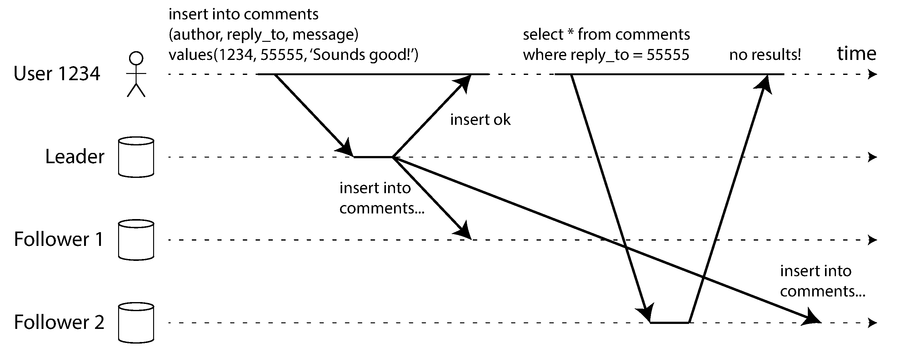
 

구현 방법은 여러 가지임

- 사용자가 수정할 수 있는 data는 leader에서 읽음
- write 직후 일정 시간 동안은 leader에서 읽음
- client가 마지막 write timestamp나 log position을 기억하고, 그 시점 이상 반영된 replica에서만 읽음
- lag가 큰 follower는 read 대상에서 제외함

여러 device를 쓰는 user에게는 더 어렵음

한 device의 write timestamp를 다른 device도 알아야 하므로 metadata를 중앙에서 공유해야 할 수 있음

datacenter가 여러 곳이면 같은 user의 device들이 서로 다른 datacenter로 route될 수 있다는 점도 고려해야 함

 

### Monotonic Reads

monotonic reads는 한 user가 시간을 거꾸로 보는 일을 막는 보장임

한 번 새 data를 본 user가 다음 read에서 더 오래된 data를 보면 혼란이 생김

이 문제는 read 요청이 매번 다른 follower로 route될 때 자주 발생할 수 있음

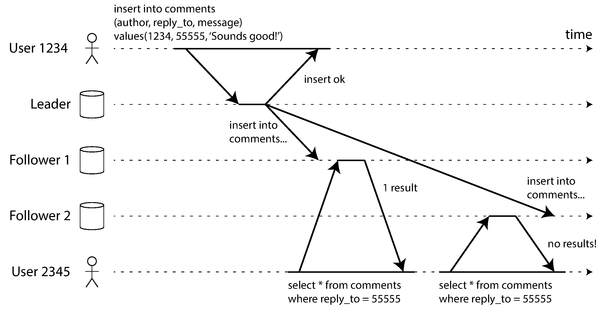
 

monotonic reads는 strong consistency보다 약하지만 eventual consistency보다는 강한 보장임

대표적인 구현 방법은 같은 user의 read를 항상 같은 replica로 보내는 것임

예를 들어 user ID hash로 replica를 선택할 수 있음

다만 해당 replica가 실패하면 다른 replica로 reroute해야 하므로, 그 순간에는 보장이 흔들릴 수 있음

 

### Consistent Prefix Reads

consistent prefix reads는 causality가 깨진 순서로 data를 보지 않게 하는 보장임

예를 들어 질문과 답변이 순서대로 write되었는데, reader가 답변을 먼저 보고 질문을 나중에 보면 인과관계가 깨짐

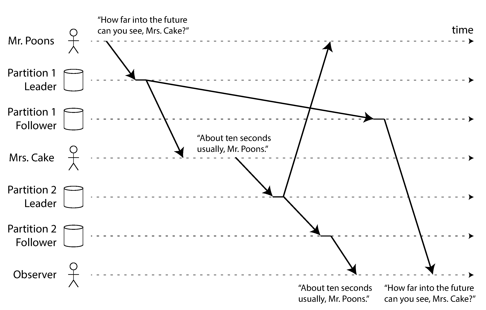
 

이 문제는 partitioned database에서 특히 중요함

서로 다른 partition이 독립적으로 replication되면 partition마다 lag가 다를 수 있음

그 결과 causal dependency가 있는 write가 reader에게 뒤섞인 순서로 보일 수 있음

해결하려면 causally related write를 같은 partition에 두거나, causal dependency를 추적하는 algorithm이 필요함

 

### Solutions for Replication Lag

eventual consistency system을 사용할 때는 lag가 커졌을 때 application이 어떻게 보이는지 먼저 생각해야 함

사용자 경험이나 business rule이 깨진다면 더 강한 보장을 설계해야 함

application code에서 leader read, timestamp tracking, replica lag filtering 같은 방식으로 보완할 수 있음

하지만 이런 보완은 복잡하고 실수하기 쉬움

database가 더 강한 guarantee를 제공하면 application은 단순해짐

transaction은 이런 복잡성을 줄이기 위한 대표적인 abstraction임

다만 distributed database에서 transaction은 performance와 availability trade-off를 만들 수 있으므로 이후 장에서 더 자세히 다룸

 

### Multi-Leader Replication

single-leader replication의 약점은 write가 하나의 leader를 통과해야 한다는 점임

leader에 연결할 수 없으면 write할 수 없음

multi-leader replication은 여러 node가 write를 받을 수 있게 함

각 leader는 자신이 받은 write를 다른 leader에게 전파하고, 동시에 다른 leader의 follower처럼 동작함

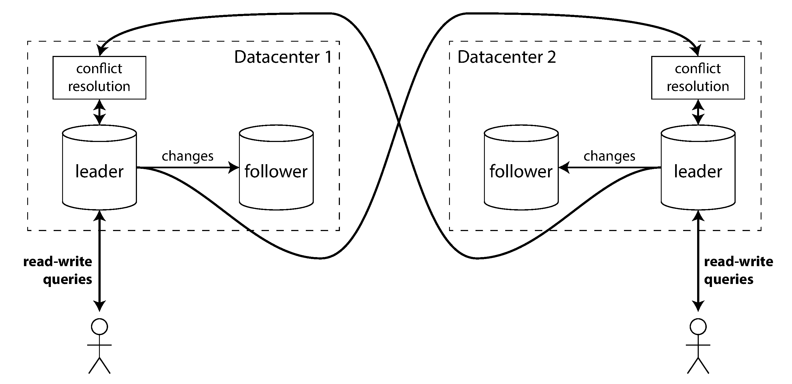
 

multi-leader replication은 단일 datacenter 안에서는 복잡도 대비 이점이 작을 수 있음

하지만 다음 상황에서는 의미가 있음

- 여러 datacenter에서 local write latency를 줄여야 함
- datacenter 단위 장애를 견뎌야 함
- network interruption 중에도 각 location이 독립적으로 write를 받아야 함
- offline 상태에서도 local write를 받고 나중에 sync해야 함
- collaborative editing처럼 여러 client가 동시에 local state를 바꿔야 함

단점은 write conflict임

같은 data를 서로 다른 leader에서 동시에 수정할 수 있기 때문임

따라서 multi-leader replication은 conflict detection과 conflict resolution이 핵심임

 

### Handling Write Conflicts

write conflict는 두 leader가 같은 record를 동시에 다른 값으로 수정할 때 발생함

single-leader에서는 두 write가 leader에서 순서대로 처리되므로 conflict가 즉시 드러남

multi-leader에서는 각 leader가 local write를 먼저 성공 처리하고, 나중에 replication 중 conflict를 발견할 수 있음

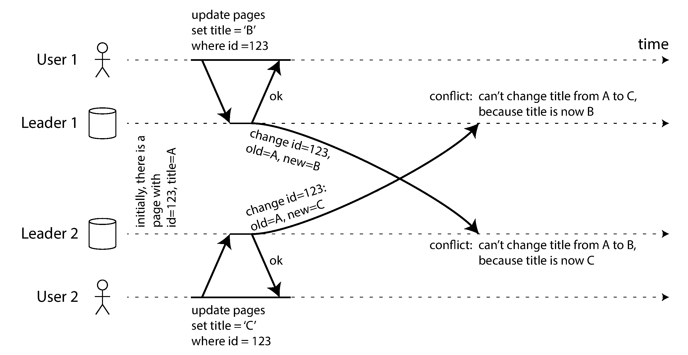
 

conflict를 다루는 가장 단순한 방법은 conflict를 피하는 것임

특정 record의 write를 항상 같은 leader로 route하면 그 record에 대해서는 single-leader처럼 동작함

하지만 datacenter failover나 user 이동처럼 designated leader가 바뀌면 concurrent write 가능성이 다시 생김

conflict가 발생했다면 모든 replica가 결국 같은 값으로 converge해야 함

대표적인 방법은 다음과 같음

- timestamp나 unique ID로 winner를 고르고 나머지를 버림
- replica ID 우선순위로 winner를 고름
- 값을 merge함
- conflict를 명시적인 data structure로 저장하고 application이 나중에 해결함

last write wins는 구현이 단순하지만 data loss를 만들 수 있음

conflict resolution logic은 application domain에 따라 달라짐

예를 들어 shopping cart, document editing, room booking은 서로 다른 merge rule이 필요함

 

### Multi-Leader Replication Topologies

replication topology는 write가 leader 사이에서 어떤 경로로 전파되는지를 말함

leader가 두 개라면 서로 write를 보내면 됨

leader가 셋 이상이면 topology 선택지가 생김

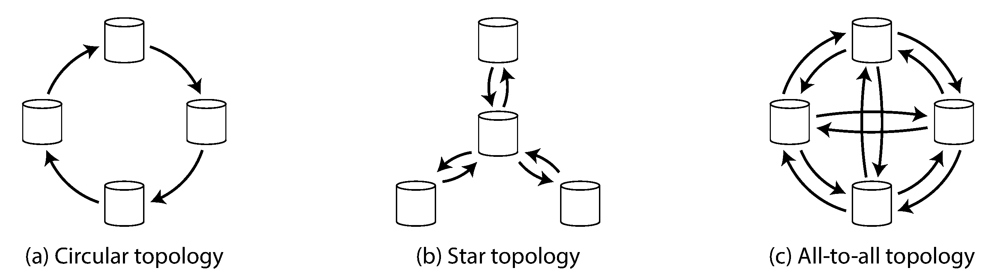
 

대표적인 topology는 다음과 같음

- circular topology
- star topology
- all-to-all topology

circular나 star topology는 구현이 단순할 수 있지만 중간 node 장애가 replication flow를 끊을 수 있음

all-to-all topology는 fault tolerance가 더 좋지만 message ordering 문제가 생길 수 있음

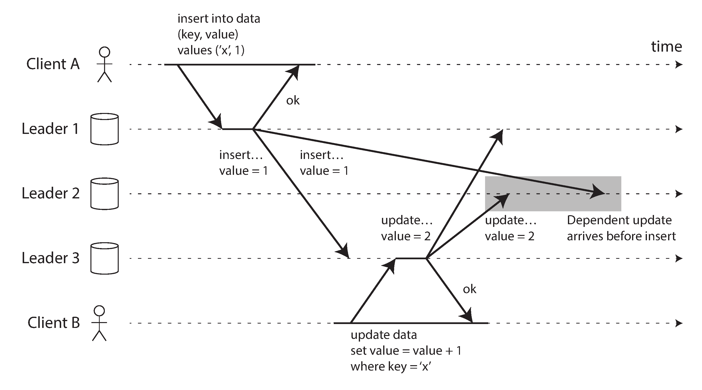
 

어떤 leader에서는 insert가 먼저 도착하고 update가 나중에 도착해야 하는데, network delay 때문에 다른 leader에서는 update가 먼저 도착할 수 있음

이 문제는 causality와 관련됨

timestamp만으로 해결하기 어렵고, version vector 같은 방식으로 dependency를 추적해야 함

multi-leader system은 구현마다 보장이 다르므로 실제 사용 전 문서와 테스트로 확인해야 함

 

### Leaderless Replication

leaderless replication은 leader 개념을 버리고 어떤 replica도 client write를 직접 받을 수 있게 함

client가 여러 replica에 직접 write를 보내거나, coordinator node가 대신 여러 replica에 보낼 수 있음

중요한 점은 coordinator가 leader처럼 write ordering을 강제하지 않는다는 것임

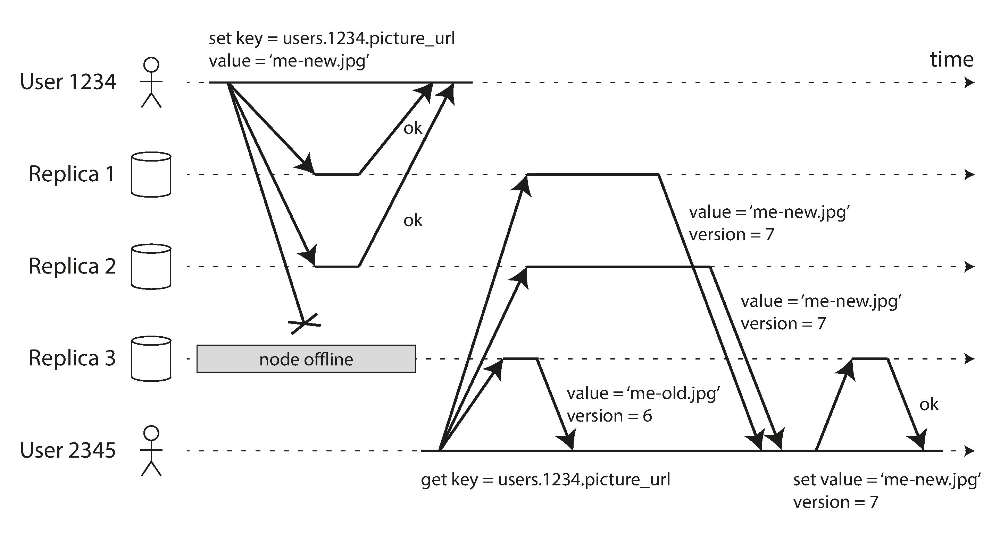
 

node 하나가 down이어도 client는 나머지 replica에 write를 보낼 수 있음

예를 들어 replica 3개 중 2개가 write를 확인하면 성공으로 간주할 수 있음

down된 node가 돌아오면 일부 값이 stale할 수 있으므로 read repair나 anti-entropy가 필요함

- read repair: read 중 stale replica를 발견하면 최신 값을 다시 써서 고침
- anti-entropy: background process가 replica 간 차이를 찾아 missing data를 복사함

read repair는 자주 읽히는 값에는 효과적임

하지만 거의 읽히지 않는 값은 anti-entropy가 없으면 오래 stale할 수 있음

 

### Quorums for Reading and Writing

leaderless replication에서는 read와 write를 여러 replica에 병렬로 보냄

`n`은 어떤 value가 저장되는 replica 수임

`w`는 write 성공에 필요한 acknowledgement 수임

`r`은 read할 때 응답을 받아야 하는 replica 수임

`w + r > n`이면 read set과 write set이 적어도 하나의 replica에서 겹치므로 최신 값을 볼 가능성이 높아짐

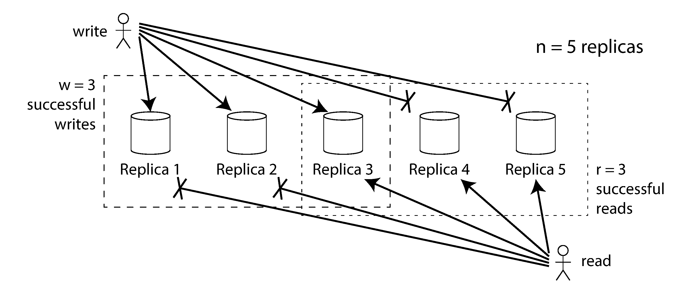
 

예를 들어 `n = 3`, `w = 2`, `r = 2`이면 하나의 node가 unavailable해도 read와 write를 계속할 수 있음

하지만 quorum은 절대적인 최신성 보장을 의미하지 않음

concurrent write, sloppy quorum, failed write 일부 반영, node restore, unlucky timing 같은 edge case가 있음

따라서 Dynamo-style database는 보통 eventual consistency를 감수할 수 있는 use case에 맞음

read-your-writes, monotonic reads, consistent prefix reads 같은 보장은 별도 설계가 필요할 수 있음

operability 관점에서는 staleness와 replication health를 monitoring해야 함

leader-based system은 replication log position으로 lag를 비교하기 쉽지만, leaderless system은 global order가 없어 더 어렵음

 

### Sloppy Quorums and Hinted Handoff

strict quorum은 value의 home replica 중 `w`개 또는 `r`개가 응답해야 함

하지만 network interruption으로 client가 home replica 대부분에 접근하지 못할 수 있음

sloppy quorum은 home replica가 아니더라도 reachable한 node에 임시로 write를 받아 availability를 높이는 방식임

network 문제가 해결되면 임시로 받은 write를 원래 home replica로 전달함

이 과정을 hinted handoff라고 함

sloppy quorum은 write availability를 높이지만 traditional quorum의 overlap guarantee를 약화함

`w + r > n`이어도 최신 값이 home replica 밖에 임시 저장되어 있으면 read가 최신 값을 못 볼 수 있음

따라서 sloppy quorum은 consistency 보장보다 durability와 availability를 위한 선택에 가까움

 

### Detecting Concurrent Writes

leaderless replication에서는 여러 client가 같은 key에 동시에 write할 수 있음

network delay와 partial failure 때문에 replica마다 write 도착 순서가 다를 수 있음

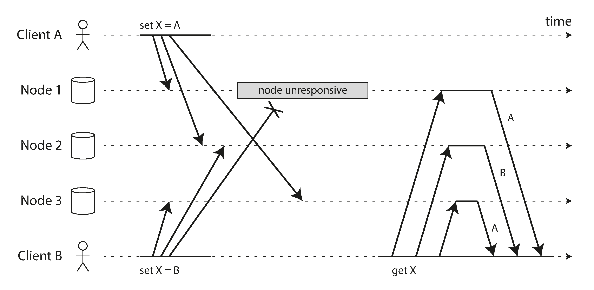
 

각 replica가 단순히 마지막으로 받은 값을 저장하면 replica들이 서로 다른 최종 값을 가질 수 있음

eventual consistency를 얻으려면 모든 replica가 결국 같은 값으로 converge해야 함

last write wins는 timestamp 같은 기준으로 winner를 고르고 나머지를 버리는 방식임

하지만 concurrent write 중 일부를 조용히 잃어버릴 수 있으므로 data loss가 허용되지 않는 경우에는 위험함

safe한 방식은 operation 간 happens-before 관계를 추적하는 것임

operation B가 A를 알고 있거나 A의 결과에 의존하면 A happens-before B라고 볼 수 있음

두 operation이 서로를 알지 못하면 concurrent함

concurrent operation은 단순 overwrite가 아니라 conflict resolution이나 merge가 필요함

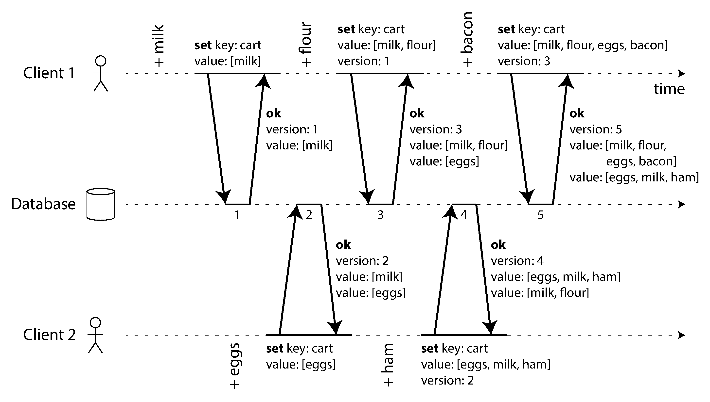
 

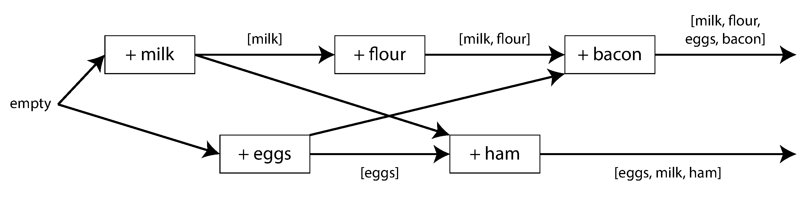
 

version number를 사용하면 server가 어떤 value가 어떤 prior state를 기반으로 하는지 판단할 수 있음

client는 read할 때 받은 version을 write에 함께 보내고, server는 그 version 이하의 old value를 overwrite할 수 있음

하지만 더 높은 version의 value는 incoming write와 concurrent할 수 있으므로 sibling으로 보존해야 함

sibling은 application이 merge해야 함

shopping cart처럼 추가만 있다면 union이 자연스러울 수 있음

삭제까지 있다면 tombstone 같은 marker가 필요함

여러 replica가 있는 leaderless system에서는 replica별 version number를 모은 version vector가 필요함

version vector는 overwrite와 concurrent write를 구분하게 해주며, replica를 바꿔 read와 write를 해도 data loss를 피할 수 있게 도움

 

### Summary

replication은 같은 data를 여러 machine에 유지하는 단순한 목표처럼 보이지만, 실제로는 fault와 concurrency를 함께 다뤄야 하는 어려운 문제임

replication의 목적은 다음과 같음

- high availability
- disconnected operation
- latency 감소
- read scalability

이 장의 세 가지 replication 방식은 서로 다른 trade-off를 가짐

- single-leader replication은 이해하기 쉽고 conflict가 적지만 leader가 write bottleneck이 됨
- multi-leader replication은 여러 location에서 write를 받을 수 있지만 conflict resolution이 필요함
- leaderless replication은 failover 없이 여러 replica에 read/write할 수 있지만 consistency reasoning이 더 어려움

synchronous replication은 durability와 consistency에 유리하지만 availability와 latency 비용이 있음

asynchronous replication은 빠르고 유연하지만 replication lag와 data loss 가능성을 고려해야 함

replication lag는 read-your-writes, monotonic reads, consistent prefix reads 같은 user-visible consistency 문제를 만들 수 있음

multi-leader와 leaderless 방식은 concurrent write를 허용하므로 conflict detection과 merge 전략이 필수임

핵심은 replication을 단순한 copy 기능으로 보지 않고, 장애와 지연이 있는 network 위에서 data 의미를 유지하는 설계 문제로 보는 것임
