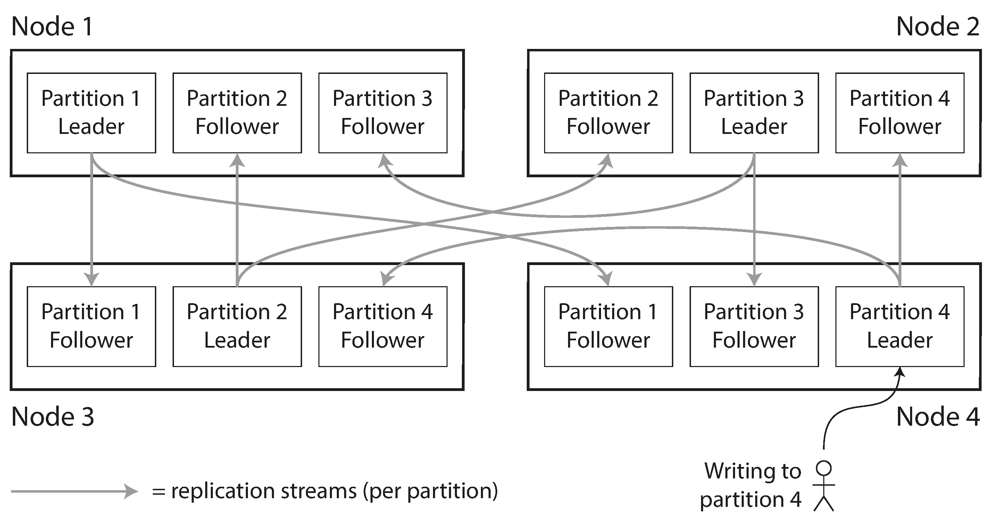
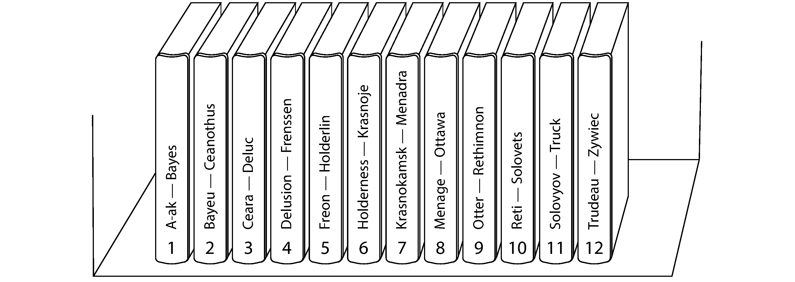
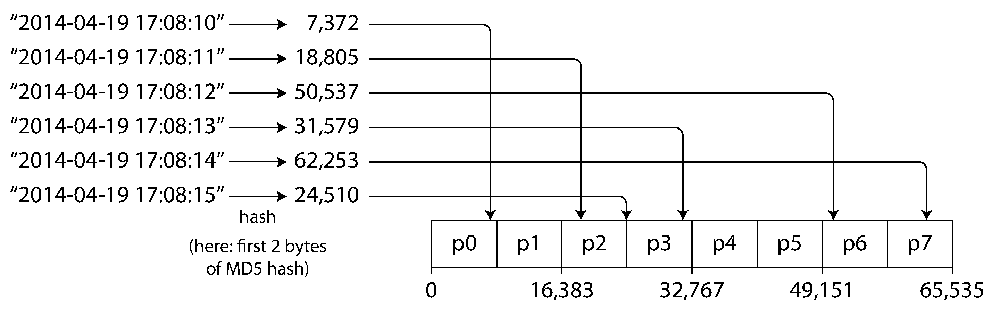
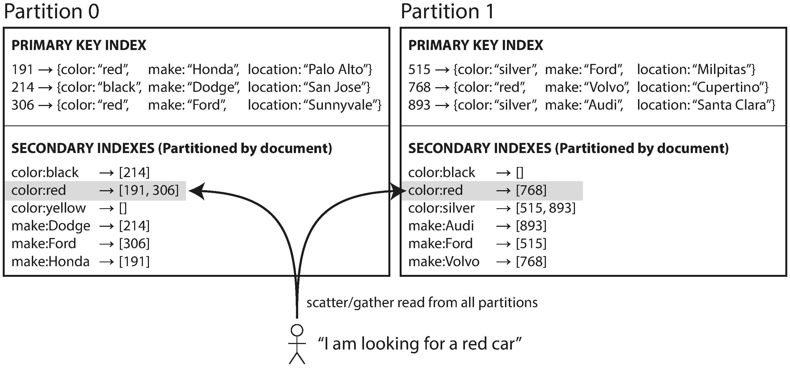
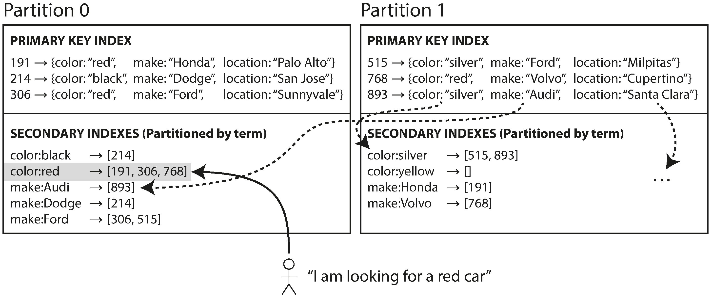
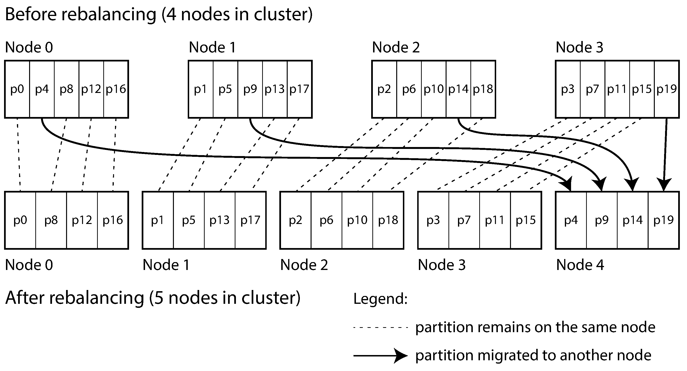
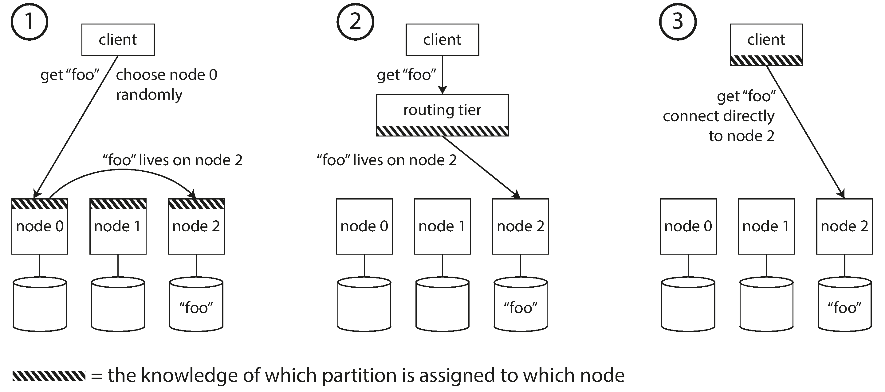
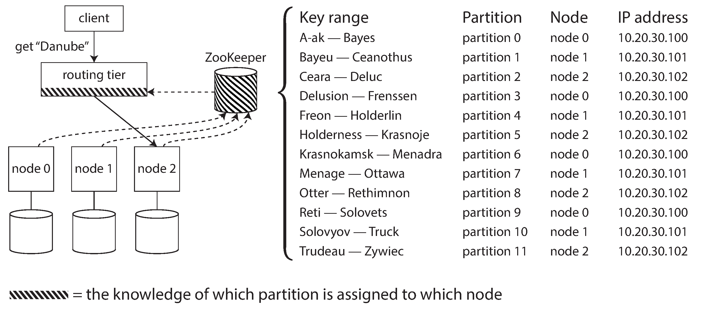

## Designing Data-Intensive Applications

### 6장. Partitioning

5장에서는 같은 data의 여러 copy를 두는 replication을 다룸

하지만 data가 너무 크거나 query throughput이 너무 높으면 replication만으로 충분하지 않음

이때 큰 dataset을 여러 작은 subset으로 나누는 partitioning이 필요함

partitioning은 MongoDB, Elasticsearch, SolrCloud에서는 shard라고 부르고, HBase에서는 region, Bigtable에서는 tablet, Cassandra와 Riak에서는 vnode, Couchbase에서는 vBucket이라고 부르기도 함

이 장에서는 가장 일반적인 표현인 partitioning을 사용함

partitioning의 기본 아이디어는 각 record, row, document가 정확히 하나의 partition에 속하도록 나누는 것임

각 partition은 작은 database처럼 동작할 수 있음

주된 목적은 scalability임

partition을 shared-nothing cluster의 여러 node에 분산하면 storage와 query load를 여러 disk와 processor로 나눌 수 있음

단일 partition만 다루는 query는 해당 partition을 가진 node가 독립적으로 처리할 수 있음

복잡한 query는 여러 partition에서 parallel하게 처리할 수도 있지만, 그만큼 어려워짐

책의 특정 database version, product 용어, 기본 설정 예시는 원문 당시 기준이므로 실제 운영 판단에는 현재 공식 문서를 확인해야 함

 

### Partitioning and Replication

partitioning은 보통 replication과 함께 사용됨

각 record는 하나의 partition에 속하지만, fault tolerance를 위해 그 partition의 copy는 여러 node에 저장될 수 있음

leader-follower replication을 사용하면 각 partition마다 leader가 있고, 다른 node에는 follower가 있을 수 있음

하나의 node는 어떤 partition의 leader이면서 동시에 다른 partition의 follower일 수 있음

 

5장에서 다룬 replication의 원리는 partition 단위에도 그대로 적용됨

partitioning scheme과 replication scheme은 대체로 독립적인 선택임

이 장에서는 설명을 단순하게 하기 위해 replication detail은 제외하고 partitioning 자체에 집중함

 

### Partitioning of Key-Value Data

partitioning의 목표는 data와 query load를 node 사이에 고르게 나누는 것임

partitioning이 불공평하면 skew가 생김

특정 partition에 data나 query가 몰리면 그 partition은 hot spot이 됨

hot spot이 생기면 cluster에 node가 많아도 일부 node만 바쁘고 나머지는 idle 상태가 될 수 있음

가장 단순한 방법은 record를 무작위 node에 배치하는 것임

하지만 그렇게 하면 특정 item을 읽을 때 어느 node에 있는지 알 수 없어 모든 node를 조회해야 함

따라서 key-value model에서는 key를 기준으로 partition을 결정하는 방식이 필요함

 

### Partitioning by Key Range

key range partitioning은 연속된 key 범위를 각 partition에 할당하는 방식임

종이 백과사전을 알파벳 범위별 volume으로 나누는 것과 비슷함

partition boundary를 알고 있으면 특정 key가 어느 partition에 있는지 알 수 있음

partition이 어느 node에 있는지도 알면 해당 node로 직접 요청할 수 있음

 

key range는 반드시 균등한 크기로 나뉘지 않음

실제 data 분포가 균등하지 않기 때문임

따라서 boundary는 data 분포에 맞춰 조정되어야 함

key range partitioning의 장점은 key를 정렬된 상태로 유지할 수 있다는 점임

그래서 range scan이 효율적임

예를 들어 timestamp 범위의 sensor reading을 가져오는 query에 잘 맞음

단점은 access pattern에 따라 hot spot이 생길 수 있다는 점임

timestamp를 key 앞부분으로 쓰면 현재 시간대의 partition에 write가 집중될 수 있음

이런 경우 sensor name 같은 값을 key 앞에 붙여 write load를 여러 partition으로 분산할 수 있음

하지만 여러 sensor의 시간 범위를 조회할 때는 sensor별 range query를 따로 수행해야 함

 

### Partitioning by Hash of Key

hash partitioning은 key에 hash function을 적용해 partition을 정하는 방식임

좋은 hash function은 skewed input을 거의 균등한 output 범위로 분산함

key가 비슷해도 hash value는 넓게 흩어질 수 있음

partitioning에 쓰는 hash는 cryptographic hash일 필요는 없음

하지만 process마다 결과가 달라질 수 있는 language built-in hash는 partitioning에 부적합할 수 있음

hash 값의 range를 partition별로 나누면 각 key가 어느 partition에 속하는지 결정할 수 있음

 

hash partitioning은 key 분포를 고르게 만들기 좋음

하지만 key의 정렬 순서를 잃어버림

따라서 primary key range query는 비효율적이거나 모든 partition에 scatter해야 할 수 있음

일부 system은 compound key로 절충함

예를 들어 Cassandra는 compound primary key의 첫 부분만 hash로 partition을 정하고, 나머지 column은 partition 내부 정렬에 사용함

이 방식은 특정 user의 update를 한 partition 안에서 timestamp 순서로 읽는 one-to-many access pattern에 유용함

 

### Skewed Workloads and Relieving Hot Spots

hash partitioning은 많은 hot spot을 줄일 수 있지만 모든 hot spot을 없애지는 못함

모든 요청이 같은 key로 몰리면 hash 결과도 같으므로 결국 같은 partition으로 감

예를 들어 유명인의 activity에 매우 많은 comment나 reaction이 몰리는 경우가 있음

이런 skewed workload는 현재 많은 data system이 자동으로 보정하지 못함

application이 직접 완화해야 하는 경우가 많음

대표적인 방법은 hot key 앞이나 뒤에 random number를 붙여 여러 key로 나누는 것임

예를 들어 2자리 random suffix를 붙이면 write를 100개 key로 나눌 수 있음

하지만 read는 100개 key를 모두 읽고 합쳐야 함

또한 모든 key에 random suffix를 붙이면 불필요한 overhead가 크므로, 실제 hot key만 추적해 적용해야 함

핵심은 hot spot 완화가 partitioning scheme만으로 끝나지 않고 workload 이해를 필요로 한다는 점임

 

### Partitioning and Secondary Indexes

primary key로만 record를 찾는다면 partition을 결정하기 쉬움

하지만 secondary index가 있으면 문제가 더 복잡해짐

secondary index는 특정 value를 가진 record를 찾는 데 사용됨

예를 들어 특정 user의 action, 특정 단어를 포함한 article, 빨간색 car listing을 찾는 query가 있음

secondary index는 relational database, document database, search server에서 매우 중요함

문제는 secondary index가 primary key처럼 partition에 깔끔하게 매핑되지 않는다는 점임

partitioned database에서 secondary index를 다루는 대표 방식은 두 가지임

- document-based partitioning
- term-based partitioning

 

### Partitioning Secondary Indexes by Document

document-partitioned index는 각 partition이 자신이 가진 document에 대해서만 secondary index를 유지하는 방식임

local index라고도 부름

예를 들어 used car listing을 document ID로 partition하고, 각 partition이 color와 make index를 따로 가질 수 있음

 

write는 단순함

document가 속한 partition 하나만 갱신하면 됨

하지만 read는 비싸질 수 있음

특정 color의 car가 어느 partition에 있을지 모르므로 모든 partition에 query를 보내고 결과를 합쳐야 함

이 방식을 scatter/gather라고 함

partition을 병렬로 조회하더라도 tail latency amplification이 생길 수 있음

그래도 write 경로가 단순하고 구현이 쉬워 많은 system에서 사용됨

secondary index query를 한 partition에서 처리할 수 있도록 partitioning scheme을 설계하면 좋지만, 여러 secondary index 조건을 동시에 쓰면 항상 가능하지는 않음

 

### Partitioning Secondary Indexes by Term

term-partitioned index는 전체 data를 대상으로 하는 global index를 만들고, 그 index 자체를 term 기준으로 partition하는 방식임

여기서 term은 `color:red` 같은 index entry를 뜻함

full-text index에서는 document에 등장하는 단어가 term이 됨

 

term 자체를 기준으로 partition하면 range scan에 유리할 수 있음

term의 hash를 기준으로 partition하면 load distribution이 더 고르게 될 수 있음

global index의 장점은 read가 효율적이라는 점임

특정 term을 가진 partition만 조회하면 되므로 모든 document partition에 scatter/gather할 필요가 없음

단점은 write가 복잡하고 느려질 수 있다는 점임

한 document의 write가 여러 secondary index term을 갱신해야 하고, 그 term들이 서로 다른 partition에 있을 수 있음

이상적으로는 document write와 index update가 즉시 일관되어야 하지만, 이를 위해서는 관련 partition 전체에 걸친 distributed transaction이 필요할 수 있음

그래서 global secondary index update는 asynchronous인 경우가 많음

write 직후 index를 읽으면 방금 쓴 변경이 아직 반영되지 않았을 수 있음

 

### Rebalancing Partitions

database는 시간이 지나며 변함

query throughput이 늘면 더 많은 CPU가 필요함

dataset이 커지면 더 많은 disk와 memory가 필요함

machine이 실패하면 다른 machine이 그 책임을 가져가야 함

이런 변화가 생기면 data와 request load를 node 사이에서 다시 옮겨야 함

이 과정을 rebalancing이라고 함

좋은 rebalancing은 최소한 다음 조건을 만족해야 함

- rebalancing 후 data storage와 read/write load가 node 사이에 고르게 분산됨
- rebalancing 중에도 database가 read와 write를 계속 처리함
- 필요 이상으로 많은 data를 옮기지 않음

 

### Strategies for Rebalancing

hash key를 node 수 `N`으로 나눈 나머지로 node를 정하는 `hash mod N` 방식은 피해야 함

node 수가 바뀌면 대부분의 key가 다른 node로 이동하기 때문임

rebalancing 비용이 지나치게 커짐

 

fixed number of partitions 방식은 node 수보다 훨씬 많은 partition을 미리 만들고, 각 node에 여러 partition을 배정함

새 node가 추가되면 기존 node에서 몇 개의 partition을 가져와 균형을 맞춤

node가 제거되면 반대로 그 node의 partition을 다른 node로 나눔

 

이 방식에서는 key가 partition에 배정되는 방식은 그대로 두고, partition이 node에 배정되는 mapping만 바뀜

따라서 이동 단위가 전체 partition이 되어 rebalancing을 단순하게 만들 수 있음

단점은 처음 정한 partition 수가 사실상 최대 확장성을 제한한다는 점임

partition이 너무 크면 이동과 recovery가 비싸고, 너무 작으면 management overhead가 커짐

 

dynamic partitioning은 partition size가 커지면 split하고, 작아지면 adjacent partition과 merge하는 방식임

key range partitioning에서는 고정 boundary가 잘못되면 한 partition에 data가 몰릴 수 있으므로 dynamic split이 특히 유용함

data volume이 작을 때는 partition 수가 적고, data volume이 커지면 partition 수가 늘어남

단점은 empty database가 처음에는 하나의 partition으로 시작할 수 있다는 점임

첫 split 전까지는 write가 한 node로 몰릴 수 있으므로 pre-splitting이 필요할 수 있음

 

partitioning proportionally to nodes 방식은 node마다 고정된 수의 partition을 두는 방식임

node가 늘어나면 partition도 함께 늘어나고, 각 partition size는 다시 작아짐

새 node는 기존 partition 일부를 split해서 그 절반을 가져감

이 방식은 hash-based partitioning과 잘 맞음

random boundary가 충분히 많으면 평균적으로 load가 공정하게 분산됨

 

### Operations: Automatic or Manual Rebalancing

rebalancing은 완전 자동일 수도 있고 완전 수동일 수도 있음

또는 system이 새 partition assignment를 제안하고 administrator가 승인하는 중간 형태일 수도 있음

automatic rebalancing은 운영 부담을 줄여줌

하지만 예측하기 어렵고, 대량 data 이동과 request rerouting으로 system에 큰 부하를 줄 수 있음

특히 automatic failure detection과 결합하면 위험할 수 있음

일시적으로 느린 node를 죽었다고 판단하고 자동 rebalancing을 시작하면, 이미 overloaded된 cluster에 더 큰 부하를 줄 수 있음

이런 경우 cascading failure로 이어질 수 있음

따라서 rebalancing은 사람이 승인하거나 속도를 제어할 수 있는 방식이 더 안전할 때가 있음

 

### Request Routing

partition을 여러 node에 나누면 client request를 어느 node로 보내야 하는지 결정해야 함

rebalancing이 일어나면 partition-to-node mapping도 바뀜

따라서 request routing은 최신 mapping을 알아야 함

이 문제는 database에만 있는 것이 아니라 service discovery 문제의 한 형태임

대표적인 routing 방식은 세 가지임

- client가 아무 node나 호출하고, 해당 node가 적절한 node로 forward함
- client가 routing tier를 호출하고, routing tier가 partition-aware load balancer처럼 적절한 node로 forward함
- client가 partition-to-node mapping을 알고 직접 해당 node로 호출함

 

핵심 문제는 routing decision을 하는 component가 partition assignment 변경을 어떻게 알 수 있느냐임

모든 참여자가 같은 mapping에 동의하지 않으면 request가 잘못된 node로 갈 수 있음

이를 위해 ZooKeeper 같은 coordination service를 사용하기도 함

각 node는 ZooKeeper에 자신을 등록하고, ZooKeeper는 partition-to-node mapping의 authoritative source 역할을 함

routing tier나 partition-aware client는 이 정보를 구독하고 변경 알림을 받을 수 있음

 

다른 방식으로는 node들끼리 gossip protocol로 cluster state를 전파하는 방식이 있음

이 방식은 외부 coordination service 의존을 줄이지만 database node의 복잡도를 높임

client가 연결할 초기 node 주소는 partition mapping보다 덜 자주 바뀌므로 DNS로 충분한 경우가 많음

 

### Parallel Query Execution

지금까지는 단일 key read/write와 secondary index scatter/gather 수준의 query를 중심으로 봄

하지만 analytics용 MPP relational database는 더 복잡한 query를 지원함

data warehouse query는 join, filtering, grouping, aggregation을 포함할 수 있음

MPP query optimizer는 query를 여러 execution stage와 partition으로 나누고, 여러 node에서 병렬로 실행함

dataset의 큰 부분을 scan하는 query는 parallel execution의 이점을 크게 받음

이 영역은 specialized topic이며, 10장에서 더 자세히 다룸

 

### Summary

partitioning은 큰 dataset을 여러 작은 subset으로 나누어 여러 machine에 분산하는 방식임

목표는 data와 query load를 고르게 나누고 hot spot을 피하는 것임

이 장의 핵심 partitioning 방식은 다음과 같음

- key range partitioning은 range query에 유리하지만 특정 key range에 load가 몰릴 수 있음
- hash partitioning은 load distribution에 유리하지만 key ordering을 잃어 range query가 어려워짐
- compound key를 사용하면 partitioning 기준과 partition 내부 정렬 기준을 분리할 수 있음

secondary index partitioning에는 두 가지 접근이 있음

- document-partitioned index는 write가 단순하지만 read가 scatter/gather가 될 수 있음
- term-partitioned index는 read가 효율적일 수 있지만 write가 여러 index partition을 갱신해야 함

rebalancing은 node 추가, node 제거, data 증가, load 변화에 맞춰 partition assignment를 바꾸는 작업임

좋은 rebalancing은 load를 고르게 나누면서도 database가 계속 read/write를 처리하고, 불필요한 data 이동을 줄여야 함

request routing은 client request를 올바른 partition의 node로 보내는 문제임

coordination service, routing tier, partition-aware client, gossip protocol 등 여러 방식이 있음

partitioned database는 각 partition이 대부분 독립적으로 동작하기 때문에 scale out이 가능함

하지만 여러 partition을 동시에 쓰는 operation은 한 partition write는 성공하고 다른 partition write는 실패하는 식의 어려운 문제를 만들 수 있음

이 문제는 이후 transaction과 distributed system 장에서 이어서 다룸
