## Designing Data-Intensive Applications

### 7장. Transactions

현실의 data system에서는 많은 일이 잘못될 수 있음

database software나 hardware가 write 중간에 실패할 수 있음

application이 여러 operation 중간에 crash할 수 있음

network interruption으로 application과 database가 끊길 수 있음

여러 client가 동시에 같은 data를 write하며 서로의 변경을 덮어쓸 수 있음

client가 부분적으로만 update된 data를 읽을 수도 있음

transaction은 이런 문제를 application이 덜 직접 다루게 해주는 abstraction임

여러 read와 write를 하나의 logical unit으로 묶고, 전체가 성공하면 commit, 실패하면 abort 또는 rollback함

transaction이 abort되면 application은 보통 retry하면 됨

핵심은 partial failure와 concurrency issue를 database가 일정 수준까지 감춰준다는 점임

하지만 transaction은 공짜가 아님

성능, availability, 구현 복잡도와 trade-off가 있음

따라서 transaction이 제공하는 safety guarantee와 isolation level의 실제 의미를 알아야 함

책의 특정 database version, isolation level 이름, product 동작 예시는 원문 당시 기준이므로 실제 운영 판단에는 현재 공식 문서를 확인해야 함

 

### The Slippery Concept of a Transaction

relational database는 오랫동안 transaction을 제공해 왔음

반면 NoSQL 흐름에서는 replication과 partitioning을 기본으로 제공하면서 transaction을 약화하거나 포기한 system도 많았음

하지만 transaction을 항상 써야 한다거나, scalability를 위해 반드시 버려야 한다는 식의 단정은 둘 다 과함

중요한 것은 transaction이 어떤 guarantee를 제공하고, 그 비용이 무엇인지 이해하는 것임

transaction의 safety guarantee는 보통 ACID로 설명됨

- Atomicity
- Consistency
- Isolation
- Durability

다만 ACID라는 말은 system마다 실제 의미가 다를 수 있음

특히 isolation은 database마다 이름과 구현이 크게 다를 수 있으므로 marketing 용어로만 믿으면 안 됨

 

### Atomicity

ACID에서 atomicity는 concurrency 문제가 아니라 failure handling에 관한 것임

여러 write 중 일부가 처리된 뒤 fault가 발생하면 transaction 전체를 abort하고 이미 수행한 write를 undo해야 함

이 guarantee가 없으면 application은 어떤 write가 반영되었고 어떤 write가 실패했는지 직접 추적해야 함

retry도 위험해짐

이미 일부 write가 반영된 상태에서 같은 작업을 다시 수행하면 duplicate나 잘못된 data가 생길 수 있기 때문임

따라서 ACID atomicity의 핵심은 all-or-nothing guarantee와 abortability임

 

### Consistency

consistency라는 단어는 여러 의미로 쓰임

- 5장의 replica consistency와 eventual consistency
- 6장의 consistent hashing
- CAP theorem에서의 linearizability
- ACID에서 application invariant가 유지되는 상태

ACID의 consistency는 database가 혼자 보장하는 성질이 아님

예를 들어 accounting system에서 debit과 credit의 합이 맞아야 한다는 invariant는 application이 정의함

database는 foreign key나 uniqueness constraint 같은 일부 invariant는 확인할 수 있음

하지만 일반적으로 어떤 data가 valid한지는 application logic이 결정함

따라서 atomicity, isolation, durability는 database의 속성에 가깝지만, ACID consistency는 application이 transaction을 올바르게 설계해야 얻을 수 있음

 

### Isolation

여러 client가 동시에 같은 record를 읽고 쓰면 race condition이 생길 수 있음

예를 들어 두 client가 counter 값을 읽고 각각 1을 더한 뒤 write하면, 실제로는 두 번 증가해야 하지만 한 번만 증가할 수 있음

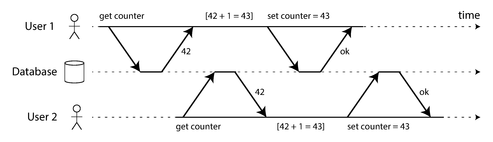
 

isolation은 concurrent transaction이 서로 간섭하지 않게 하는 guarantee임

가장 강한 형태는 serializability임

transaction들이 실제로는 동시에 실행되더라도 결과는 하나씩 순서대로 실행한 것과 같아야 함

하지만 serializable isolation은 비용이 있어서 많은 database가 더 약한 isolation level을 기본으로 사용함

이 장의 많은 내용은 약한 isolation에서 어떤 race condition이 남는지 설명함

 

### Durability

durability는 transaction이 commit된 뒤에는 hardware fault나 database crash가 있어도 write를 잃지 않는다는 약속임

single-node database에서는 보통 disk나 SSD 같은 nonvolatile storage와 write-ahead log가 필요함

replicated database에서는 여러 node에 복제되었는지가 durability 기준이 될 수 있음

하지만 perfect durability는 없음

disk, SSD, filesystem, firmware, replication, backup 모두 failure mode가 있음

asynchronous replication에서는 leader failover 중 최근 write가 사라질 수 있음

따라서 durability는 절대 보장이 아니라 risk를 줄이는 여러 기법의 조합으로 봐야 함

disk write, replication, backup은 서로 대체재라기보다 함께 써야 하는 보완 수단임

 

### Single-Object and Multi-Object Operations

atomicity와 isolation은 보통 여러 object를 함께 변경할 때 특히 중요함

예를 들어 email을 추가하면서 unread counter도 함께 증가시켜야 할 수 있음

중간 상태가 보이면 mailbox에는 unread email이 있는데 counter는 0인 이상한 상태가 될 수 있음

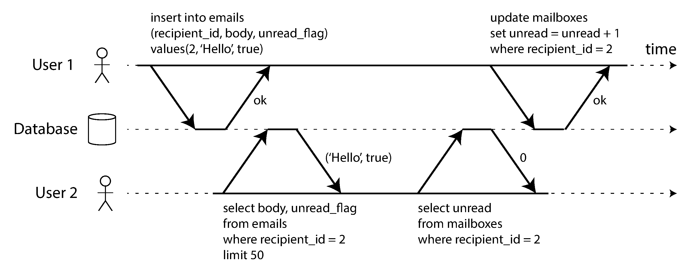
 

또한 email insert는 성공했지만 counter update가 실패하면 data가 서로 맞지 않게 됨

atomic transaction은 이 경우 전체를 abort해 이전 write를 rollback함

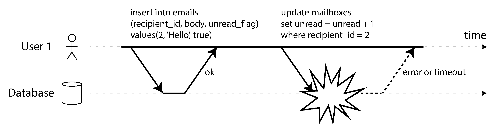
 

single object write에도 atomicity와 isolation은 필요함

예를 들어 JSON document를 쓰는 중 network가 끊기거나 power가 나가도 database가 깨진 half-written value를 저장하면 안 됨

많은 storage engine은 single object 수준의 atomicity와 isolation은 제공함

하지만 이것만으로 multi-object transaction과 같은 의미의 transaction이 되는 것은 아님

foreign key, denormalized data, secondary index처럼 여러 object를 함께 맞춰야 하는 경우에는 multi-object transaction이 유용함

transaction이 없으면 partial failure와 concurrent write를 application이 직접 복구해야 함

 

### Handling Errors and Aborts

transaction의 중요한 특징은 abort 후 retry가 가능하다는 점임

database가 atomicity, isolation, durability를 지킬 수 없다고 판단하면 half-finished 상태를 허용하지 않고 transaction을 abort함

하지만 retry도 항상 안전하지는 않음

- commit은 성공했지만 acknowledgement가 network에서 사라졌다면 retry가 duplicate effect를 만들 수 있음
- overload 상황에서 retry는 부하를 더 키울 수 있음
- permanent error는 retry해도 의미가 없음
- database 밖의 side effect는 transaction abort와 함께 자동으로 rollback되지 않음
- client process 자체가 실패하면 retry하려던 data가 사라질 수 있음

따라서 transaction abort는 retry를 쉽게 만들지만, application-level deduplication, backoff, side effect 처리도 함께 고려해야 함

 

### Weak Isolation Levels

두 transaction이 서로 다른 data만 다룬다면 parallel하게 실행해도 문제가 적음

문제는 한 transaction이 다른 transaction이 동시에 변경하는 data를 읽거나, 둘이 같은 data를 동시에 write할 때 생김

concurrency bug는 timing이 맞아야 드러나므로 test로 찾기 어렵고 재현도 어려움

database는 isolation으로 이런 문제를 숨기려 하지만, 실제 system은 성능 때문에 weaker isolation level을 많이 사용함

약한 isolation level은 일부 anomaly만 막고 나머지는 application이 감수해야 함

따라서 database가 ACID라고 말해도 어떤 isolation level에서 어떤 anomaly를 막는지 확인해야 함

 

### Read Committed

read committed는 가장 기본적인 transaction isolation level 중 하나임

두 가지를 보장함

- committed data만 읽음
- committed data만 overwrite함

첫 번째는 dirty read를 막는다는 뜻임

transaction이 아직 commit하지 않은 write는 다른 transaction에게 보이면 안 됨

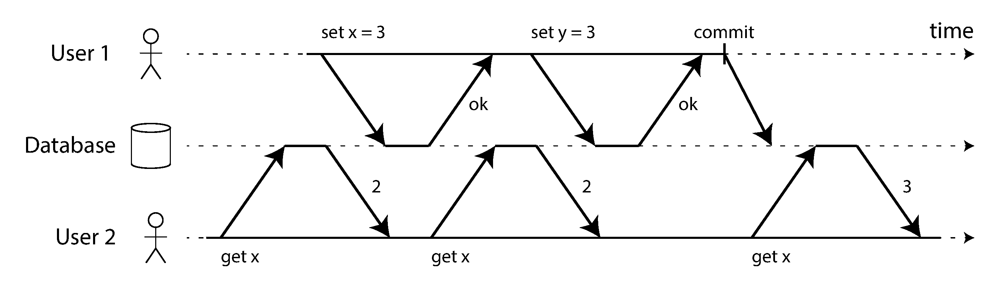
 

dirty read를 허용하면 다른 transaction이 나중에 rollback될 data를 보고 decision을 내릴 수 있음

또한 여러 object를 update하는 transaction의 중간 상태를 다른 client가 볼 수 있음

 

두 번째는 dirty write를 막는다는 뜻임

한 transaction이 아직 commit하지 않은 value를 다른 transaction이 덮어쓰면 안 됨

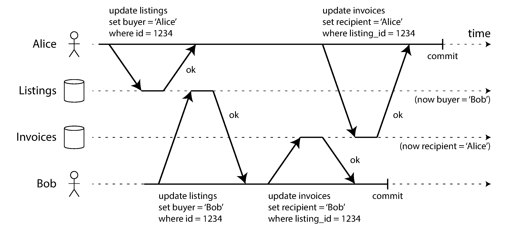
 

read committed는 보통 row-level lock으로 dirty write를 막음

dirty read는 old committed value와 new uncommitted value를 함께 보관해 막는 경우가 많음

write transaction이 진행 중일 때 다른 reader에게는 old committed value를 보여주고, commit 후에만 new value를 보여줌

하지만 read committed는 모든 race condition을 막지 않음

counter lost update 같은 문제는 여전히 생길 수 있음

 

### Snapshot Isolation and Repeatable Read

read committed에서는 한 transaction 안의 여러 read가 서로 다른 시점의 database를 볼 수 있음

이 때문에 read skew 또는 nonrepeatable read가 생길 수 있음

예를 들어 Alice가 두 account balance를 읽는 동안 다른 transaction이 한 account에서 다른 account로 돈을 옮기면, Alice는 총액이 사라진 것처럼 볼 수 있음

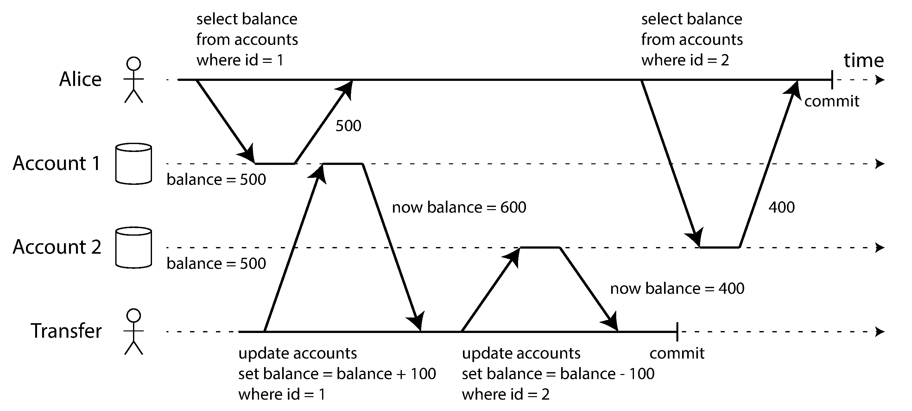
 

일시적인 UI 문제로 끝날 수도 있지만 backup, analytics query, integrity check에서는 큰 문제가 됨

backup이 몇 시간 동안 실행되는 동안 database가 계속 변하면 backup 내부의 일부 data는 과거, 일부 data는 현재를 반영할 수 있음

snapshot isolation은 transaction이 시작된 시점의 consistent snapshot을 보게 함

transaction 중간에 다른 write가 commit되어도 해당 transaction의 read는 같은 snapshot을 유지함

이 방식은 long-running read-only query에 특히 유용함

 

### Implementing Snapshot Isolation

snapshot isolation은 보통 multi-version concurrency control, 즉 MVCC로 구현됨

database는 object의 여러 committed version을 동시에 유지함

reader는 lock을 잡지 않고 자신이 볼 수 있는 version을 읽음

writer도 reader를 block하지 않음

핵심 원칙은 readers never block writers, writers never block readers임

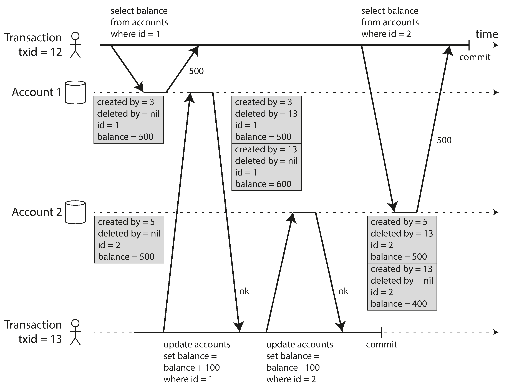
 

각 row에는 보통 생성한 transaction ID와 삭제한 transaction ID 같은 metadata가 붙음

update는 내부적으로 old row를 delete 표시하고 new row를 create하는 방식으로 표현될 수 있음

transaction은 자신이 시작된 시점에 이미 commit된 version만 볼 수 있음

aborted transaction의 write, 나중에 시작한 transaction의 write, 시작 시점에 아직 commit되지 않은 write는 보이지 않음

오래 실행되는 transaction은 오래된 snapshot을 계속 읽을 수 있음

이를 위해 database는 old version을 당장 지우지 않고, 더 이상 필요한 transaction이 없을 때 garbage collection함

 

### Repeatable Read Naming Confusion

snapshot isolation은 database마다 다른 이름으로 제공됨

PostgreSQL과 MySQL은 repeatable read라고 부르고, Oracle은 serializable이라는 이름으로 더 약한 snapshot isolation을 제공함

SQL standard의 isolation level 정의는 모호하고 구현 독립적이지 않음

따라서 repeatable read라는 이름만 보고 같은 guarantee를 기대하면 안 됨

실제 isolation behavior는 각 database 문서와 실험으로 확인해야 함

 

### Preventing Lost Updates

lost update는 두 transaction이 같은 값을 읽고 각각 수정한 뒤 write하면서 한쪽 변경이 사라지는 문제임

read-modify-write cycle에서 자주 발생함

대표적인 예는 counter increment, account balance update, JSON document 수정, wiki page 동시 편집임

이를 막는 방법은 여러 가지임

첫째, atomic write operation을 사용함

counter increment처럼 database가 제공하는 atomic update로 표현할 수 있으면 application에서 read-modify-write를 직접 구현하지 않는 것이 좋음

둘째, explicit lock을 사용함

`SELECT FOR UPDATE`처럼 수정할 row를 먼저 lock하고 application logic을 수행하면 같은 object에 대한 concurrent update를 막을 수 있음

셋째, database가 lost update를 자동 감지하고 transaction을 abort하게 할 수 있음

일부 snapshot isolation 구현은 lost update를 감지하지만, 모든 database가 그런 것은 아님

넷째, compare-and-set을 사용할 수 있음

마지막으로 읽은 값이 그대로일 때만 update를 수행하고, 값이 바뀌었다면 retry하는 방식임

하지만 compare-and-set도 database가 stale snapshot으로 condition을 평가하면 안전하지 않을 수 있음

replicated database에서는 더 복잡함

multi-leader나 leaderless replication은 여러 replica에서 concurrent write를 허용하므로 single up-to-date copy를 가정한 lock이나 compare-and-set이 잘 맞지 않음

이 경우 conflicting versions를 sibling으로 남기고 application이나 data structure가 merge하는 방식이 필요할 수 있음

last write wins는 단순하지만 lost update를 만들 수 있음

 

### Write Skew and Phantoms

write skew는 두 transaction이 같은 data를 읽고 서로 다른 object를 update하면서 invariant를 깨뜨리는 문제임

doctor on-call 예시에서는 Alice와 Bob이 모두 현재 on-call doctor가 2명이라고 읽고, 각각 자신을 off-call로 바꿈

두 transaction은 서로 다른 row를 update하므로 dirty write나 lost update가 아님

하지만 결과적으로 on-call doctor가 0명이 되어 invariant가 깨짐

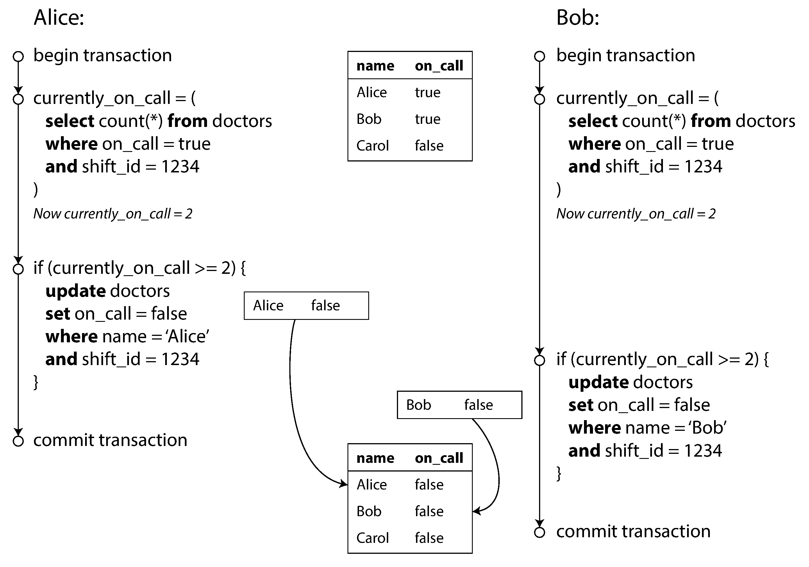
 

write skew는 lost update의 일반화로 볼 수 있음

두 transaction이 같은 object를 update하면 lost update가 되고, 서로 다른 object를 update해도 같은 predicate에 의존하면 write skew가 될 수 있음

atomic single-object operation으로는 해결되지 않음

snapshot isolation의 lost update detection도 보통 write skew를 막지 못함

true serializable isolation이 가장 직접적인 해결책임

serializable isolation을 사용할 수 없다면 관련 row를 명시적으로 lock해야 할 수 있음

하지만 meeting room booking처럼 아직 존재하지 않는 row의 absence를 확인하는 경우에는 `SELECT FOR UPDATE`로 lock할 row가 없음

이때 한 transaction의 write가 다른 transaction의 search query 결과를 바꾸는 현상을 phantom이라고 함

phantom은 write skew를 더 까다롭게 만듦

materializing conflicts는 phantom을 concrete lock row로 바꾸는 우회 방법임

예를 들어 room-time slot row를 미리 만들어두고 booking 전 해당 slot row를 lock할 수 있음

하지만 concurrency control을 application data model에 새겨 넣는 방식이라 복잡하고 error-prone하므로 last resort에 가까움

 

### Serializability

serializable isolation은 가장 강한 isolation level로 간주됨

transaction이 실제로는 concurrent하게 실행되더라도 결과는 어떤 serial order로 실행한 것과 같아야 함

application이 transaction을 하나씩 실행했을 때 올바르다면, serializable isolation에서는 concurrent하게 실행해도 올바름

serializability를 구현하는 대표 방식은 세 가지임

- actual serial execution
- two-phase locking
- serializable snapshot isolation

 

### Actual Serial Execution

가장 단순한 방법은 transaction을 실제로 하나씩 serial order로 실행하는 것임

concurrency를 없애면 conflict detection도 필요 없음

이 방식은 active dataset이 memory에 들어가고, OLTP transaction이 짧을 때 현실적인 선택이 될 수 있음

하지만 interactive transaction과는 맞지 않음

application과 database가 query와 response를 여러 번 주고받으면 database가 network I/O를 기다리는 시간이 너무 커짐

그래서 serial execution system은 보통 전체 transaction logic을 stored procedure로 database에 미리 보냄

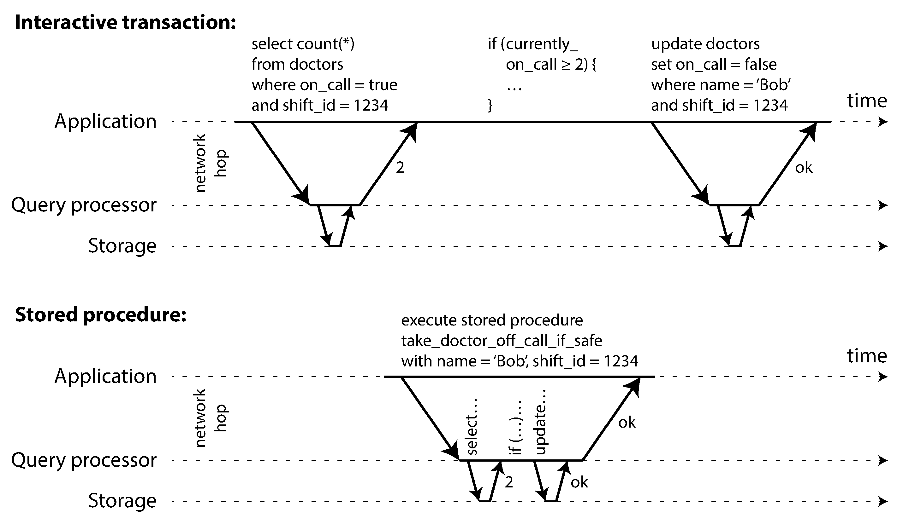
 

stored procedure는 debug, version control, deploy, monitoring이 어려울 수 있음

하지만 modern system은 Java, Clojure, Lua 같은 general-purpose language를 사용해 이 문제를 줄이기도 함

serial execution은 single thread throughput에 제한됨

partitioning으로 각 partition마다 독립 transaction thread를 둘 수 있지만, transaction이 여러 partition을 건드리면 coordination이 필요하고 성능이 크게 떨어질 수 있음

따라서 serial execution은 다음 조건에서 잘 맞음

- transaction이 작고 빠름
- active dataset이 memory에 들어감
- write throughput이 단일 core 또는 독립 partition으로 감당 가능함
- cross-partition transaction 비율이 낮음

 

### Two-Phase Locking

two-phase locking, 2PL은 오랫동안 serializability를 구현하는 대표 방식이었음

2PL은 two-phase commit, 2PC와 다른 개념임

2PL에서는 reader와 writer가 서로 block할 수 있음

transaction이 object를 읽으려면 shared lock이 필요하고, write하려면 exclusive lock이 필요함

shared lock은 여러 transaction이 동시에 가질 수 있지만, exclusive lock은 혼자만 가질 수 있음

transaction은 획득한 lock을 commit 또는 abort까지 유지함

그래서 transaction 실행 중에는 lock을 얻는 phase가 있고, 끝날 때 lock을 release하는 phase가 있음

2PL은 lost update, write skew, phantom 같은 race condition을 막을 수 있음

하지만 성능 비용이 큼

reader와 writer가 서로 block하므로 latency가 불안정해질 수 있음

하나의 느린 transaction이나 많은 lock을 잡는 transaction이 전체 system을 밀리게 할 수 있음

deadlock도 자주 발생할 수 있고, database는 deadlock을 감지하면 transaction 하나를 abort해야 함

 

### Predicate Locks and Index-Range Locks

serializable isolation은 phantom도 막아야 함

이를 개념적으로 해결하는 방법은 predicate lock임

predicate lock은 특정 row 하나가 아니라 search condition에 matching되는 모든 object에 적용됨

심지어 아직 존재하지 않지만 나중에 추가될 수 있는 row에도 적용되어야 함

하지만 predicate lock은 많은 lock을 검사해야 하므로 성능이 좋지 않음

그래서 실제 database는 보통 index-range lock을 사용함

index-range lock은 predicate를 더 넓은 index range로 근사해 lock을 거는 방식임

정확도는 떨어질 수 있지만 안전함

필요 이상으로 넓게 lock할 수는 있어도, serializability를 깨뜨리는 write를 놓치지 않기 때문임

적절한 index가 없다면 table 전체 lock으로 fallback할 수 있음

성능은 좋지 않지만 safe한 선택임

 

### Serializable Snapshot Isolation

serializable snapshot isolation, SSI는 snapshot isolation의 성능 장점을 유지하면서 serializability를 제공하려는 optimistic concurrency control 방식임

2PL은 위험할 가능성이 있으면 먼저 block하는 pessimistic 방식임

SSI는 transaction을 일단 계속 실행하게 두고, commit 시점에 serializability가 깨졌는지 검사함

문제가 있으면 transaction을 abort하고 retry하게 함

SSI는 snapshot isolation 위에서 동작함

transaction은 consistent snapshot을 읽고, database는 serialization conflict를 감지함

핵심은 transaction이 outdated premise를 기반으로 decision을 내렸는지 확인하는 것임

write skew는 보통 transaction이 어떤 data를 읽고 그 결과를 premise로 삼아 write할 때 발생함

commit 시점에 그 premise가 더 이상 참이 아니라면 transaction을 abort해야 함

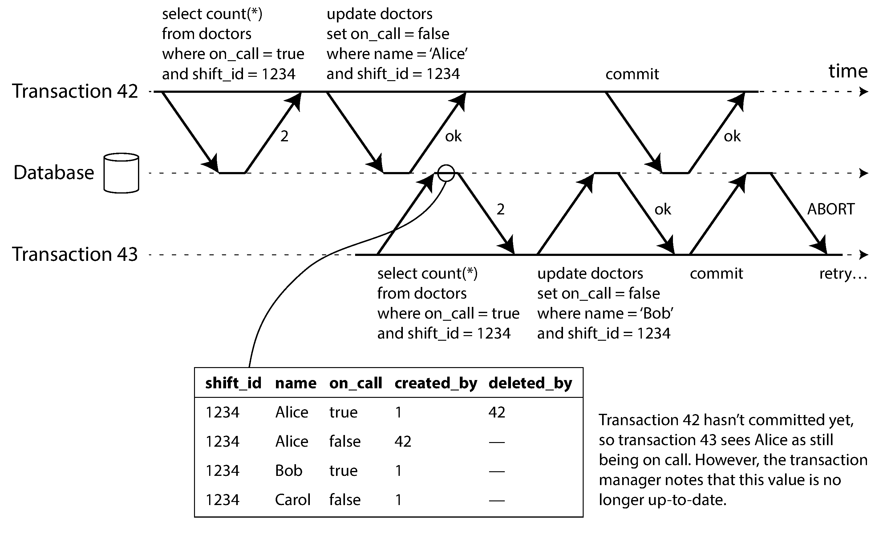
 

첫 번째 감지 대상은 stale MVCC read임

transaction이 snapshot을 읽는 동안 다른 transaction의 uncommitted write를 무시했는데, commit 시점에는 그 write가 commit되어 있을 수 있음

이 경우 읽었던 premise가 outdated되었을 수 있음

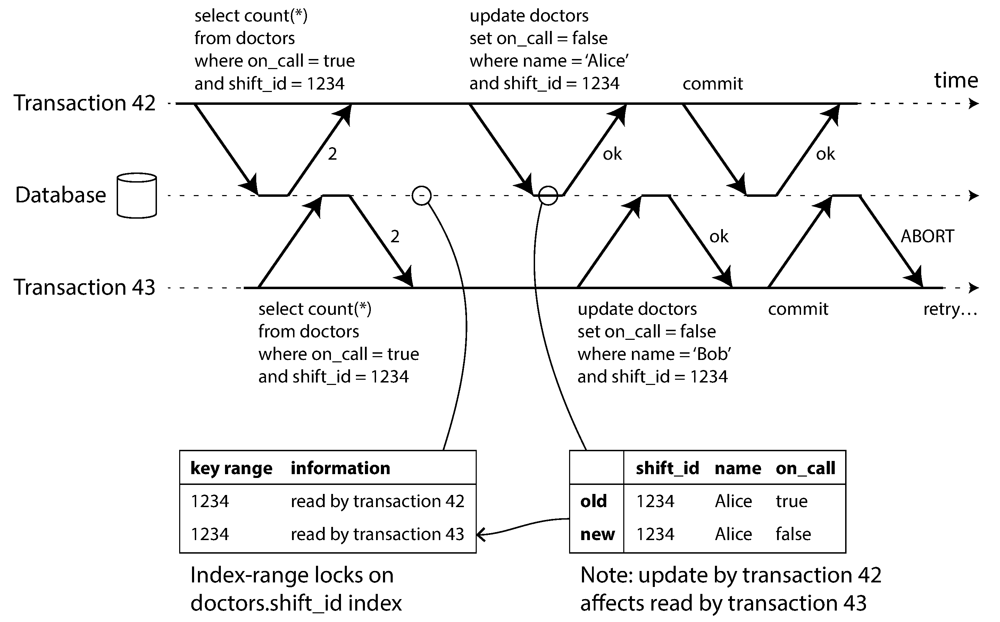
 

두 번째 감지 대상은 prior read에 영향을 주는 later write임

database는 어떤 transaction이 어떤 index range를 읽었는지 기록해두고, 다른 transaction이 그 range에 write할 때 conflict 가능성을 표시함

SSI의 장점은 reader와 writer가 서로 block하지 않는다는 점임

따라서 query latency가 2PL보다 예측 가능할 수 있음

또한 serial execution처럼 단일 CPU core throughput에만 묶이지 않을 수 있음

단점은 abort rate가 성능에 큰 영향을 준다는 점임

contention이 높거나 read-write transaction이 오래 실행되면 retry 비용이 커질 수 있음

 

### Summary

transaction은 application이 일부 concurrency problem과 fault를 직접 다루지 않아도 되게 해주는 abstraction임

많은 복잡한 failure case를 transaction abort와 retry라는 단순한 형태로 줄여줌

하지만 모든 application이 transaction을 같은 수준으로 필요로 하지는 않음

single record만 읽고 쓰는 단순한 pattern은 transaction 없이도 충분할 수 있음

반면 여러 object, denormalized data, secondary index, invariant를 함께 다루는 application은 transaction이 없으면 reasoning이 어려워짐

이 장에서 다룬 주요 anomaly는 다음과 같음

- dirty reads: commit되지 않은 write를 읽음
- dirty writes: commit되지 않은 write를 다른 transaction이 덮어씀
- read skew: 한 transaction이 database의 서로 다른 부분을 서로 다른 시점으로 봄
- lost updates: concurrent read-modify-write 중 한쪽 변경이 사라짐
- write skew: 같은 premise를 읽고 서로 다른 object를 update해 invariant가 깨짐
- phantom reads: search condition의 결과가 다른 transaction의 write로 바뀜

weak isolation level은 일부 anomaly만 막음

serializable isolation은 가장 강한 guarantee를 제공하지만 구현 방식에 따라 성능과 확장성 trade-off가 있음

actual serial execution은 단순하지만 transaction이 작고 빠르며 memory-resident workload에 잘 맞음

2PL은 강한 isolation을 제공하지만 blocking과 deadlock, latency 문제가 있음

SSI는 optimistic하게 실행하고 commit 시 conflict를 감지해 abort하는 방식으로, serializability와 성능 사이의 현실적인 절충을 제공함
