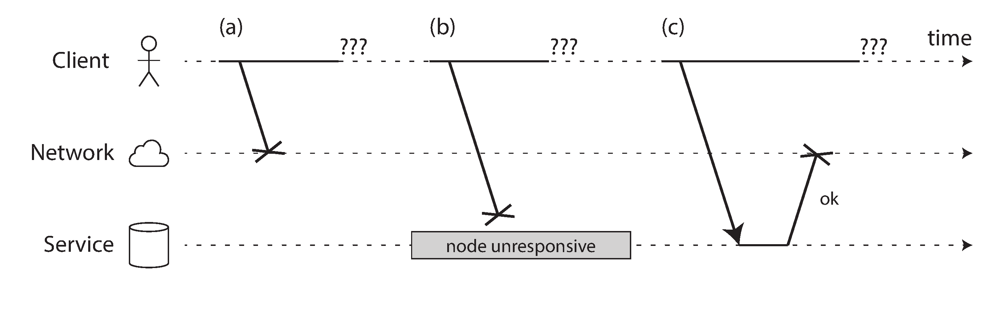
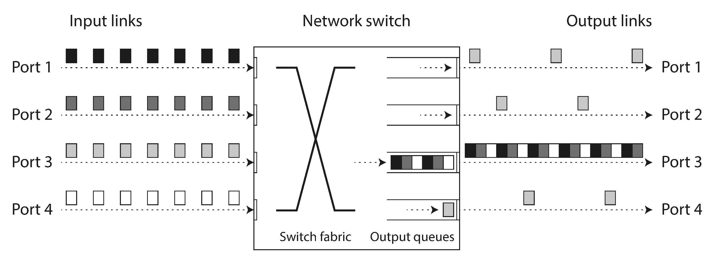
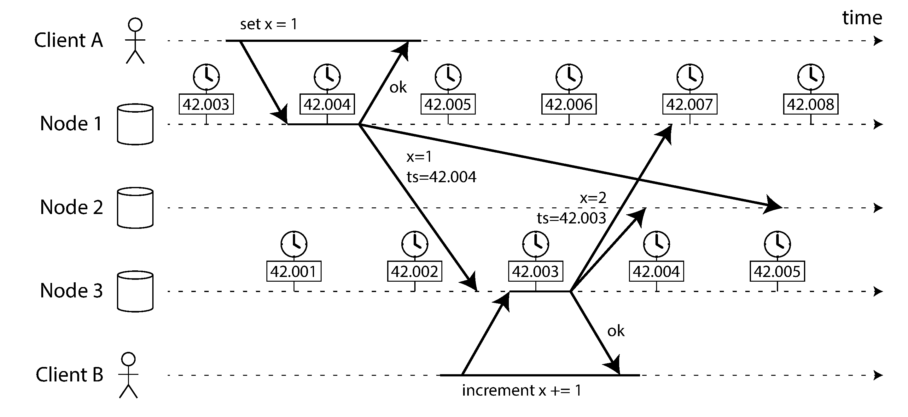
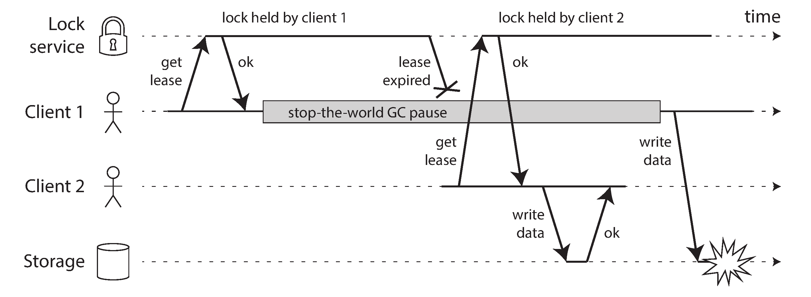
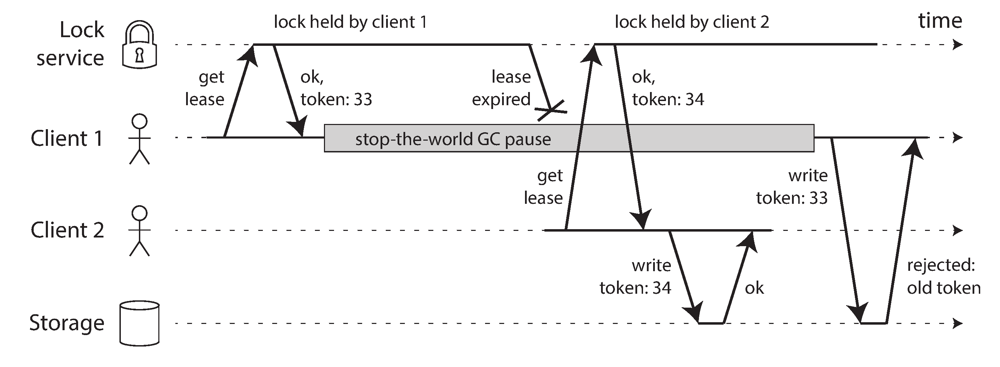

## Designing Data-Intensive Applications

### 8장. The Trouble with Distributed Systems

분산 시스템은 단일 장비보다 더 이상한 방식으로 실패함

한 node는 정상처럼 보이지만 다른 node와 통신하지 못할 수 있음

request는 처리되었지만 response만 사라질 수 있음

clock은 서로 맞지 않을 수 있고, process는 예고 없이 멈출 수 있음

이 장의 핵심은 distributed system에서 무엇을 믿을 수 있고, 무엇을 믿으면 안 되는지 구분하는 것임

신뢰할 수 없는 network, clock, process 위에서 더 신뢰할 수 있는 system을 만들려면 failure를 명시적으로 다뤄야 함

책의 product 예시와 clock 동기화 관련 세부 수치는 원문 당시 기준이므로 실제 운영 판단에는 현재 공식 문서를 확인해야 함

 

### Faults and Partial Failures

단일 computer에서는 보통 system이 동작하거나 동작하지 않는 식으로 보임

하지만 distributed system에서는 partial failure가 흔함

일부 node는 정상이고, 일부 node는 느리거나 죽었거나 network에서 분리될 수 있음

문제는 이런 failure가 deterministic하지 않다는 점임

같은 operation도 어떤 시점에는 성공하고 어떤 시점에는 실패할 수 있음

따라서 distributed system에서는 failure가 드문 예외라고 가정하면 안 됨

failure가 생겨도 system이 어떤 상태가 되는지 설계해야 함

reliable system은 unreliable component 위에서도 만들 수 있지만, 그 전제는 failure를 감지하고 견디는 logic이 있다는 것임

 

### Cloud Computing and Supercomputing

supercomputer는 많은 장비가 함께 계산하고, 한 부분이 실패하면 전체 job을 중단하는 방식이 자연스러울 수 있음

반면 internet service나 cloud 환경의 data system은 계속 online이어야 함

node가 실패해도 전체 system을 멈추기 어렵고, commodity hardware와 shared network를 사용하는 경우가 많음

따라서 failure를 완전히 없애려 하기보다 failure가 있어도 service를 유지하는 방향으로 설계해야 함

큰 system일수록 component 수가 많아지고, component가 많을수록 항상 어딘가는 고장날 가능성이 커짐

 

### Unreliable Networks

shared-nothing distributed system은 node 사이 통신을 message에 의존함

대부분의 system은 asynchronous packet network 위에서 동작함

이 network는 message가 언제 도착하는지, 도착하기는 하는지 보장하지 않음

request를 보냈는데 response가 없으면 원인은 여러 가지일 수 있음

- request가 network에서 사라짐
- request가 queue에서 오래 지연됨
- remote node가 죽음
- remote node가 잠시 멈춤
- remote node가 request를 처리했지만 response가 사라짐
- response가 도착했지만 너무 늦게 도착함

sender 입장에서는 이 차이를 직접 구분할 수 없음

알 수 있는 것은 일정 시간 안에 response를 받지 못했다는 사실뿐임

 

### Network Faults in Practice

network fault는 datacenter 안에서도 발생함

switch, cable, network interface, routing, firewall, load balancer, kernel queue 등 다양한 지점에서 문제가 생길 수 있음

따라서 software는 network가 항상 정상이라고 가정하면 안 됨

fault가 발생했을 때 사용자가 error를 볼 수는 있음

하지만 fault가 사라졌을 때 system이 복구되지 않거나 data가 깨지는 것은 별개의 문제임

운영에서는 network fault를 주입해 실제 동작을 확인하는 것이 중요함

문서상 retry가 있다고 해서 전체 workflow가 안전하다고 볼 수는 없음

 

### Detecting Faults

distributed system은 failed node를 감지해야 할 때가 많음

예를 들어 load balancer는 죽은 node로 traffic을 보내지 않아야 함

leader가 죽으면 다른 node가 leader가 되어야 함

하지만 node가 정말 죽었는지 확실히 아는 것은 어려움

TCP connection close, ICMP error, management interface 같은 signal은 도움이 될 수 있음

그러나 이런 signal이 항상 오지는 않음

operation이 성공했는지 확실히 알려면 application-level response가 필요함

보통은 retry를 몇 번 수행한 뒤 timeout을 기준으로 node를 dead로 간주함

그래도 실제로는 node가 죽은 것이 아니라 느린 것일 수 있음

 

### Timeouts and Unbounded Delays

timeout은 failure detection의 핵심 도구임

하지만 timeout 값은 trade-off임

너무 길면 진짜 failure를 늦게 감지함

너무 짧으면 살아 있는 node를 죽었다고 오해함

이 오해는 불필요한 failover, duplicated work, 부하 증가로 이어질 수 있음

network delay와 processing time의 maximum을 안다면 timeout을 계산할 수 있음

하지만 일반적인 packet network에서는 delay에 엄격한 upper bound가 없음

 

### Network Congestion and Queueing

packet은 switch queue, operating system queue, TCP 재전송, virtualization layer, disk I/O, CPU scheduling 때문에 지연될 수 있음

 

실무에서는 latency distribution을 측정해 timeout을 정함

고정된 정답은 없고, system의 workload와 network 상태에 따라 달라짐

adaptive timeout이나 failure detector를 사용할 수 있지만, 불확실성이 사라지는 것은 아님

 

### Synchronous Versus Asynchronous Networks

telephone network는 circuit-switched 방식에 가까움

통화가 연결되면 일정한 bandwidth가 예약되고 delay도 비교적 bounded 됨

반면 internet과 datacenter network는 packet-switched 방식임

packet-switched network는 bandwidth를 동적으로 공유함

bursty traffic에는 효율적이지만, queueing과 variable delay가 생김

QoS나 admission control이 있는 network에서는 일부 guarantee를 줄 수 있음

하지만 일반적인 distributed data system은 그런 hard guarantee에 의존하기 어려움

따라서 network가 synchronous하다고 가정하고 정확한 timeout 값을 계산하는 방식은 현실과 맞지 않음

 

### Unreliable Clocks

distributed system에서는 각 machine이 자기 clock을 가지고 있음

clock은 duration을 재거나, 특정 event의 wall-clock time을 기록하는 데 쓰임

문제는 machine마다 clock이 조금씩 다르게 움직인다는 점임

NTP 같은 protocol은 clock을 맞추려 하지만 완벽하게 맞추지는 못함

clock drift, network delay, leap second, hardware 문제, VM pause 때문에 clock은 계속 어긋날 수 있음

 

### Monotonic Versus Time-of-Day Clocks

clock은 크게 두 종류로 나누어 생각해야 함

time-of-day clock은 현재 날짜와 시간을 나타냄

이 clock은 NTP나 수동 조정 때문에 앞으로 또는 뒤로 jump할 수 있음

따라서 elapsed time 측정에는 적합하지 않음

monotonic clock은 항상 앞으로만 진행함

timeout이나 duration 측정에는 monotonic clock을 사용해야 함

다만 monotonic clock의 절대값은 machine 사이에서 의미가 없음

서로 다른 machine의 monotonic clock 값을 직접 비교하면 안 됨

 

### Clock Synchronization and Accuracy

clock synchronization은 여러 이유로 정확하지 않을 수 있음

- quartz clock의 drift
- NTP server와의 network delay
- NTP server 자체의 문제
- leap second 처리
- VM이나 process pause
- hardware clock 오작동

clock이 correctness에 중요하다면 offset을 monitoring해야 함

허용 범위를 벗어난 node는 traffic이나 quorum에서 제외하는 방식이 필요할 수 있음

clock을 맞춘다고 해서 clock이 완전히 신뢰 가능해지는 것은 아님

 

### Relying on Synchronized Clocks

clock은 사용하기 쉬워 보이지만 correctness의 근거로 삼기 위험함

특히 timestamp ordering은 clock skew에 취약함

 

### Timestamps for Ordering Events

multi-leader나 leaderless database에서 last write wins를 physical timestamp로 구현하면 data loss가 조용히 발생할 수 있음

나중에 발생한 write가 더 오래된 timestamp를 받을 수도 있고, 먼저 발생한 write가 더 최신 timestamp를 받을 수도 있음

 

event ordering이 필요하다면 physical clock보다 logical clock이 더 적합한 경우가 많음

logical clock은 실제 시간이 아니라 event 사이의 causality를 표현함

version vector 같은 방식은 어떤 write가 어떤 write를 알고 있었는지 판단하는 데 유용함

 

### Clock Readings Have a Confidence Interval

physical clock을 써야 한다면 clock reading을 point value가 아니라 uncertainty를 가진 값으로 봐야 함

책의 Spanner와 TrueTime 예시는 clock uncertainty를 API로 드러내고 commit wait로 interval overlap을 피하는 접근을 설명함

이런 방식은 tight clock synchronization과 운영 전제가 함께 필요함

 

### Synchronized Clocks for Global Snapshots

snapshot isolation을 여러 datacenter에 걸쳐 제공하려면 transaction ordering이 필요함

단일 counter로 transaction ID를 만들면 causality를 표현하기 쉽지만 distributed system에서는 bottleneck이 될 수 있음

timestamp를 transaction ID처럼 쓰면 coordination을 줄일 수 있음

하지만 이 방식은 clock uncertainty를 제대로 다룰 때만 안전함

clock skew를 무시하고 timestamp만 믿으면 snapshot의 일관성이 깨질 수 있음

 

### Process Pauses

network와 clock만 문제가 되는 것은 아님

process 자체도 예고 없이 멈출 수 있음

대표적인 원인은 stop-the-world GC pause임

그 밖에도 VM suspend, OS scheduling, page fault, disk I/O, signal, hypervisor pause가 process를 오래 멈출 수 있음

문제는 pause 중인 process가 자신이 멈췄다는 사실을 모른다는 점임

pause가 끝난 뒤에도 자신이 여전히 lease나 lock을 가지고 있다고 믿을 수 있음

하지만 그 사이 lease가 만료되고 다른 client가 lock을 얻었을 수 있음

 

이 상황에서는 old leader나 old lock holder가 다시 write를 수행하며 data를 망가뜨릴 수 있음

해결책은 fencing token임

lock service가 lock을 줄 때마다 단조 증가하는 token을 함께 발급함

storage system은 더 오래된 token을 가진 write를 거부함

 

핵심은 client가 lock을 가지고 있다고 주장하는 말만 믿지 않는 것임

resource 자체가 token을 확인해야 stale client를 막을 수 있음

 

### Response Time Guarantees

hard real-time system은 deadline을 반드시 지켜야 함

deadline을 넘기면 전체 system failure로 볼 수 있음

하지만 일반적인 database와 distributed data system은 hard real-time system이 아님

real-time scheduling, bounded GC, memory allocation 제한 같은 기법은 가능하지만 비용이 크고 programming model도 제한됨

대부분의 data system은 pause를 완전히 없애기보다 pause가 생겨도 correctness가 깨지지 않게 설계해야 함

 

### Limiting the Impact of Garbage Collection

GC pause의 영향을 줄이는 실용적인 방법도 있음

node가 큰 GC pause에 들어가기 전에 traffic을 다른 node로 넘기면 일시적인 node outage처럼 처리할 수 있음

또는 heap이 너무 커지기 전에 process를 재시작하는 방식도 가능함

하지만 이런 방법은 latency를 줄이는 운영 기법이지 correctness의 대체재는 아님

pause가 발생해도 stale leader나 stale lock holder가 damage를 만들지 못하게 해야 함

 

### Knowledge, Truth, and Lies

distributed system에서 한 node는 global truth를 직접 알 수 없음

node가 알 수 있는 것은 자신이 받은 message와 자신의 clock, timeout 결과뿐임

따라서 어떤 node가 스스로 정상이라고 믿는 것과 실제로 system이 그 node를 정상으로 인정하는 것은 다름

이 차이를 다루기 위해 quorum과 majority가 중요함

 

### The Truth Is Defined by the Majority

distributed system에서는 하나의 node 판단보다 majority 판단을 더 신뢰함

majority는 split brain을 막는 데 중요함

두 group이 동시에 leader를 선출하려 해도, 과반수를 얻을 수 있는 group은 하나뿐임

따라서 old leader가 자신이 leader라고 믿더라도 majority가 새 leader를 인정하면 old leader는 더 이상 system의 truth가 아님

이 원리는 consensus, leader election, quorum read/write의 기반이 됨

 

### The Leader and the Lock

lease 기반 lock은 편리하지만 시간에 의존함

process pause나 network delay가 있으면 client는 자신이 lock을 가지고 있다고 잘못 믿을 수 있음

lock service만 올바르게 동작해도 충분하지 않음

lock으로 보호되는 resource가 stale holder를 거부해야 함

fencing token은 이 문제를 단순하게 해결하는 방법임

token은 lock 획득 순서를 나타내고, resource는 더 작은 token의 요청을 거부함

 

### Byzantine Faults

지금까지의 논의는 node가 crash하거나 느려지거나 message를 잃는 상황을 주로 가정함

Byzantine fault는 node가 거짓말을 하거나 임의의 잘못된 message를 보내는 경우임

대부분의 datacenter system은 Byzantine fault를 기본 가정으로 두지 않음

모든 node가 같은 조직의 control 아래 있고, malicious behavior보다 crash나 network fault가 더 흔하기 때문임

Byzantine fault tolerance는 서로 신뢰하지 않는 participant가 있거나 adversarial environment에서 중요함

하지만 비용과 복잡도가 큼

 

### Weak Forms of Lying

일반적인 system에서도 약한 형태의 잘못된 동작은 대비해야 함

checksum, input validation, authentication, authorization은 여전히 필요함

 

### System Model and Reality

distributed algorithm은 특정 system model 위에서 증명됨

timing assumption은 보통 다음처럼 나뉨

- synchronous model은 message delay와 process pause에 bounded limit이 있다고 가정함
- partially synchronous model은 대부분 비동기적이지만 언젠가는 timing bound가 성립한다고 가정함
- asynchronous model은 timing에 어떤 bound도 두지 않음

node failure assumption도 구분해야 함

- crash-stop은 node가 죽으면 돌아오지 않는다고 가정함
- crash-recovery는 node가 죽었다가 stable storage를 바탕으로 돌아올 수 있다고 가정함
- Byzantine은 node가 임의로 잘못된 행동을 할 수 있다고 가정함

 

### Correctness of an Algorithm

algorithm의 correctness는 보통 safety와 liveness로 나눠 설명함

 

### Safety and Liveness

safety는 나쁜 일이 절대 발생하지 않는다는 성질임

liveness는 좋은 일이 언젠가 발생한다는 성질임

distributed system에서는 safety가 특히 중요함

일시적으로 progress가 멈추는 것은 복구할 수 있지만, 잘못된 commit이나 split brain으로 data가 깨지는 것은 되돌리기 어렵기 때문임

 

### Mapping System Models to the Real World

system model은 현실을 단순화하지만 쓸모가 큼

어떤 assumption 아래에서 algorithm이 안전한지 명확하게 해주기 때문임

다만 구현은 model 밖의 현실적인 fault도 고려해야 함

 

### Summary

distributed system의 어려움은 partial failure에서 시작됨

network는 message delivery와 delay를 보장하지 않음

timeout은 필요하지만 추측에 가깝고, 너무 짧거나 길면 각각 다른 문제가 생김

clock은 machine마다 다르고, time-of-day clock은 jump할 수 있음

duration 측정에는 monotonic clock을 사용해야 함

physical timestamp ordering은 clock skew 때문에 data loss를 만들 수 있음

process pause는 lease, lock, leader election 같은 timing assumption을 깨뜨릴 수 있음

quorum과 majority는 한 node의 착각보다 system의 합의를 더 신뢰하게 해줌

fencing token은 stale lock holder가 resource를 망가뜨리는 것을 막는 실용적인 방법임

Byzantine fault는 일반 datacenter system의 기본 가정은 아니지만, integrity와 security를 위한 기본 방어는 필요함

system model은 distributed algorithm을 이해하는 데 필요한 언어임

핵심은 network, clock, process를 절대적으로 믿지 않고, 불확실성 속에서도 safety가 유지되게 설계하는 것임
