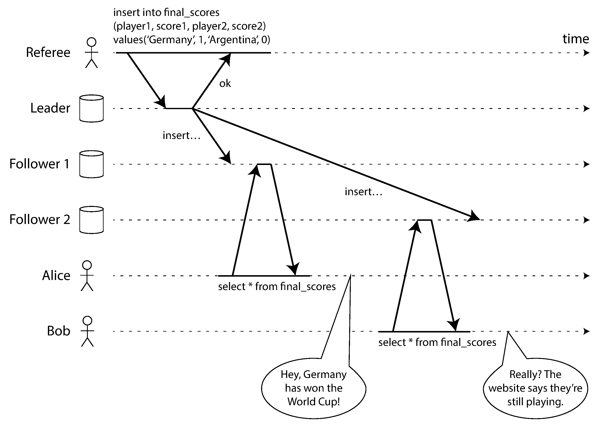
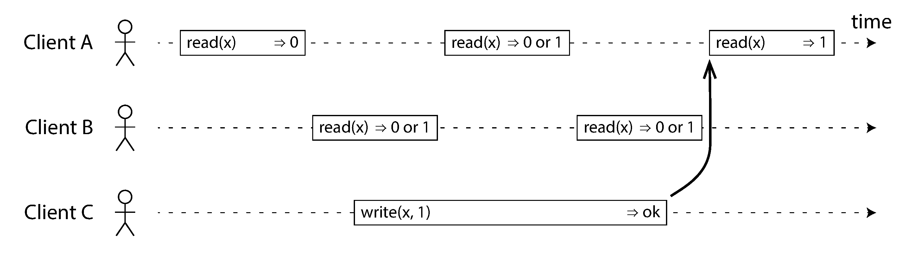
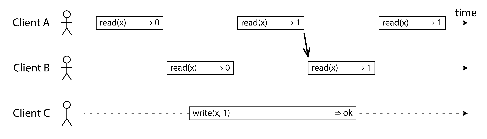
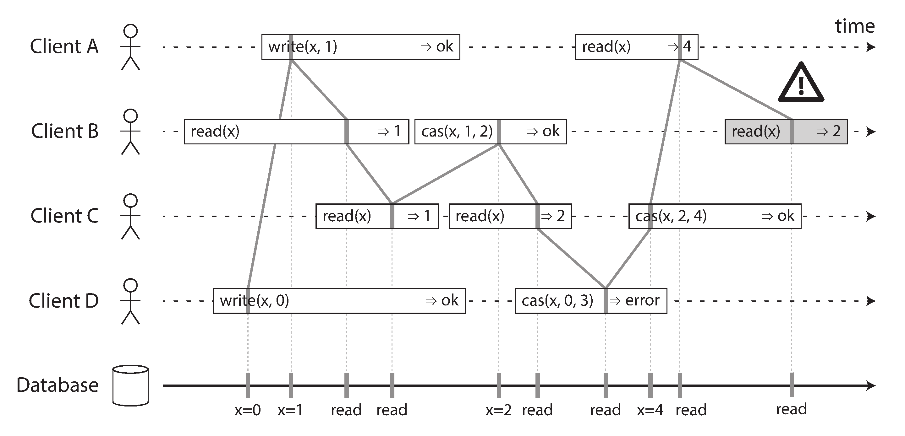
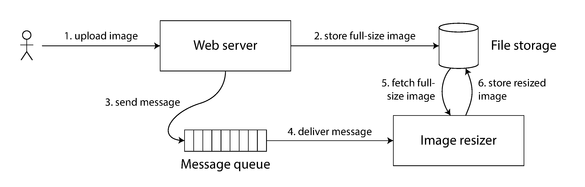
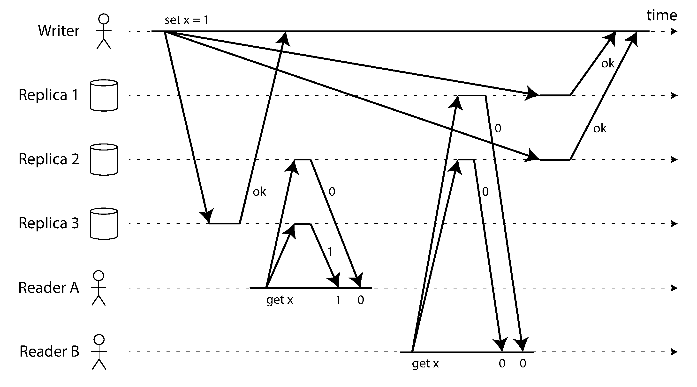
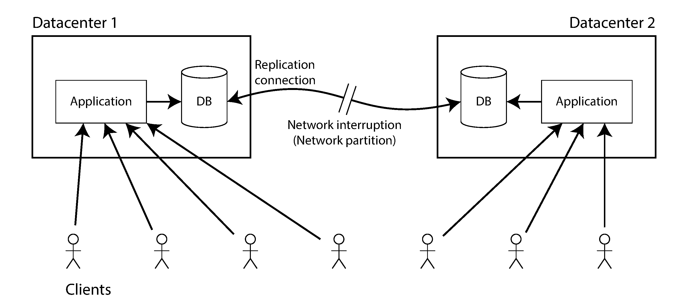
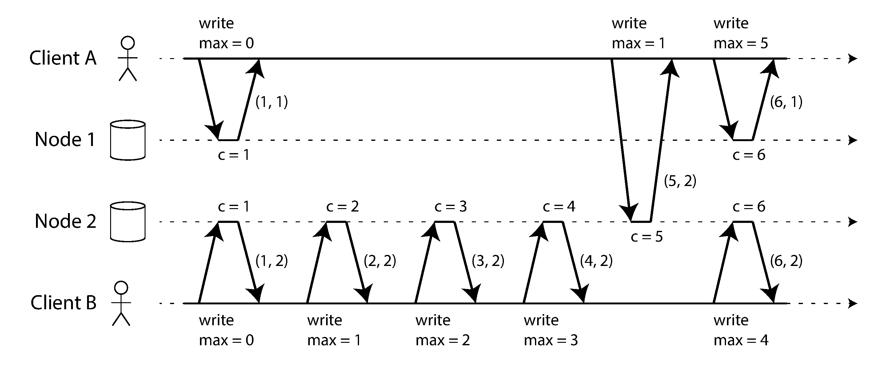
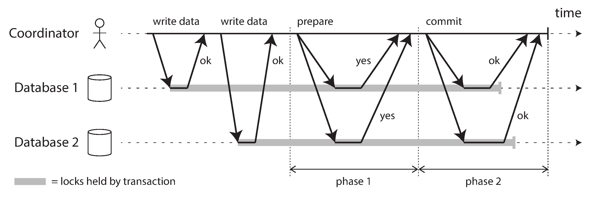
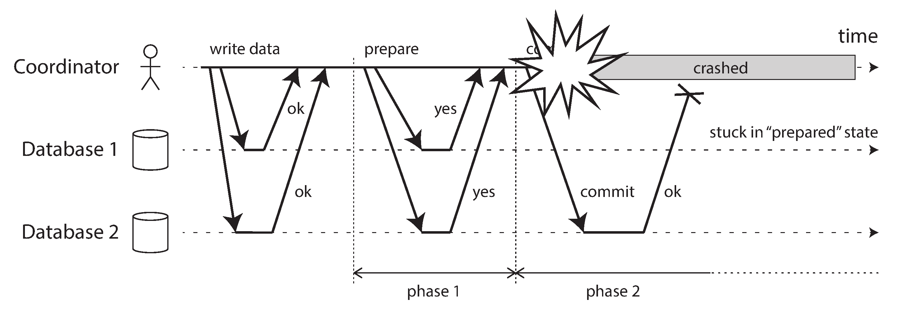

## Designing Data-Intensive Applications

### 9장. Consistency and Consensus

8장에서는 network, clock, process pause 때문에 distributed system이 얼마나 불확실한지 봤음

9장은 그 불확실성 위에서 어떤 guarantee를 만들 수 있는지 다룸

핵심 주제는 consistency와 consensus임

consistency model은 application이 data를 읽고 쓸 때 무엇을 기대할 수 있는지 정의함

consensus는 여러 node가 하나의 결정에 합의하는 문제임

leader election, distributed transaction commit, lock, uniqueness constraint는 모두 consensus와 연결됨

이 장의 product 예시와 API 이름은 원문 당시 기준이므로 실제 운영 판단에는 현재 공식 문서를 확인해야 함

 

### Consistency Guarantees

replicated database에서는 같은 순간에 서로 다른 replica가 다른 값을 가질 수 있음

write가 각 replica에 도착하는 시간이 다르기 때문임

eventual consistency는 write가 멈추고 충분히 기다리면 replica들이 결국 같은 값으로 수렴한다는 guarantee임

하지만 언제 수렴하는지는 말해주지 않음

그 사이 read는 오래된 값이나 서로 다른 값을 반환할 수 있음

weak guarantee만 제공하는 database를 사용할 때는 application이 그 한계를 계속 의식해야 함

stronger consistency model은 사용하기 쉽지만 보통 성능이나 availability 비용이 있음

transaction isolation이 concurrent transaction의 race condition을 다루는 문제라면, distributed consistency는 replica 사이의 delay와 fault를 다루는 문제에 가까움

 

### Linearizability

linearizability는 여러 replica가 있어도 single copy처럼 보이게 하는 guarantee임

client 입장에서는 모든 read와 write가 하나의 최신 data copy에 atomic하게 적용되는 것처럼 보여야 함

따라서 한 client가 write 성공을 확인했다면, 그 이후의 모든 client는 그 write를 볼 수 있어야 함

linearizability는 recency guarantee임

stale replica나 stale cache에서 오래된 값을 읽는 것을 허용하지 않음

 

figure 9-1의 문제는 Alice가 새 score를 본 뒤 Bob이 다시 조회했는데도 old score를 본다는 점임

Bob의 read는 Alice가 본 결과 이후에 발생했으므로, linearizable system이라면 Bob도 새 score를 봐야 함

 

### What Makes a System Linearizable?

linearizability를 판단하려면 각 operation이 어느 한 순간에 실행된 것처럼 배치할 수 있어야 함

operation이 진행 중인 동안에는 network delay 때문에 실제 처리 시점을 client가 알 수 없음

read가 write와 겹치면 old value나 new value 중 하나를 볼 수 있음

하지만 한 번 new value를 본 read가 있다면, 그 이후의 read는 old value로 돌아가면 안 됨

 

 

각 operation에는 논리적으로 effect point가 있음

그 effect point들을 시간 순서로 연결했을 때 항상 앞으로만 이동해야 함

뒤로 이동하는 순서가 필요하다면 linearizable하지 않음

 

linearizability와 serializability는 다름

- serializability는 transaction isolation에 관한 성질임
- linearizability는 single object read/write의 최신성에 관한 성질임
- 둘을 함께 제공하면 strict serializability에 가까운 guarantee가 됨

serializable snapshot isolation은 consistent snapshot을 읽기 때문에 보통 linearizable read를 제공하지 않음

 

### Relying on Linearizability

linearizability가 항상 필요한 것은 아님

몇 초 늦은 스포츠 점수는 큰 문제가 아닐 수 있음

하지만 일부 기능은 linearizability 없이는 correctness를 보장하기 어려움

 

### Locking and Leader Election

single-leader replication에서는 leader가 정확히 하나여야 함

두 node가 동시에 leader라고 믿으면 split brain이 생기고 data loss로 이어질 수 있음

leader election을 lock으로 구현한다면 그 lock은 linearizable해야 함

모든 node가 누가 lock owner인지 같은 결론을 내려야 하기 때문임

ZooKeeper나 etcd 같은 coordination service는 consensus를 이용해 이런 linearizable operation을 제공함

다만 lock을 실제로 안전하게 쓰려면 8장에서 본 fencing token 같은 세부 사항도 필요함

 

### Constraints and Uniqueness Guarantees

username, email, file path 같은 uniqueness constraint는 linearizability가 필요한 대표 사례임

두 client가 같은 username을 동시에 만들려 할 때 하나만 성공해야 함

이 문제는 username이라는 resource에 대한 lock을 얻는 것과 비슷함

stock이 음수가 되지 않게 하거나 같은 좌석을 두 번 팔지 않는 것도 비슷한 문제임

다만 모든 constraint가 hard guarantee를 요구하는 것은 아님

비즈니스적으로 보상 가능한 overbooking이라면 더 약한 consistency를 선택할 수도 있음

 

### Cross-Channel Timing Dependencies

linearizability violation은 여러 communication channel이 섞일 때 더 잘 드러남

Alice와 Bob 예시에서는 database replication과 사람 사이의 대화가 두 channel이었음

image resize system에서도 file storage와 message queue가 별도 channel이 됨

 

web server가 full-size image를 저장한 뒤 queue에 resize message를 넣었다고 해도, file storage가 linearizable하지 않으면 resizer가 old image나 missing image를 볼 수 있음

message queue가 file replication보다 더 빨리 도착할 수 있기 때문임

linearizability는 이런 channel 간 timing race를 단순하게 막아줌

대신 queue message에 version 정보나 causal dependency를 담는 식의 대안도 가능하지만 복잡도가 늘어남

 

### Implementing Linearizable Systems

linearizability는 single copy처럼 보이는 것을 요구함

진짜 single copy만 사용하면 구현은 쉽지만 fault tolerance가 없음

따라서 replication 방식별로 linearizability 가능성이 달라짐

- single-leader replication은 leader read나 synchronous follower read를 쓰면 linearizable할 가능성이 있음
- consensus algorithm은 split brain과 stale replica를 막는 절차를 포함하므로 linearizable storage를 안전하게 만들 수 있음
- multi-leader replication은 여러 leader가 동시에 write를 처리하므로 일반적으로 linearizable하지 않음
- leaderless replication은 quorum을 사용해도 일반적으로 linearizable하다고 가정하면 위험함

leaderless system에서 strict quorum을 사용해도 network delay 때문에 nonlinearizable execution이 가능함

 

Dynamo-style quorum을 linearizable하게 만들 수 있는 방법은 있지만 synchronous read repair와 추가 read/write 절차가 필요해 성능 비용이 큼

따라서 leaderless replication을 쓰는 system은 linearizability를 제공하지 않는다고 보는 것이 안전함

 

### The Cost of Linearizability

linearizability는 이해하기 쉽지만 비용이 있음

multi-datacenter 환경에서 network interruption이 생기면 그 비용이 뚜렷해짐

 

multi-leader database는 datacenter 사이 network가 끊겨도 각 datacenter가 write를 계속 받을 수 있음

대신 나중에 conflict resolution이 필요하고 linearizable하지 않음

single-leader database는 leader가 있는 datacenter에 접근해야 linearizable read/write가 가능함

leader와 단절된 datacenter는 stale read만 하거나 error를 반환해야 함

즉 network partition 상황에서는 linearizability와 total availability를 동시에 얻기 어려움

 

### The CAP Theorem

CAP은 흔히 consistency, availability, partition tolerance 중 2개를 고르는 문제처럼 설명됨

하지만 이 표현은 오해를 만들기 쉬움

network partition은 선택지가 아니라 발생할 수 있는 fault임

network가 정상일 때는 consistency와 availability를 함께 제공할 수 있음

문제는 network fault가 발생했을 때 linearizability를 유지할지, 모든 replica가 계속 요청을 처리하게 할지 선택해야 한다는 점임

CAP의 formal definition은 linearizability와 network partition이라는 좁은 범위만 다룸

network delay, node crash, latency trade-off 같은 더 넓은 문제를 설명하지 못함

따라서 CAP은 역사적으로는 중요하지만, 실제 설계 판단에는 더 구체적인 consistency와 failure model을 보는 것이 나음

 

### Linearizability and Network Delays

linearizability 비용은 network partition 때만 생기는 것이 아님

평상시에도 read/write latency는 network delay uncertainty의 영향을 받음

modern CPU의 memory model조차 성능 때문에 완전한 linearizability를 기본으로 제공하지 않음

distributed database도 linearizable guarantee를 약화해 latency를 줄이는 경우가 많음

linearizable storage의 response time은 network delay uncertainty에 비례할 수밖에 없음

latency가 중요한 system에서는 weaker consistency model을 검토해야 함

 

### Ordering Guarantees

linearizability는 operation이 하나의 timeline 위에서 실행된 것처럼 보이게 함

즉 ordering이 핵심임

ordering은 이 책의 여러 주제에서 반복됨

- single-leader replication은 leader가 write order를 결정함
- serializability는 transaction이 어떤 serial order로 실행된 것처럼 보이게 함
- timestamp와 clock은 event order를 만들려는 시도임

ordering, linearizability, consensus는 서로 깊게 연결되어 있음

 

### Ordering and Causality

causality는 cause가 effect보다 먼저 와야 한다는 ordering임

message는 receive되기 전에 send되어야 함

answer는 question 이후에 와야 함

row update는 row create 이후에 와야 함

snapshot이 answer를 포함한다면 그 answer의 원인이 된 question도 포함해야 함

causal consistency는 이런 causal order를 보존하는 consistency model임

 

### The Causal Order Is Not a Total Order

total order는 임의의 두 event를 항상 비교할 수 있음

causal order는 partial order임

두 event가 causally related이면 순서를 정할 수 있음

하지만 concurrent event는 어느 쪽이 먼저라고 말할 수 없음

linearizability는 모든 operation을 하나의 total order에 넣음

causality는 필요한 순서만 보존하고 concurrent operation은 incomparable로 둠

따라서 causal consistency는 linearizability보다 약하지만 더 높은 availability와 performance를 얻을 수 있음

 

### Linearizability Is Stronger Than Causal Consistency

linearizability는 causality를 자동으로 보존함

그래서 이해하기 쉽고 application이 추가 metadata를 덜 다뤄도 됨

하지만 linearizability는 network delay가 큰 환경에서 느리고 availability도 낮아질 수 있음

많은 경우 실제로 필요한 것은 linearizability가 아니라 causal consistency일 수 있음

causal consistency는 network delay에 덜 민감하고, network failure 중에도 더 높은 availability를 줄 수 있음

 

### Capturing Causal Dependencies

causal consistency를 유지하려면 어떤 operation이 어떤 operation 이후에 발생했는지 알아야 함

replica가 later operation을 처리하려면 그 operation의 causal predecessor들이 먼저 처리되어 있어야 함

이를 위해 node가 어떤 version을 이미 봤는지 추적해야 함

version vector는 이 정보를 표현하는 방법 중 하나임

다만 database 전체의 causal dependency를 추적하면 metadata와 bookkeeping 비용이 커질 수 있음

 

### Sequence Number Ordering

causal dependency를 모두 추적하는 대신 sequence number나 logical timestamp로 event를 정렬할 수 있음

single-leader replication에서는 leader의 replication log가 write의 total order를 만듦

follower가 log 순서대로 write를 적용하면 leader보다 lagging하더라도 causal consistency는 유지됨

문제는 single leader가 없을 때 sequence number를 어떻게 만들지임

각 node가 독립 counter를 쓰거나, physical timestamp를 쓰거나, sequence block을 미리 할당할 수 있음

하지만 이런 방식은 causality와 맞지 않는 order를 만들 수 있음

physical timestamp는 clock skew 때문에 특히 위험함

 

### Lamport Timestamps

Lamport timestamp는 causality와 일관된 total order를 만드는 간단한 logical clock임

각 node는 counter와 node ID를 사용해 timestamp를 만듦

client와 node는 자신이 본 최대 counter 값을 request에 함께 전달함

node는 더 큰 counter를 보면 자신의 counter를 그 값 이상으로 끌어올림

이 방식은 causal dependency가 timestamp 증가로 반영되게 만듦

 

Lamport timestamp는 physical time과 관계가 없음

version vector와도 목적이 다름

version vector는 두 operation이 concurrent인지 causally dependent인지 구분할 수 있음

Lamport timestamp는 항상 total order를 만들지만, 그 total order만으로 concurrency 여부를 알 수는 없음

 

### Timestamp Ordering Is Not Sufficient

Lamport timestamp는 causality와 일관된 total order를 만들지만, 그것만으로 모든 distributed problem을 해결할 수는 없음

예를 들어 username uniqueness를 보장하려면 concurrent username creation 중 하나만 즉시 성공시켜야 함

timestamp를 모아 나중에 winner를 정하는 것은 가능함

하지만 request를 받은 node가 지금 성공 여부를 답하려면 다른 node가 더 낮은 timestamp로 같은 username을 만들고 있는지 알아야 함

이를 확인하려면 다른 node들과 coordination해야 함

즉 total order 자체뿐 아니라 그 order가 언제 확정되었는지도 필요함

이 지점에서 total order broadcast와 consensus가 필요해짐

 

### Total Order Broadcast

total order broadcast는 모든 node가 같은 message를 같은 순서로 deliver하도록 보장하는 protocol임

두 가지 safety property가 중요함

- reliable delivery는 한 node에 deliver된 message가 모든 node에도 deliver됨을 의미함
- totally ordered delivery는 모든 node가 message를 같은 순서로 deliver함을 의미함

network가 끊긴 동안 message delivery가 멈출 수는 있음

하지만 network가 복구되면 같은 순서를 유지하며 delivery되어야 함

total order broadcast는 replication log를 만드는 것과 비슷함

모든 replica가 같은 log를 같은 순서로 적용하면 같은 상태를 유지할 수 있음

ZooKeeper와 etcd 같은 consensus service는 total order broadcast와 밀접하게 연결됨

 

### Linearizable Storage and Total Order Broadcast

total order broadcast와 linearizable storage는 서로 변환 가능한 관계에 가까움

total order broadcast가 있으면 append-only log 위에 compare-and-set을 구현할 수 있음

예를 들어 username claim message를 log에 append하고, 자신보다 앞선 같은 username claim이 없는지 확인하면 uniqueness를 보장할 수 있음

반대로 linearizable increment-and-get register가 있으면 message마다 gap 없는 sequence number를 붙여 total order broadcast를 만들 수 있음

Lamport timestamp와 달리 gap 없는 sequence number는 missing message를 기다릴 수 있게 해줌

이 관계 때문에 linearizable atomic operation, total order broadcast, consensus는 서로 강하게 연결됨

 

### Distributed Transactions and Consensus

consensus는 여러 node가 하나의 값이나 결론에 합의하는 문제임

겉보기에는 단순하지만 network fault와 node crash가 있으면 어려움

대표적인 합의 문제는 두 가지임

- leader election은 어떤 node가 leader인지 모두가 동의해야 함
- atomic commit은 distributed transaction이 commit인지 abort인지 모두가 동의해야 함

FLP result는 asynchronous model에서 crash 가능성이 있으면 deterministic consensus가 항상 가능하지 않음을 보임

하지만 실제 system은 timeout, failure detector, randomization 같은 추가 가정을 사용하므로 practical consensus algorithm을 만들 수 있음

 

### Atomic Commit and Two-Phase Commit (2PC)

single-node transaction에서는 commit record가 disk에 durable하게 기록되는 순간이 commit point가 됨

여러 node가 참여하는 transaction에서는 각 node가 독립적으로 commit하면 atomicity가 깨질 수 있음

어떤 node는 commit하고 다른 node는 abort하면 system이 inconsistent해짐

2PC는 여러 participant가 모두 commit하거나 모두 abort하도록 만드는 atomic commit protocol임

 

2PC에는 coordinator와 participant가 있음

phase 1에서 coordinator는 모든 participant에게 prepare를 보냄

모든 participant가 yes를 보내면 phase 2에서 commit을 보냄

하나라도 no이거나 timeout이면 abort를 보냄

participant가 yes라고 답했다는 것은 나중에 commit 요청이 오면 반드시 commit할 수 있다고 약속했다는 뜻임

coordinator가 commit 결정을 durable log에 기록하면 그 결정은 되돌릴 수 없음

2PC의 atomicity는 이 promise와 durable decision에 의존함

 

### Coordinator Failure

2PC의 약점은 coordinator failure임

participant가 prepare에 yes라고 답한 뒤 coordinator가 죽으면 participant는 스스로 commit이나 abort를 결정할 수 없음

이 상태를 in-doubt 또는 uncertain 상태라고 함

 

participant가 timeout만 보고 unilateral abort를 하면 이미 commit한 다른 participant와 불일치할 수 있음

unilateral commit도 안전하지 않음

따라서 participant는 coordinator가 복구되어 결정을 알려줄 때까지 기다려야 함

이 때문에 2PC는 blocking atomic commit protocol임

3PC는 nonblocking을 목표로 하지만 bounded delay와 reliable failure detector 같은 현실적으로 강한 가정이 필요함

일반적인 unbounded network delay 환경에서는 2PC의 blocking 문제가 남음

 

### Distributed Transactions in Practice

distributed transaction은 안전한 atomic commit을 제공하지만 운영 비용이 큼

database-internal distributed transaction과 heterogeneous distributed transaction은 구분해야 함

database-internal transaction은 같은 database system 내부 node들끼리 동작하므로 최적화 여지가 있음

heterogeneous transaction은 서로 다른 database, message broker, 외부 system이 같은 atomic commit protocol에 참여해야 하므로 훨씬 어려움

exactly-once message processing은 distributed transaction의 대표적 사용 사례임

message acknowledgement와 database write를 하나의 atomic transaction으로 묶으면 retry가 안전해짐

하지만 email 전송처럼 2PC에 참여하지 않는 side effect는 rollback되지 않으므로 duplicate가 생길 수 있음

 

### XA Transactions

XA는 heterogeneous technology 사이에서 2PC를 구현하기 위한 표준 API임

XA는 network protocol이 아니라 transaction coordinator와 participant driver가 상호작용하는 interface에 가까움

coordinator는 participant 목록, prepare response, commit/abort decision을 추적하고 local log에 기록함

문제는 coordinator가 application process 안의 library로 구현되는 경우가 많다는 점임

application server가 죽으면 coordinator도 함께 죽고, prepared transaction은 in-doubt 상태로 남을 수 있음

이 coordinator log는 application server를 stateless하게 다루는 deployment model과 충돌함

 

### Holding Locks While in Doubt

in-doubt transaction이 위험한 이유는 lock을 놓지 못하기 때문임

participant는 commit 또는 abort가 결정될 때까지 modified row의 lock을 유지해야 함

coordinator가 20분 동안 복구되지 않으면 lock도 20분 동안 유지될 수 있음

coordinator log가 유실되면 lock이 사실상 영구적으로 남을 수도 있음

이 lock은 다른 transaction의 write나 read를 막아 application availability를 크게 떨어뜨릴 수 있음

 

### Recovering from Coordinator Failure

이론적으로 coordinator는 재시작 후 log를 읽고 in-doubt transaction을 해결해야 함

하지만 log 손상이나 bug 때문에 orphaned in-doubt transaction이 생길 수 있음

이 경우 administrator가 각 participant 상태를 확인하고 commit 또는 rollback을 수동으로 결정해야 함

일부 XA 구현은 heuristic decision이라는 escape hatch를 제공함

하지만 이는 atomicity를 깨뜨릴 수 있으므로 catastrophic situation에서만 쓰는 마지막 수단임

 

### Limitations of Distributed Transactions

XA는 여러 data system을 일관되게 묶는 실제 문제를 해결하지만 큰 대가가 있음

coordinator는 transaction outcome을 저장하는 database와 같음

따라서 coordinator log는 durable하고 recoverable해야 함

하지만 많은 구현은 coordinator를 highly available하게 만들지 않거나, application server local disk에 의존함

또한 XA는 여러 system을 지원해야 하므로 lowest common denominator가 됨

cross-system deadlock detection이나 advanced isolation과 잘 맞지 않을 수 있음

운영적으로는 prepared transaction monitoring, coordinator recovery, manual resolution 절차가 필요함

 

### Fault-Tolerant Consensus

consensus는 여러 node가 같은 결정을 내리게 하는 abstraction임

대부분의 consensus algorithm은 다음 property를 목표로 함

- uniform agreement는 두 node가 서로 다른 결정을 내리지 않음을 의미함
- integrity는 한 node가 같은 결정을 두 번 하지 않음을 의미함
- validity는 결정된 값이 누군가 제안한 값이어야 함을 의미함
- termination은 crash하지 않은 node가 결국 결정을 내림을 의미함

agreement와 integrity는 safety property임

termination은 liveness property임

consensus algorithm은 일부 node가 crash해도 majority가 살아 있고 통신 가능하면 progress할 수 있어야 함

 

### Consensus Algorithms and Total Order Broadcast

Paxos, Raft, Zab, Viewstamped Replication 같은 algorithm은 보통 한 번의 decision이 아니라 sequence of decisions를 다룸

즉 total order broadcast에 가까운 형태로 구현됨

각 decision은 log entry가 되고, 모든 node는 같은 entry를 같은 순서로 적용함

이 방식은 state machine replication의 기반이 됨

total order broadcast가 있으면 linearizable storage와 lock service 같은 기능을 만들 수 있음

 

### Epoch Numbering and Quorums

consensus protocol은 내부적으로 leader를 쓰는 경우가 많음

하지만 leader가 항상 하나라는 사실을 단순히 믿지는 않음

protocol은 epoch, ballot, view, term 같은 단조 증가하는 번호를 사용함

새 leader election이 시작될 때마다 더 높은 epoch가 부여됨

두 leader가 충돌하면 더 높은 epoch의 leader가 우선함

leader가 결정을 내리려면 quorum의 vote가 필요함

leader election quorum과 proposal quorum이 서로 overlap해야 안전함

이 overlap 덕분에 더 높은 epoch의 leader가 있었는지 감지할 수 있음

2PC와 달리 consensus는 모든 participant의 yes가 아니라 majority quorum으로 progress할 수 있음

또한 새 leader가 선출된 뒤 consistent state로 복구하는 절차를 포함함

 

### Limitations of Consensus

consensus는 강력하지만 비용이 있음

proposal에 대해 quorum vote를 받아야 하므로 synchronous replication과 비슷한 latency가 생김

majority가 필요하므로 1개 failure를 견디려면 최소 3개 node, 2개 failure를 견디려면 최소 5개 node가 필요함

network partition이 생기면 majority side만 progress할 수 있고 minority side는 block됨

membership 변경도 쉽지 않음

많은 algorithm은 fixed voting set을 가정하고, dynamic membership은 더 복잡함

또한 timeout 기반 failure detection은 false suspicion을 만들 수 있음

network delay가 큰 환경에서는 leader election이 자주 발생해 성능이 크게 나빠질 수 있음

 

### Membership and Coordination Services

ZooKeeper, etcd 같은 system은 작은 양의 coordination data를 consensus로 복제함

일반적인 application data store라기보다 coordination service에 가까움

제공하는 기능은 다음과 같음

- linearizable atomic operation
- total ordering of operations
- failure detection
- change notification

이 조합은 distributed lock, leader election, membership tracking, partition assignment에 유용함

application이 consensus algorithm을 직접 구현하는 것보다 검증된 coordination service를 사용하는 편이 안전함

 

### Allocating Work to Nodes

coordination service는 어떤 node가 어떤 work를 맡는지 결정하는 데 자주 사용됨

leader failover, partition ownership, job scheduling, stream partition assignment가 대표적임

node가 join하거나 leave하면 assignment를 다시 계산해야 함

ephemeral node와 notification을 사용하면 node failure를 감지하고 다른 node가 work를 넘겨받게 할 수 있음

다만 ZooKeeper 자체는 보통 3개나 5개 node의 작은 cluster로 운영하고, 다수의 client가 coordination을 outsource하는 구조로 사용함

runtime application state를 높은 빈도로 저장하는 용도는 아님

 

### Service Discovery

ZooKeeper, etcd, Consul은 service discovery에도 사용됨

service discovery는 특정 service에 접속할 IP나 endpoint를 찾는 문제임

하지만 service discovery가 항상 consensus를 필요로 하는 것은 아님

DNS처럼 stale read를 어느 정도 허용해도 되는 경우가 많음

leader election처럼 정확히 하나를 골라야 하는 문제는 consensus가 필요함

반면 단순 endpoint lookup은 availability와 caching이 더 중요할 수 있음

 

### Membership Services

membership service는 현재 cluster에 어떤 node가 살아 있는지에 대한 합의를 제공함

8장에서 본 것처럼 timeout만으로 node failure를 확실히 알 수는 없음

하지만 failure detection과 consensus를 결합하면 cluster가 어떤 node를 current member로 볼지 합의할 수 있음

실제로 살아 있는 node가 잘못 dead로 판단될 수도 있음

그래도 모든 node가 같은 membership view를 가지는 것은 leader election이나 work assignment에 매우 중요함

 

### Summary

linearizability는 replicated data를 single copy처럼 보이게 하는 강한 consistency model임

사용하기 쉽고 recency guarantee를 제공하지만 latency와 availability 비용이 큼

causal consistency는 cause-before-effect 순서를 보존하면서 linearizability보다 약한 guarantee를 제공함

Lamport timestamp는 causality와 일관된 total order를 만들 수 있지만, 그 order가 언제 확정되는지는 알려주지 않음

uniqueness constraint, lock, leader election 같은 문제는 total order의 확정과 consensus가 필요함

total order broadcast는 모든 node가 같은 message를 같은 순서로 처리하게 함

linearizable atomic operation, total order broadcast, consensus는 서로 밀접하게 연결됨

2PC는 distributed atomic commit을 제공하지만 coordinator failure에 blocking될 수 있음

XA transaction은 heterogeneous system을 묶을 수 있지만 coordinator log, in-doubt transaction, lock 유지 같은 운영 문제가 큼

fault-tolerant consensus는 majority quorum과 epoch를 사용해 agreement와 progress를 얻음

ZooKeeper나 etcd 같은 coordination service는 consensus를 직접 구현하지 않고 사용할 수 있게 해줌

핵심은 모든 문제에 consensus를 붙이는 것이 아니라, linearizability나 single decision이 정말 필요한 곳에만 신중히 사용하는 것임
