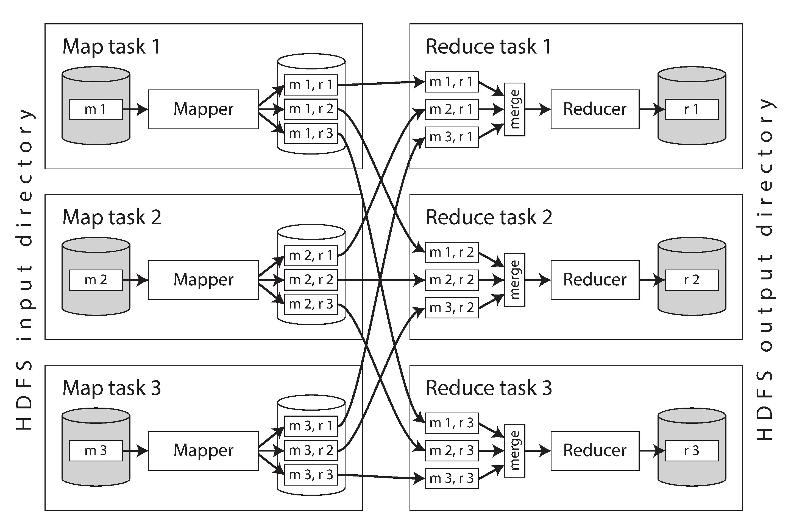
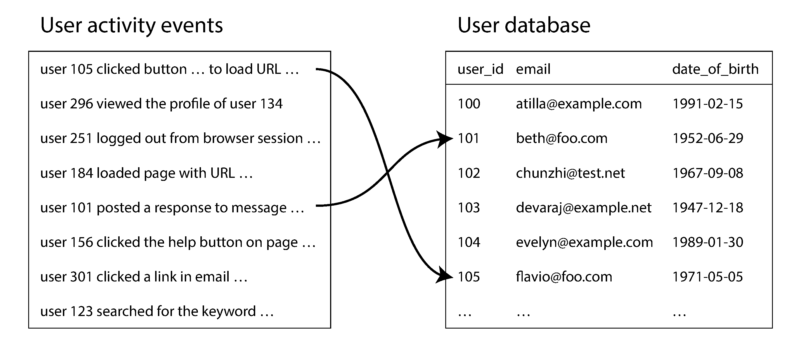
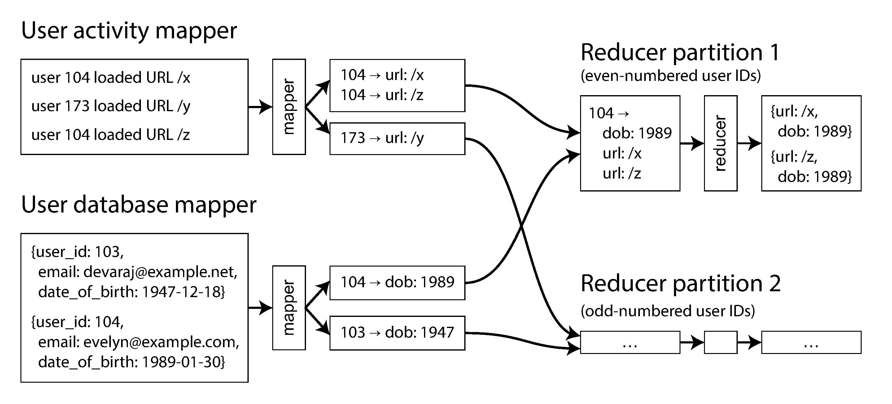

## Designing Data-Intensive Applications

### 10장. Batch Processing

앞 장들에서는 주로 online system을 다뤘음

online system은 user request나 query를 받고 짧은 시간 안에 response를 돌려줘야 함

batch processing은 그와 다름

bounded input을 읽고, 긴 시간 동안 계산한 뒤, output dataset을 생성함

input은 보통 log file, database snapshot, data warehouse export처럼 크고 고정된 dataset임

batch job은 input을 직접 수정하지 않고 새로운 output을 만듦

이 장의 핵심은 큰 dataset을 안정적으로 처리하기 위해 partitioning, sorting, joining, fault tolerance를 어떻게 구성하는지 이해하는 것임

책의 Hadoop, Spark, Flink, Hive 같은 product 예시는 원문 당시 기준이므로 실제 운영 판단에는 현재 공식 문서를 확인해야 함

 

### Systems of Record and Derived Data

batch processing은 derived data를 만드는 데 자주 쓰임

system of record는 사용자가 직접 쓰거나 transaction이 발생하는 원본 data임

derived data는 원본 data를 가공해 만든 index, cache, recommendation table, report, machine learning feature 같은 data임

derived data는 원본에서 다시 만들 수 있다는 점이 중요함

따라서 batch job은 실패하거나 잘못된 output을 만들더라도, code를 고치고 input에서 다시 실행할 수 있음

이 성질은 batch processing을 online request 처리보다 실험과 복구에 강하게 만듦

 

### Batch Processing with Unix Tools

Unix tool은 batch processing의 좋은 출발점임

`awk`, `sed`, `grep`, `sort`, `uniq` 같은 tool은 file을 읽고 file이나 pipe로 output을 보냄

작은 program을 조합해 큰 작업을 만드는 방식임

핵심은 input을 읽고 output을 만들 뿐, input을 수정하지 않는다는 점임

이 구조는 재실행과 debugging을 쉽게 만듦

 

### Simple Log Analysis

web server access log는 batch processing 예시로 적합함

log file은 계속 append되지만, 특정 시점의 log file 집합은 bounded input으로 볼 수 있음

예를 들어 URL별 request 수를 세고 상위 URL을 찾는 작업은 다음 흐름으로 나눌 수 있음

- log line에서 URL field 추출
- URL별로 grouping
- count 계산
- count 기준으로 sorting
- top N 선택

Unix command pipeline은 이 과정을 여러 작은 step으로 표현함

각 command는 stdin을 읽고 stdout을 쓰므로 서로 쉽게 연결됨

 

### Chain of Commands Versus Custom Program

같은 작업을 하나의 custom program으로도 만들 수 있음

하지만 command chain은 몇 가지 장점이 있음

- 각 step의 output을 중간에서 확인할 수 있음
- 이미 검증된 tool을 재사용할 수 있음
- 특정 step만 바꿔 실험하기 쉬움
- file과 pipe라는 uniform interface를 사용함

custom program은 더 세밀한 최적화가 가능하지만, dataflow가 code 내부에 숨어 debugging이 어려워질 수 있음

batch workflow에서는 logic과 wiring이 분리될수록 운영과 실험이 쉬워짐

 

### Sorting Versus In-Memory Aggregation

URL별 count를 계산할 때 memory hash table을 사용할 수 있음

하지만 input이 memory보다 크면 문제가 생김

Unix `sort`는 input이 memory보다 커도 disk를 사용해 external sort를 수행할 수 있음

sorting 기반 approach는 큰 dataset을 안정적으로 다루는 데 유리함

MapReduce도 이 아이디어를 확장함

mapper output을 key 기준으로 partitioning하고 sorting한 뒤 reducer에 전달함

즉 sorting은 단순 정렬 기능을 넘어, 관련 record를 같은 곳으로 모으는 핵심 도구가 됨

 

### The Unix Philosophy

Unix philosophy는 batch processing design에 직접 연결됨

핵심은 작은 program이 한 가지 일을 잘하고, uniform interface로 조합 가능해야 한다는 점임

이 방식의 장점은 다음과 같음

- program 간 coupling이 낮음
- 중간 output을 관찰하기 쉬움
- 실패한 step을 다시 실행하기 쉬움
- 새로운 tool을 기존 pipeline에 끼워 넣기 쉬움

MapReduce와 dataflow engine은 이 철학을 distributed environment로 확장함

file과 pipe가 Unix의 interface라면, HDFS 같은 distributed filesystem은 MapReduce의 interface가 됨

 

### A Uniform Interface

Unix tool은 byte stream이라는 단순한 interface를 공유함

많은 tool은 line-based text를 다루지만, 핵심은 program이 서로의 내부 구현을 몰라도 조합된다는 점임

database나 application-specific API는 이런 조합성이 떨어질 수 있음

같은 data model을 사용해도 export format, query interface, schema evolution 방식이 달라지면 연결 비용이 커짐

batch system에서는 input과 output format이 명확할수록 workflow를 구성하기 쉬움

 

### Separation of Logic and Wiring

Unix pipeline에서는 program logic과 wiring이 분리됨

program은 stdin을 읽고 stdout을 쓰는 logic에 집중함

shell은 어떤 program의 output을 다음 program의 input으로 보낼지 결정함

MapReduce에서도 비슷하게 mapper와 reducer는 record 처리 logic에 집중함

framework는 input file 분할, task 배치, shuffle, retry, output directory 관리를 담당함

이 분리는 code 재사용과 운영 변경을 쉽게 만듦

 

### Transparency and Experimentation

batch pipeline은 중간 file을 쉽게 확인할 수 있어야 함

작은 sample로 command를 실행하고 output을 직접 볼 수 있으면 debugging이 쉬움

input을 수정하지 않고 output을 새로 만들기 때문에 실험 부담도 낮음

잘못된 output이 나오면 code를 수정하고 다시 실행하면 됨

이 특성은 large-scale data workflow에서도 중요함

batch job은 실패를 완전히 피하는 것보다, 실패해도 안전하게 재실행할 수 있게 만드는 것이 중요함

 

### MapReduce and Distributed Filesystems

MapReduce는 Unix tool pipeline을 distributed filesystem 위로 확장한 model로 볼 수 있음

Unix tool은 local file과 pipe를 사용함

MapReduce job은 HDFS 같은 distributed filesystem의 file을 input과 output으로 사용함

input은 여러 block으로 나뉘고 여러 machine에 분산 저장됨

framework는 input block 근처에서 map task를 실행하려고 함

이렇게 하면 network로 data를 많이 옮기지 않고 computation을 data 가까이 보낼 수 있음

 

### HDFS

HDFS는 shared-nothing principle을 따름

각 machine은 local disk를 가지고 있고, HDFS daemon은 block을 network로 노출함

file은 큰 block으로 나뉘고 여러 node에 replicated 됨

machine이나 disk가 실패해도 다른 replica에서 block을 읽을 수 있음

HDFS는 random update보다 large sequential read/write에 적합함

batch processing은 보통 input을 sequential scan하고 output을 새 file로 쓰기 때문에 HDFS와 잘 맞음

 

### MapReduce Job Execution

MapReduce job은 크게 map, shuffle, reduce로 구성됨

mapper는 input record를 읽고 key-value pair를 생성함

framework는 mapper output을 key 기준으로 partitioning하고 sorting함

reducer는 같은 key를 가진 value들을 한 곳에서 받아 처리함

 

figure 10-1처럼 각 mapper output은 reducer partition별로 나뉨

reducer는 모든 mapper의 자기 partition file을 가져와 merge하고 key 순서대로 처리함

이 과정이 shuffle임

shuffle은 random하게 섞는 것이 아니라, 같은 key를 같은 reducer로 보내기 위한 partitioning과 sorting 과정임

 

### Mapper

mapper는 input record 하나를 받아 0개 이상의 key-value pair를 출력함

mapper는 보통 stateless하게 작성됨

각 input record를 독립적으로 처리해야 framework가 task를 병렬화하고 retry하기 쉬움

mapper가 external database에 side effect를 만들면 retry semantics가 어려워짐

따라서 mapper output은 framework가 관리하는 intermediate file로 제한하는 것이 안전함

 

### Reducer

reducer는 같은 key에 속한 value iterator를 받아 처리함

framework가 key별 grouping과 sorting을 해주므로 reducer는 관련 record가 이미 같은 곳에 모였다고 가정할 수 있음

count, aggregation, join, index build 같은 작업이 reducer에서 수행됨

reducer도 output을 지정된 output directory에 쓰는 방식이 일반적임

external side effect를 피해야 failed task retry가 안전함

 

### Distributed Execution of MapReduce

MapReduce의 핵심 장점은 병렬화와 fault tolerance를 framework가 담당한다는 점임

input file block 수에 따라 map task가 나뉨

reducer 수는 job author가 설정함

mapper output은 reducer partition별로 local disk에 기록되고, reducer는 필요한 partition을 network로 가져옴

task가 실패하면 framework는 같은 input으로 task를 다시 실행함

failed task의 partial output은 버려짐

이 때문에 user code는 distributed failure handling을 직접 구현하지 않아도 됨

 

### MapReduce Workflows

한 MapReduce job으로 해결할 수 있는 문제는 제한적임

복잡한 분석은 여러 job을 연결한 workflow로 구성됨

한 job의 output directory가 다음 job의 input directory가 됨

Hadoop MapReduce 자체는 workflow scheduling을 크게 지원하지 않으므로, Oozie, Azkaban, Luigi, Airflow 같은 scheduler가 사용될 수 있음

여러 stage가 연결될수록 intermediate output이 많아짐

이 방식은 안정적이지만 느릴 수 있음

뒤에서 보는 dataflow engine은 이 intermediate materialization 비용을 줄이는 방향으로 발전함

 

### Reduce-Side Joins and Grouping

batch job은 여러 dataset을 join해야 할 때가 많음

예를 들어 user activity event와 user profile database를 user ID로 join할 수 있음

database에서는 index를 사용해 필요한 row만 찾을 수 있음

하지만 MapReduce는 보통 input file 전체를 scan함

large dataset 전체를 처리하는 batch job에서는 full scan이 자연스러운 선택일 수 있음

 

각 mapper는 join key를 key로 삼아 record를 emit함

framework는 같은 key를 가진 record를 같은 reducer로 보냄

reducer는 한 user ID에 대한 profile과 activity event를 함께 받아 join 결과를 만들 수 있음

 

 

### Sort-Merge Joins

reduce-side join은 sort-merge join과 비슷함

두 input dataset 모두 mapper를 거쳐 join key 기준으로 partitioning되고 sorting됨

reducer는 같은 key의 record를 모아서 join함

이 방식의 장점은 input dataset의 size나 partitioning layout에 대한 사전 가정이 적다는 점임

단점은 shuffle과 sorting 비용이 크다는 점임

 

### Bringing Related Data Together

MapReduce programming model은 related data를 같은 reducer로 모으는 데 초점을 둠

mapper가 emit하는 key는 destination address처럼 동작함

같은 key를 가진 모든 record는 같은 reducer call로 전달됨

이 구조는 network communication을 framework가 담당하게 만듦

application code가 remote database를 record마다 조회하지 않아도 됨

이 점은 partial failure와 retry semantics를 단순하게 만듦

 

### GROUP BY

SQL의 `GROUP BY`도 같은 원리로 구현할 수 있음

mapper는 grouping key를 emit함

framework는 같은 key를 가진 record를 같은 reducer로 모음

reducer는 count, sum, average 같은 aggregation을 수행함

hot key가 있으면 특정 reducer에 work가 몰릴 수 있음

이 경우 key salting, two-stage aggregation, skewed join 같은 방식으로 load를 분산할 수 있음

 

### Map-Side Joins

reduce-side join은 일반적이지만 비용이 큼

shuffle, sorting, disk write, network copy가 필요하기 때문임

입력 data에 대한 특정 가정이 가능하면 map-side join이 더 빠를 수 있음

map-side join은 reducer와 sorting 없이 mapper에서 join을 수행함

대표적인 경우는 작은 dataset을 memory hash table로 올리고 큰 dataset을 scan하는 broadcast hash join임

 

### Broadcast Hash Joins

broadcast hash join은 한쪽 input이 충분히 작을 때 사용함

작은 input 전체를 각 mapper가 memory에 load함

큰 input은 block 단위로 나뉘어 scan됨

각 record는 memory hash table을 lookup해 join됨

작은 input을 모든 mapper에 복제하므로 broadcast라는 이름이 붙음

작은 dataset이 memory에 들어가고 여러 mapper로 복제해도 괜찮을 때 효과적임

 

### Partitioned Hash Joins

두 input이 같은 key, 같은 hash function, 같은 partition 수로 partitioned 되어 있다면 partitioned hash join이 가능함

각 mapper는 대응되는 partition끼리만 join하면 됨

전체 dataset을 shuffle하지 않아도 되므로 빠름

하지만 input layout에 대한 강한 가정이 필요함

따라서 dataset의 partitioning metadata를 정확히 관리해야 함

Hadoop ecosystem에서는 Hive metastore나 HCatalog 같은 metadata store가 이런 정보를 다룰 수 있음

 

### Map-Side Merge Joins

두 input이 같은 key 기준으로 partitioned and sorted 되어 있다면 map-side merge join도 가능함

mapper는 두 sorted input을 순서대로 읽으며 merge join을 수행함

이 방식은 sorting 비용을 다시 치르지 않아도 되는 장점이 있음

하지만 input이 이미 올바른 layout으로 준비되어 있어야 함

따라서 upstream workflow와 downstream workflow의 data layout 설계가 중요해짐

 

### The Output of Batch Workflows

batch workflow의 output은 단순 report만이 아님

report는 사람이 읽는 analytic output임

batch processing은 search index, recommendation database, machine learning model, derived key-value store 같은 system input을 만들기도 함

즉 batch job의 output은 다른 service가 읽는 production data가 될 수 있음

이때 output을 어떻게 publish하고 rollback할 수 있는지가 중요함

 

### Building Search Indexes

MapReduce의 초기 주요 사용 사례 중 하나는 search index build였음

document set을 input으로 받아 inverted index file을 생성함

mapper는 document에서 term을 추출하고, reducer는 term별 postings list를 만듦

fixed document set에 대해 index를 새로 만드는 작업은 batch processing에 잘 맞음

output index file은 immutable하게 저장되고 query service가 읽음

document set이 바뀌면 전체 index를 다시 만들거나 incremental update를 사용할 수 있음

전체 rebuild는 비용이 크지만 reasoning이 단순함

 

### Key-Value Stores as Batch Process Output

recommendation이나 machine learning workflow의 output은 key-value database 형태일 수 있음

예를 들어 user ID로 추천 친구 목록을 조회하거나, product ID로 관련 상품 목록을 조회할 수 있음

batch job이 production database에 record별로 직접 write하는 것은 위험함

- record마다 network request를 보내면 매우 느림
- parallel task가 production database를 과부하 상태로 만들 수 있음
- job failure나 speculative execution 때문에 partial side effect가 외부에 보일 수 있음

더 나은 방식은 batch job 안에서 새 database file을 만들어 distributed filesystem에 쓰는 것임

그 뒤 serving system이 새 file을 bulk load하고, 준비가 끝나면 atomically switch over함

문제가 생기면 old file로 되돌릴 수 있음

 

### Philosophy of Batch Process Outputs

batch output은 Unix philosophy와 잘 맞음

input은 immutable하고 output은 새로 생성됨

기존 output은 새 output으로 완전히 교체됨

external side effect를 피하면 job retry와 rollback이 쉬워짐

buggy code가 잘못된 output을 만들면 code를 고치고 다시 실행하면 됨

old output directory를 보존해 두면 즉시 rollback도 가능함

이런 방식은 human fault tolerance를 제공함

사람이 실수해도 data를 다시 만들 수 있는 구조가 되기 때문임

 

### Comparing Hadoop to Distributed Databases

Hadoop은 distributed Unix에 가까움

HDFS는 filesystem이고 MapReduce는 그 위에서 동작하는 process model처럼 볼 수 있음

MPP database는 analytic SQL query를 병렬 실행하는 데 초점을 둠

반면 Hadoop과 MapReduce는 arbitrary code와 arbitrary file format을 처리하는 general-purpose platform에 가까움

이 차이는 storage diversity, processing model diversity, fault handling 방식에서 드러남

 

### Diversity of Storage

MPP database는 data를 특정 schema와 storage format에 맞춰 import해야 함

Hadoop은 distributed filesystem에 어떤 형식의 file도 저장할 수 있음

text, image, sensor reading, feature vector, genome sequence처럼 다양한 data를 먼저 모아둘 수 있음

이 접근은 schema-on-read와 가까움

producer가 upfront schema를 강제하기보다 consumer가 나중에 data를 해석함

이 방식은 data lake나 enterprise data hub 같은 개념으로 이어짐

장점은 data collection이 빠르고 여러 목적의 transformation을 허용한다는 점임

단점은 해석 책임이 consumer에게 넘어가 data quality 관리가 어려워질 수 있다는 점임

 

### Diversity of Processing Models

MPP database는 SQL query와 analytic workload에 강함

하지만 machine learning, search index build, image analysis, custom feature engineering 같은 작업은 SQL만으로 표현하기 어려울 수 있음

MapReduce는 engineer가 arbitrary code를 큰 dataset 위에서 실행할 수 있게 해줌

Hadoop ecosystem은 SQL engine, OLTP-style store, batch processing framework를 같은 distributed filesystem 위에서 공존시킬 수 있음

data를 여러 specialized system으로 복사하지 않아도 다양한 processing model을 실험할 수 있음

이 openness가 Hadoop의 큰 장점이었음

 

### Designing for Frequent Faults

MapReduce와 MPP database는 fault handling에서 다른 선택을 함

MPP database는 query가 보통 짧기 때문에 node failure가 생기면 전체 query를 abort하고 재실행하는 방식이 가능함

MapReduce job은 훨씬 오래 실행되고 많은 data를 처리하므로 일부 task failure 때문에 전체 job을 다시 실행하면 비용이 큼

그래서 MapReduce는 task 단위 retry를 기본으로 설계됨

intermediate output을 disk에 자주 쓰는 것도 fault tolerance를 쉽게 만들기 위한 선택임

이 방식은 failure-free case에서는 느릴 수 있지만, 긴 batch job에서는 합리적일 수 있음

특히 low-priority batch task가 preempt될 수 있는 multi-tenant cluster에서는 이런 설계가 더 중요해짐

 

### Beyond MapReduce

MapReduce는 중요한 learning model이지만 모든 batch processing에 최적은 아님

raw MapReduce API로 복잡한 workflow를 작성하는 것은 번거로움

그래서 Pig, Hive, Cascading, Crunch 같은 high-level abstraction이 등장함

하지만 abstraction만으로 MapReduce execution model의 구조적 비용이 사라지지는 않음

대표적인 비용은 intermediate state를 매 job마다 distributed filesystem에 materialize하는 것임

 

### Materialization of Intermediate State

MapReduce workflow에서 한 job의 output은 다음 job의 input이 됨

이 output은 HDFS에 완전히 기록되고 replicated 됨

이 방식은 durable하고 재사용 가능하지만, purely intermediate data에는 과할 수 있음

복잡한 workflow에서는 수십 개의 intermediate dataset이 생길 수 있음

Unix pipe는 intermediate state를 file로 완전히 쓰지 않고 streaming 방식으로 다음 process에 전달함

MapReduce는 Unix pipe보다 temporary file에 더 가까움

이 차이가 MapReduce workflow의 latency와 I/O 비용을 크게 만듦

 

### Dataflow Engines

Spark, Tez, Flink 같은 dataflow engine은 전체 workflow를 하나의 job graph로 다룸

map과 reduce가 번갈아 나오는 고정 구조 대신 operator들을 더 유연하게 연결함

operator 사이 연결 방식도 다양함

- key 기준 repartition and sort
- partitioning만 수행하고 sorting은 생략
- small input을 모든 partition에 broadcast

이 방식은 필요한 곳에서만 sort를 수행하고, 불필요한 map task를 줄이며, intermediate state를 memory나 local disk에 둘 수 있게 함

operator는 input이 준비되는 대로 실행될 수 있어 pipeline execution이 가능함

그래서 동일한 계산도 MapReduce보다 훨씬 빠르게 실행될 수 있음

 

### Fault Tolerance in Dataflow Engines

dataflow engine은 HDFS에 모든 intermediate state를 쓰지 않으므로 fault tolerance 방식이 달라짐

machine failure로 intermediate state가 사라지면, framework는 lineage를 따라 data를 다시 계산함

Spark는 RDD lineage를 사용하고, Flink는 operator state checkpoint를 사용함

이 방식이 안전하려면 operator가 deterministic해야 함

같은 input에서 다른 output이 나오면 downstream operator가 이미 받은 old output과 recomputed output이 충돌할 수 있음

random number, system clock, external data source, hash iteration order 같은 비결정성이 문제를 만들 수 있음

intermediate data가 작거나 computation이 비싸다면 recomputation보다 materialization이 더 나을 수 있음

 

### Discussion of Materialization

dataflow engine은 MapReduce보다 Unix pipe에 가까움

특히 Flink는 pipelined execution을 강조함

하지만 모든 operator가 pipeline 가능한 것은 아님

sorting은 전체 input을 봐야 output을 낼 수 있으므로 state를 materialize해야 함

반면 filtering, mapping, 일부 join은 streaming 방식으로 연결될 수 있음

최종 output은 여전히 durable storage에 기록되어야 함

즉 dataflow engine은 initial input과 final output은 HDFS 같은 storage를 사용하되, 중간 단계의 materialization을 줄이는 방향임

 

### Graphs and Iterative Processing

graph processing은 batch processing의 또 다른 영역임

PageRank, recommendation, ranking, transitive closure 같은 작업은 graph 전체를 반복적으로 처리해야 함

plain MapReduce는 한 번의 pass를 수행하는 model이라 iterative algorithm에 비효율적임

각 iteration마다 전체 input을 읽고 전체 output을 새로 쓰기 때문임

변한 부분이 작아도 전체 dataset을 다시 처리하게 됨

 

### The Pregel Processing Model

Pregel model은 graph algorithm을 위한 bulk synchronous parallel model임

각 vertex는 state를 가지고 있고, iteration마다 message를 받음

vertex function은 incoming message를 처리하고 다른 vertex로 message를 보냄

message는 보통 graph edge를 따라 전달됨

MapReduce reducer와 비슷하게 같은 vertex로 온 message가 모이지만, vertex state가 iteration 사이에 유지된다는 점이 다름

모든 message는 다음 iteration에서 처리되며, iteration 간 barrier가 있음

 

### Fault Tolerance in Pregel

Pregel-style system은 vertex state를 주기적으로 checkpoint함

node failure가 발생하면 마지막 checkpoint로 돌아가 computation을 재시작할 수 있음

message passing model은 framework가 communication과 retry를 관리하기 쉽게 만듦

하지만 graph algorithm은 cross-machine communication이 많을 수 있음

graph partitioning이 나쁘면 message overhead가 original graph보다 커질 수 있음

graph가 single machine memory나 disk에 들어간다면 distributed graph processing보다 single-machine algorithm이 더 빠를 수 있음

distributed approach는 graph가 너무 커서 single machine에 담기 어려울 때 더 적합함

 

### High-Level APIs and Languages

batch processing engine이 성숙하면서 관심은 low-level execution보다 programming model로 이동함

Hive, Pig, Cascading, Crunch, Spark DataFrame 같은 high-level API는 user가 map/reduce callback을 직접 작성하지 않아도 되게 함

join, grouping, filtering, aggregation 같은 relational-style building block을 제공함

interactive shell에서 작은 분석을 반복 실행하며 data를 탐색할 수도 있음

이 방식은 Unix philosophy의 experimentation과도 잘 맞음

 

### The Move Toward Declarative Query Languages

join을 code로 직접 구현하면 framework는 최적화할 여지가 적음

join을 declarative operator로 표현하면 optimizer가 input size, partitioning, sorting 정보를 보고 join algorithm을 선택할 수 있음

Hive, Spark, Flink 같은 system은 cost-based optimizer를 점점 더 활용함

column-oriented storage, vectorized execution, code generation 같은 database 기술도 batch engine에 들어옴

반대로 batch engine은 arbitrary code와 arbitrary input format을 처리하는 flexibility를 유지하려 함

결과적으로 dataflow engine과 MPP database는 점점 서로 닮아감

 

### Specialization for Different Domains

batch processing은 business reporting만을 위한 것이 아님

machine learning, recommendation, spatial search, genome analysis, full-text search 같은 domain-specific workload도 많음

이런 영역에서는 common algorithm을 reusable library로 제공하는 것이 중요함

Mahout, GraphX, Gelly 같은 project는 특정 domain의 반복되는 pattern을 추상화하려는 시도임

batch processing system이 성숙할수록 general-purpose execution engine 위에 domain-specific API가 올라가는 형태가 됨

 

### Summary

batch processing은 bounded input을 읽고 derived output을 생성하는 방식임

input을 수정하지 않고 output을 새로 만들기 때문에 retry, rollback, experimentation에 강함

Unix tool은 file과 pipe라는 uniform interface로 작은 program을 조합하는 model을 보여줌

MapReduce는 이 model을 distributed filesystem 위로 확장함

MapReduce의 핵심 문제는 partitioning과 fault tolerance임

mapper output은 key 기준으로 partitioning, sorting, merging되어 reducer로 전달됨

이 과정은 join, grouping, aggregation을 가능하게 함

reduce-side join은 일반적이지만 shuffle과 sort 비용이 큼

map-side join은 input layout에 대한 가정이 가능할 때 더 빠름

batch output은 report뿐 아니라 search index, key-value store, recommendation table 같은 serving data가 될 수 있음

external database에 record별로 직접 write하기보다 immutable output file을 만들고 atomic switch over하는 방식이 안전함

Hadoop은 MPP database보다 storage format과 processing model의 자유도가 큼

MapReduce는 robust하지만 intermediate state를 자주 materialize해 느릴 수 있음

Spark, Tez, Flink 같은 dataflow engine은 workflow 전체를 operator graph로 다뤄 불필요한 materialization을 줄임

graph processing과 high-level declarative API는 batch processing engine이 다양한 domain으로 확장된 사례임

핵심은 batch job을 side effect가 적고 deterministic하며 재실행 가능한 data transformation으로 설계하는 것임
