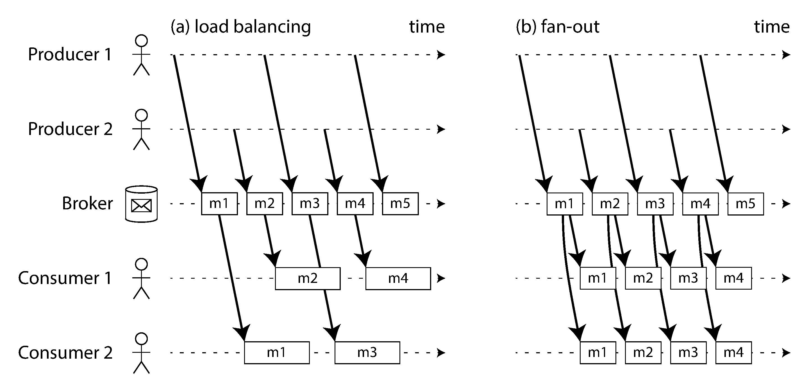
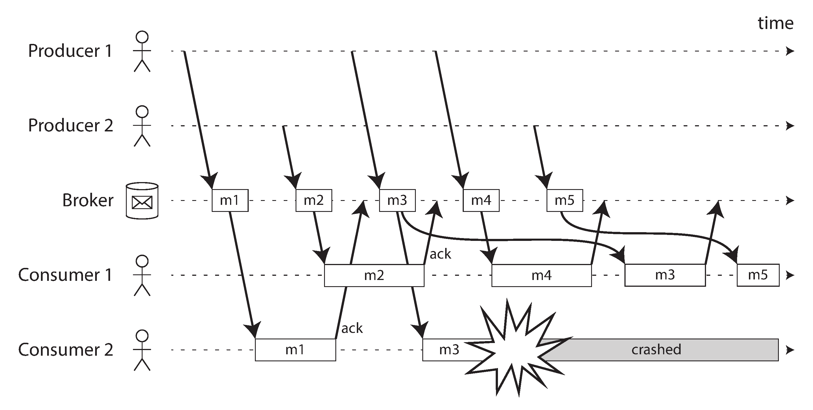
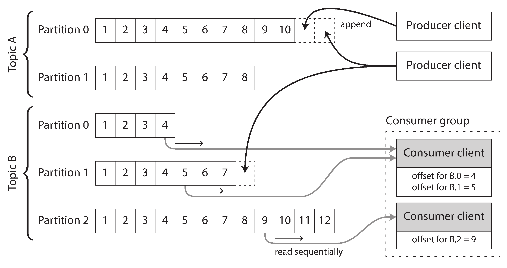
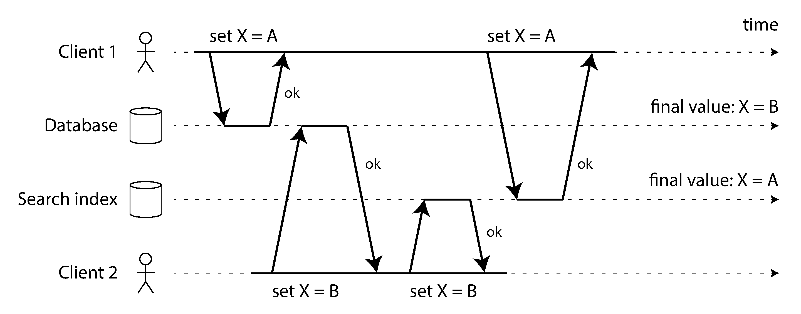
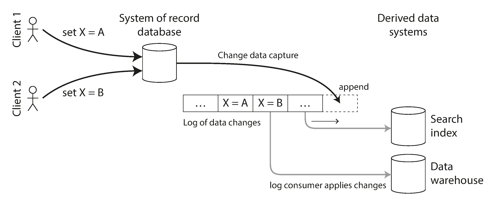
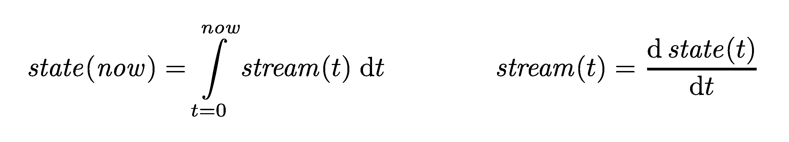
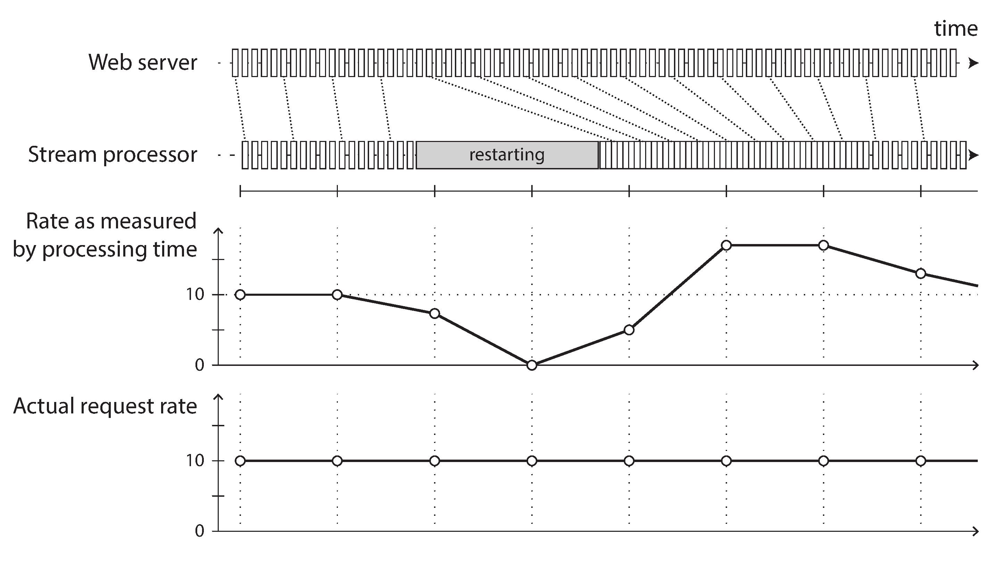

## Designing Data-Intensive Applications

### 11장. Stream Processing

앞 장의 batch processing은 bounded input을 읽고 결과를 생성하는 방식이었음

stream processing은 시간이 지나며 계속 도착하는 unbounded data를 처리함

핵심은 event가 발생한 뒤 가능한 한 짧은 시간 안에 처리하고, 그 결과를 다른 system이나 사용자에게 전달하는 것임

event는 특정 시점에 발생한 사실을 나타내는 작은 record임

event는 한 번 생성되면 바뀌지 않는 immutable data로 다루는 것이 중요함

이 장의 핵심은 event stream을 전달하고, 저장하고, 처리하며, failure와 time 문제를 어떻게 다루는지 이해하는 것임

책의 product 예시는 원문 당시 기준이므로 실제 운영 판단에는 현재 공식 문서를 확인해야 함

 

### Transmitting Event Streams

batch processing에서는 input과 output이 보통 file임

stream processing에서는 producer가 event를 계속 만들고 consumer가 이를 계속 읽음

database나 file을 주기적으로 polling해서 새 data를 찾을 수도 있지만, delay가 크고 비용이 커질 수 있음

따라서 낮은 latency가 필요하면 event가 생겼음을 consumer에게 알려주는 messaging 방식이 필요함

보통 producer는 event를 topic이나 stream에 보내고, consumer는 그 topic을 subscribe함

이 구조는 producer와 consumer를 느슨하게 연결함

 

### Messaging Systems

messaging system은 producer가 보낸 message를 consumer에게 전달함

설계에서 중요한 질문은 두 가지임

- producer가 consumer보다 빠르게 message를 보내면 어떻게 할 것인가
- consumer가 message를 처리하다가 crash하면 어떻게 할 것인가

직접 messaging은 producer와 consumer가 network로 바로 통신하는 방식임

구조가 단순하고 latency가 낮을 수 있지만, consumer가 내려가 있거나 network 문제가 있으면 message를 잃기 쉬움

message loss가 허용되거나 application이 별도 재시도를 구현할 때만 적합함

 

### Message Brokers

message broker는 producer와 consumer 사이에서 queue 역할을 함

producer는 broker에 message를 보내고, consumer는 broker에서 message를 가져감

broker는 consumer가 잠시 느리거나 내려가 있어도 message를 buffer할 수 있음

또한 consumer가 처리 완료를 알리기 전에는 message를 다시 전달할 수 있음

이 방식은 producer가 consumer의 상태를 직접 알 필요를 줄여줌

전통적인 broker는 message가 ack되면 삭제하는 경우가 많음

따라서 database처럼 장기간 data를 보관하고 임의 query를 수행하는 system이라기보다, 일시적인 전달 buffer에 가까움

 

### Multiple Consumers

하나의 topic을 여러 consumer가 읽는 방식은 크게 두 가지임

- load balancing은 하나의 message를 consumer group 안의 consumer 하나에게만 전달함
- fan-out은 같은 message를 여러 consumer group에 각각 전달함

load balancing은 처리량을 늘리는 데 유리함

fan-out은 같은 event를 서로 다른 목적의 system이 독립적으로 처리하게 해줌

실제 system에서는 consumer group을 통해 두 방식을 함께 사용함

 

figure 11-1은 같은 event stream을 load balancing과 fan-out으로 소비하는 차이를 보여줌

 

### Acknowledgments and Redelivery

broker는 consumer가 message를 처리했다는 ack를 받을 때까지 message를 완료 처리하지 않을 수 있음

consumer가 ack 전에 crash하면 broker는 message를 다시 전달함

이 방식은 message loss를 줄이지만, 같은 message가 두 번 처리될 수 있음을 의미함

따라서 consumer logic은 duplicate message를 견딜 수 있어야 함

redelivery는 ordering에도 영향을 줄 수 있음

한 consumer가 실패한 message를 나중에 다시 처리하는 동안 다른 consumer가 뒤의 message를 먼저 처리할 수 있기 때문임

 

figure 11-2는 ack 전에 consumer가 crash하면 broker가 message를 다시 전달하는 흐름을 보여줌

 

### Partitioned Logs

log-based broker는 message를 append-only log에 저장함

producer는 log 끝에 event를 추가하고, consumer는 log를 순서대로 읽음

log는 partition으로 나뉠 수 있고, 각 partition 안에서는 ordering이 유지됨

하지만 서로 다른 partition 사이에는 전역 ordering이 없음

partition은 처리량을 늘리는 단위이자 consumer group 안에서 작업을 나누는 단위임

 

figure 11-3은 topic이 여러 partition으로 나뉘고 consumer가 각 partition의 offset을 따라 읽는 구조를 보여줌

 

### Logs Compared to Traditional Messaging

log-based system에서는 message를 소비해도 즉시 삭제하지 않음

consumer마다 자신이 어디까지 읽었는지 offset을 기록함

consumer가 실패하면 마지막으로 commit한 offset 이후부터 다시 읽음

이 방식은 per-message ack보다 단순하고, fan-out도 각 consumer group의 offset만 따로 관리하면 됨

또한 오래된 message를 다시 읽어 derived data를 재구성할 수 있음

다만 느린 consumer가 계속 lag를 쌓으면 retention 기간 안에 따라잡을 수 있는지 감시해야 함

retention보다 오래 lag가 지속되면 필요한 event가 삭제될 수 있음

 

### Replaying Old Messages

log를 읽는 행위는 log 자체를 바꾸지 않음

따라서 consumer offset을 과거로 되돌리면 같은 event를 다시 처리할 수 있음

이는 debugging, bug fix 이후 재처리, 새로운 derived view 생성에 유용함

immutable input을 다시 읽는다는 점에서 batch processing과 비슷함

stream processing은 batch processing을 대체한다기보다, unbounded log 위에서 batch와 비슷한 재처리 능력을 제공함

 

### Databases and Streams

database replication log도 일종의 event stream으로 볼 수 있음

leader가 write를 기록하고 follower가 같은 순서로 변경을 적용하기 때문임

이 관점은 database와 search index, cache, data warehouse 같은 derived system을 동기화하는 문제로 이어짐

 

### Keeping Systems in Sync

application이 database와 search index에 동시에 write하면 문제가 생길 수 있음

하나는 성공하고 다른 하나는 실패할 수 있음

또는 concurrent write의 순서가 두 system에서 다르게 반영될 수 있음

이런 dual writes는 data inconsistency를 만들기 쉬움

 

figure 11-4는 database와 search index에 각각 write할 때 update 순서가 어긋나는 문제를 보여줌

 

### Change Data Capture

change data capture는 database의 변경 사항을 stream으로 추출해 다른 system에 적용하는 방식임

database를 system of record로 두고, search index나 data warehouse는 그 변경 stream에서 파생된 derived data로 둠

이 방식은 application이 여러 system에 직접 dual write하는 문제를 줄임

 

figure 11-5는 system of record의 변경 log를 여러 derived system으로 전달하는 구조를 보여줌

 

### Implementing Change Data Capture

CDC consumer는 database change log를 읽어 derived system에 반영함

처리는 보통 asynchronous이므로 derived system은 system of record보다 잠시 늦을 수 있음

따라서 lag를 감시하고, 같은 변경을 다시 처리해도 안전하도록 만드는 것이 중요함

새 consumer가 전체 state를 필요로 하면 현재 snapshot과 그 이후 change log를 함께 사용해야 함

현재 log 끝부터 읽기만 하면 과거 state를 복구할 수 없기 때문임

log compaction은 key별 최신 value를 유지해 state 재구성을 가능하게 함

delete는 tombstone 같은 marker로 표현해야 나중에 state를 올바르게 지울 수 있음

 

### Event Sourcing

event sourcing은 application이 발생한 event 자체를 source of truth로 저장하는 방식임

CDC가 database row 변경을 capture하는 데 가깝다면, event sourcing은 domain event를 먼저 설계함

현재 state는 event log를 replay해서 계산할 수 있음

snapshot은 replay 비용을 줄이기 위해 사용할 수 있음

command와 event는 구분해야 함

command는 사용자의 요청이나 의도이고, validation에 실패할 수 있음

event는 system이 받아들인 뒤 기록된 사실임

 

### State, Streams, and Immutability

state는 시간에 따른 event stream을 누적한 결과임

반대로 stream은 state의 변화를 시간 순서대로 펼친 것이라고 볼 수 있음

 

figure 11-6은 stream과 state가 서로 변환 가능한 관계임을 보여줌

immutable event는 audit과 debugging에 유리함

같은 event log에서 search index, cache, analytics view 같은 여러 derived view를 만들 수 있음

하지만 immutable log도 무한히 커질 수 있으므로 compaction과 snapshot이 필요함

privacy나 법적 삭제 요구가 있으면 단순한 append-only model만으로는 충분하지 않을 수 있음

외부 system으로 나간 side effect는 event replay만으로 되돌릴 수 없으므로 별도 idempotence나 transaction 설계가 필요함

 

### Processing Streams

stream을 처리하는 방식은 크게 세 가지로 나눌 수 있음

- event를 database, cache, search index 같은 storage에 기록함
- event를 사용자나 monitoring system에 push함
- input stream에서 새로운 output stream을 생성함

stream operator는 batch processing의 operator와 비슷하지만, input이 끝나지 않는다는 점이 다름

따라서 계속 실행되며, failure와 backpressure를 견뎌야 함

 

### Uses of Stream Processing

complex event processing은 event pattern을 query처럼 등록하고, 들어오는 event가 그 pattern과 맞는지 찾음

stream analytics는 request rate, error rate, percentile, rolling metric 같은 값을 계속 계산함

materialized view maintenance는 change stream을 읽어 read model을 최신 상태로 유지함

search on streams는 query가 고정되어 있고 document나 event가 계속 흘러오는 형태임

message passing과 RPC는 service 사이의 통신을 구성하는 방식이며, stream processing과 경계가 겹칠 수 있음

 

### Reasoning About Time

stream processing에서는 time을 다루는 방식이 중요함

event time은 event가 실제로 발생한 시간임

processing time은 system이 event를 처리한 시간임

network delay, queueing, offline client, retry 때문에 두 시간은 크게 다를 수 있음

 

figure 11-7은 processing time 기준 집계가 재시작이나 지연 때문에 실제 event 발생률과 다르게 보일 수 있음을 보여줌

실제 현상을 분석하려면 가능한 한 event time을 기준으로 window를 잡아야 함

 

### Windows

unbounded stream에서는 전체 input이 끝나지 않으므로 time window로 범위를 나눠 집계함

대표적인 window는 다음과 같음

- tumbling window는 겹치지 않는 고정 길이 window임
- hopping window는 일정 간격으로 시작하고 서로 겹칠 수 있는 고정 길이 window임
- sliding window는 특정 시간 간격 안에 있는 event 쌍이나 범위를 기준으로 계산함
- session window는 사용자별로 가까운 시간에 발생한 event를 하나의 session으로 묶음

event-time window에서는 늦게 도착하는 event를 어떻게 처리할지 정해야 함

정해진 timeout이나 watermark 이후에 window를 닫고, late event는 버리거나 보정 update로 처리할 수 있음

client timestamp를 사용할 때는 clock skew도 고려해야 함

필요하면 event 발생 시각, 전송 시각, server 수신 시각을 함께 기록해 delay를 추정함

 

### Stream Joins

stream processing에서도 join이 필요함

하지만 input이 계속 도착하므로 join 대상과 시간 범위를 명확히 해야 함

stream-stream join은 두 stream의 event를 일정 time window 안에서 맞춤

예를 들어 search event와 click event를 연결해 click-through rate를 계산할 수 있음

stream-table join은 stream event를 table의 현재 state로 enrich함

예를 들어 user activity event에 user profile 정보를 붙일 수 있음

table-table join은 두 change stream을 함께 사용해 materialized view를 유지함

join 결과는 시간에 의존함

event가 발생한 시점에 유효했던 table version과 join해야 올바른 결과가 됨

 

### Fault Tolerance

stream processor는 failure 이후에도 failure가 없었던 것과 같은 결과를 만들려고 해야 함

이를 위해 input offset과 output write를 함께 다루는 것이 중요함

microbatching은 짧은 시간의 event를 작은 batch로 묶어 처리하고 checkpoint를 남김

checkpointing은 operator state와 input position을 저장해 failure 이후 재시작 지점을 제공함

atomic commit은 output write와 offset commit이 함께 성공하거나 함께 실패하게 만드는 방식임

외부 system까지 포함하면 완전한 exactly-once는 어려울 수 있음

따라서 output operation을 idempotent하게 만들거나, duplicate를 감지할 수 있는 key를 사용하는 것이 중요함

stateful stream processor는 failure 이후 log나 checkpoint에서 state를 재구성해야 함

replay 가능한 log와 deterministic processing은 복구를 단순하게 만듦

 

### Summary

stream processing은 unbounded event stream을 낮은 latency로 처리하는 방식임

message broker는 producer와 consumer를 분리하고, partitioned log는 durable replay와 fan-out을 쉽게 만듦

database change log와 event sourcing은 state 변경을 stream으로 보는 관점을 제공함

stream processor는 event time, window, join, fault tolerance를 명확히 다뤄야 함

가장 중요한 점은 event를 immutable record로 보고, derived data는 event log에서 다시 만들 수 있게 설계하는 것임
