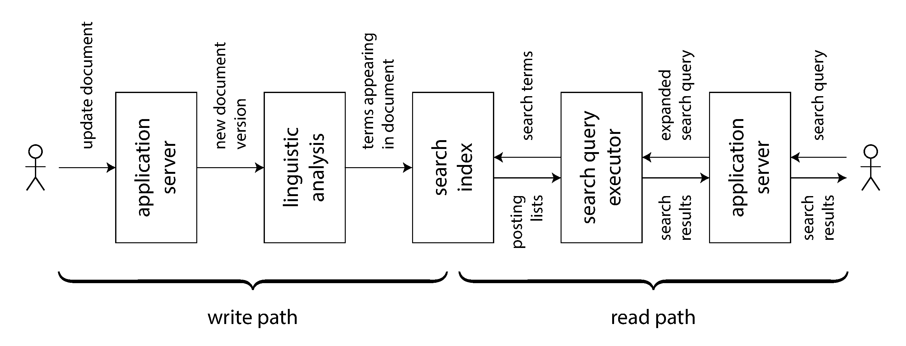

## Designing Data-Intensive Applications

### 12장. The Future of Data Systems

이 장은 앞 장들의 내용을 바탕으로 data system의 미래 방향을 논의함

앞 장들이 현재의 system을 설명했다면, 이 장은 더 나은 application을 어떻게 설계할 수 있는지 제안함

핵심 목표는 reliability, scalability, maintainability를 넘어서 correctness와 human impact까지 함께 고려하는 것임

책의 마지막 장인 만큼 저자의 의견과 추측이 많이 포함되어 있음

따라서 product 예시나 기술 전망은 원문 당시 기준으로 이해하고, 실제 운영 판단에는 현재 공식 문서를 확인해야 함

 

### Data Integration

하나의 tool이 모든 workload에 최적일 수는 없음

storage engine, replication, query model, processing model은 각각 trade-off가 다름

복잡한 application은 같은 data를 여러 방식으로 사용함

예를 들어 OLTP database, full-text search index, cache, data warehouse, recommendation system이 함께 필요할 수 있음

따라서 중요한 문제는 여러 specialized tool을 어떻게 안전하게 조합할 것인가임

 

### Combining Specialized Tools by Deriving Data

여러 system을 조합할 때 기준은 system of record와 derived data를 분리하는 것임

system of record는 write가 처음 들어오는 authoritative source임

derived data는 search index, materialized view, cache, analytics table처럼 원본에서 다시 만들 수 있는 data임

derived data를 원본에서 deterministic하게 만들 수 있으면 장애나 bug 이후 재처리가 쉬워짐

반대로 application이 여러 system에 직접 dual write하면 ordering과 partial failure 문제가 생김

 

### Reasoning About Dataflows

data integration에서는 input과 output을 명확히 해야 함

어느 system이 write ordering을 결정하는지, 어떤 representation이 어떤 source에서 파생되는지 분명해야 함

change data capture나 event sourcing log를 사용하면 같은 event order를 기준으로 여러 derived system을 갱신할 수 있음

중요한 것은 CDC를 쓰느냐 event sourcing을 쓰느냐보다, write order를 하나의 log로 결정하고 그 순서대로 파생 data를 만드는 것임

derived update는 deterministic하고 idempotent하게 만들 수 있어야 함

그래야 fault 이후 retry와 replay가 쉬워짐

 

### Derived Data Versus Distributed Transactions

여러 storage system을 일관되게 유지하는 전통적 방법은 distributed transaction임

distributed transaction은 lock과 atomic commit으로 write ordering과 exactly-once effect를 제공함

log-based derived data는 ordered log, deterministic retry, idempotence로 비슷한 목표를 달성하려고 함

큰 차이는 timing guarantee임

distributed transaction은 보통 linearizability나 read-your-own-writes 같은 성질을 제공함

log-based derived system은 보통 asynchronous라서 같은 timeliness를 기본으로 제공하지 않음

하지만 heterogeneous system 사이에서 XA 같은 distributed transaction은 성능과 fault tolerance에 제약이 큼

책은 log-based derived data가 여러 data system을 통합하는 더 실용적인 방향이라고 봄

 

### The Limits of Total Ordering

작은 system에서는 하나의 leader가 모든 event의 total order를 정할 수 있음

하지만 scale이 커지면 total order는 병목이 됨

문제가 되는 경우는 다음과 같음

- event throughput이 단일 leader가 처리할 수 있는 범위를 넘는 경우
- 여러 datacenter가 독립적으로 write를 받아야 하는 경우
- microservice마다 독립적인 durable state를 갖는 경우
- offline client가 local state를 먼저 변경하는 경우

total order broadcast는 consensus와 동등한 문제임

따라서 모든 event를 전역 순서로 정렬하려는 설계는 scale과 availability에서 비용이 큼

 

### Ordering Events to Capture Causality

모든 event에 전역 순서가 필요한 것은 아님

causal dependency가 없는 concurrent event는 임의 순서로 처리해도 문제가 없을 수 있음

하지만 어떤 event가 다른 event의 결과나 전제라면 causal order를 보존해야 함

예를 들어 친구 관계 삭제 이후 보낸 message가 이전 친구에게 notification으로 전달되면 안 됨

이 문제는 message stream과 friend list를 join할 때 time-dependence를 놓친 사례임

가능한 접근은 다음과 같음

- logical timestamp로 coordination 없이 순서를 표현함
- 사용자가 본 state를 event에 함께 기록하고 이후 event가 이를 참조하게 함
- conflict resolution으로 예상 밖의 순서로 도착한 event를 처리함

단순한 해법은 없으며, application이 causal dependency를 명시적으로 다루는 것이 중요함

 

### Batch and Stream Processing

data integration의 목표는 data가 올바른 form으로 올바른 place에 도달하게 하는 것임

이를 위해 input을 consume하고, transform하고, join하고, filter하고, aggregate하고, output을 생성해야 함

batch processing과 stream processing은 이 목표를 달성하는 주요 도구임

batch는 bounded input을 처리하고, stream은 unbounded input을 처리함

하지만 둘 다 immutable input에서 derived output을 만드는 dataflow라는 점에서 공통점이 큼

현대 processing engine에서는 batch와 stream의 경계가 점점 흐려짐

 

### Maintaining Derived State

batch processing은 deterministic function을 선호함

input을 수정하지 않고 output을 새로 만들기 때문에 fault tolerance와 reasoning이 쉬움

stream processing도 같은 원칙을 따르지만, unbounded input을 처리하기 위해 managed state와 checkpoint가 필요함

derived state를 유지할 때는 state change를 functional application code에 통과시켜 새로운 derived state를 만드는 관점이 유용함

asynchronous event log는 한 component의 장애를 다른 component로 전파하지 않게 함

반대로 distributed transaction은 participant 하나의 장애가 전체 transaction failure로 확산될 수 있음

 

### Reprocessing Data for Application Evolution

stream processing은 새 change를 낮은 delay로 derived view에 반영함

batch processing은 accumulated historical data를 다시 처리해 새로운 view를 만들 수 있음

reprocessing은 application evolution에 중요함

schema나 data model을 크게 바꿔야 할 때 기존 data를 새 model로 다시 파생할 수 있기 때문임

old view와 new view를 나란히 유지하고 일부 user만 new view로 보내면 migration을 점진적으로 수행할 수 있음

문제가 생기면 old view로 되돌릴 수 있어 irreversible damage의 위험이 줄어듦

 

### The Lambda Architecture

lambda architecture는 immutable event log에서 batch view와 stream view를 함께 만드는 방식임

stream layer는 최근 event를 빠르게 처리해 approximate view를 만들고, batch layer는 전체 historical data를 다시 처리해 corrected view를 만듦

이 접근은 immutable event와 reprocessing의 가치를 널리 알렸다는 점에서 의미가 있음

하지만 실무상 문제가 큼

- 같은 logic을 batch framework와 stream framework에 각각 유지해야 함
- 두 output을 query 시점에 merge해야 함
- 큰 dataset을 자주 전체 재처리하기 어렵고 incremental batch가 다시 복잡해짐

결국 stream layer와 batch layer를 분리하면 operational complexity가 커짐

 

### Unifying Batch and Stream Processing

batch와 stream을 하나의 system에서 처리하면 lambda architecture의 장점을 유지하면서 중복을 줄일 수 있음

이를 위해 필요한 기능은 다음과 같음

- historical event를 같은 processing engine으로 replay할 수 있어야 함
- fault가 있어도 output이 한 번 처리된 것처럼 보이는 exactly-once semantics가 필요함
- processing time이 아니라 event time 기준 windowing을 지원해야 함

이 방향은 batch를 stream의 특수한 경우로 보거나, stream을 작은 batch의 연속으로 보는 관점을 가능하게 함

핵심은 같은 logic으로 과거 data와 새 event를 모두 처리하는 것임

 

### Unbundling Databases

database, filesystem, batch processor, stream processor는 모두 data를 저장하고 처리한다는 공통점을 가짐

database가 제공하는 기능을 분해해 보면 storage, indexing, query execution, transaction, materialized view maintenance 같은 component로 볼 수 있음

unbundling databases는 이 기능들을 하나의 monolithic database 안에 묶지 않고, specialized component와 dataflow로 조합하는 관점임

하지만 목적은 database를 없애는 것이 아님

database는 여전히 state 저장, query serving, stream processor state 관리에 필요함

unbundling의 가치는 단일 database가 모든 workload를 만족하지 못할 때 여러 system을 조합할 수 있게 하는 데 있음

 

### Composing Data Storage Technologies

heterogeneous storage system을 동기화할 때 distributed transaction보다 event log와 idempotent consumer가 더 단순한 abstraction이 될 수 있음

log-based integration의 장점은 두 가지임

- system level에서 producer와 consumer가 느슨하게 연결되어 component 장애가 전체 장애로 확산되지 않음
- human level에서 team이 well-defined event interface를 기준으로 독립적으로 개발할 수 있음

consumer가 느리거나 실패해도 event log가 buffer 역할을 함

고장난 consumer는 복구 후 뒤처진 event를 따라잡으면 됨

 

### Unbundled Versus Integrated Systems

unbundling이 항상 좋은 것은 아님

여러 infrastructure를 운영하면 learning curve, configuration, monitoring, debugging 비용이 늘어남

하나의 integrated product가 필요한 workload를 충분히 잘 처리한다면 그 product를 쓰는 편이 낫음

필요 없는 scale을 위해 복잡한 architecture를 만드는 것은 premature optimization임

unbundling은 하나의 tool이 요구사항을 모두 만족하지 못할 때 선택할 수 있는 composition 방식임

 

### Designing Applications Around Dataflow

dataflow 중심 application은 database를 passive mutable variable로만 보지 않음

state change를 stream으로 보고, application code가 그 change에 반응해 다른 state change를 만들어내는 구조로 봄

spreadsheet가 input cell 변경에 따라 formula result를 자동 재계산하듯, data system도 base data 변경에 따라 index, cache, materialized view를 갱신할 수 있어야 함

차이는 data system이 durable storage, fault tolerance, scalability, heterogeneous integration을 함께 만족해야 한다는 점임

 

### Application Code as a Derivation Function

derived dataset은 어떤 transformation function의 결과임

secondary index는 base table에서 indexed field를 뽑아 정렬한 derived dataset임

full-text search index는 tokenization, stemming, synonym 처리 같은 domain-specific function을 적용해 만들어짐

machine learning model은 training data에서 feature extraction과 statistical analysis를 거쳐 파생됨

cache는 UI가 필요로 하는 형태로 data를 미리 계산한 derived view임

문제는 application-specific derivation이 database built-in 기능만으로는 충분하지 않다는 점임

따라서 application code를 dataflow 안의 derivation function으로 실행할 수 있어야 함

 

### Separation of Application Code and State

현대 application은 application code 실행과 durable state 관리를 분리하는 경향이 있음

application server는 stateless하게 배포되고, persistent state는 database에 저장됨

이 구조는 deployment와 scaling을 단순하게 만들지만, database가 passive variable처럼 취급되는 문제가 있음

대부분의 database는 값을 읽을 수는 있지만, 값의 change를 자연스럽게 subscribe하는 model은 약함

dataflow 관점에서는 application code가 state change stream을 구독하고, 그 결과로 다른 state change를 생성함

이는 database trigger, secondary index update, stream processing을 database 밖으로 확장한 model임

 

### Stream Processors and Services

microservice architecture는 synchronous request-response로 service를 조합하는 경우가 많음

dataflow architecture는 asynchronous event stream으로 operator를 조합함

예를 들어 purchase 처리에서 exchange rate service를 매번 RPC로 호출하는 대신, exchange rate update stream을 구독해 local state에 유지할 수 있음

purchase event를 처리할 때는 local state와 join하면 됨

이 방식은 network request를 줄이고 failure에 강함

다만 join은 time-dependent하므로 event가 발생한 시점의 exchange rate를 사용해야 함

 

### Observing Derived State

write path는 data가 system에 들어와 여러 processing stage를 거쳐 derived dataset을 갱신하는 경로임

read path는 user request가 derived dataset을 읽고 response를 만드는 경로임

derived dataset은 write path와 read path가 만나는 지점임

 

figure 12-1은 document update가 search index로 반영되는 write path와 query가 search result를 만드는 read path를 보여줌

index, cache, materialized view는 write path와 read path 사이의 boundary를 옮기는 도구임

write path에서 더 많이 precompute하면 read path가 빨라짐

반대로 write path를 단순하게 두면 read path가 더 많은 work를 수행해야 함

 

### Stateful, Offline-Capable Clients

전통적인 web application은 client를 stateless하게 보고 server가 data authority를 갖는 구조가 많았음

하지만 browser와 mobile app은 local storage와 rich interaction을 갖게 되었음

offline-first application은 device local database를 사용해 network 없이도 동작하고, 연결이 가능할 때 server와 sync함

이 관점에서는 end-user device도 dataflow의 일부가 됨

server에서 client로 state change를 push하면 UI는 read path의 끝에서 derived state를 관찰하는 component가 됨

reads도 event로 기록하면 query가 어떤 state를 보고 이루어졌는지 추적할 수 있음

 

### Aiming for Correctness

correctness는 단순히 database가 transaction을 지원한다고 자동으로 보장되지 않음

application bug, 잘못된 retry, duplicate request, partial failure는 여전히 data corruption을 만들 수 있음

serializability와 atomic commit은 강력하지만 비용이 크고, 특히 geographically distributed system이나 heterogeneous storage에서는 제약이 큼

따라서 dataflow architecture에서도 correctness를 달성할 수 있는 abstraction이 필요함

 

### The End-to-End Argument for Databases

exactly-once는 operation이 retry되더라도 최종 effect가 한 번 실행된 것과 같아야 한다는 뜻임

이를 위해서는 operation을 idempotent하게 만들거나 duplicate를 suppress해야 함

TCP는 packet duplicate를 connection 안에서 제거할 수 있지만, user가 timeout 이후 같은 HTTP request를 다시 보내는 문제까지 해결하지 못함

database transaction도 client와 server 사이의 한 구간만 다룰 뿐, end-user device부터 database까지 전체 path를 보장하지 못함

따라서 request ID 같은 operation identifier를 end-to-end로 전달해야 함

같은 request ID가 이미 처리되었다면 다시 실행하지 않게 해야 함

end-to-end argument의 핵심은 correctness function이 endpoint application의 도움 없이 lower layer만으로 완전히 구현될 수 없다는 점임

 

### Enforcing Constraints

uniqueness constraint는 distributed setting에서 consensus가 필요한 문제임

동일한 username을 여러 client가 동시에 요청하면 system은 하나만 accept하고 나머지는 reject해야 함

log-based messaging에서는 unique value 기준으로 partition을 나누고, 해당 partition의 stream processor가 순서대로 request를 처리할 수 있음

같은 username request는 같은 partition에 들어가므로 processor가 deterministic하게 승자를 정할 수 있음

이 방식은 username뿐 아니라 account balance, inventory, booking 같은 constraint에도 응용될 수 있음

핵심은 conflict 가능성이 있는 write를 같은 partition으로 보내고 sequential하게 validation하는 것임

 

### Multi-Partition Request Processing

여러 partition을 건드리는 operation은 더 복잡함

전통적인 database는 atomic commit으로 여러 partition의 변경을 하나의 transaction처럼 처리함

log-based approach는 먼저 client request를 하나의 durable message로 기록한 뒤, stream processor가 이를 여러 output instruction으로 파생함

예를 들어 money transfer는 request ID 기준 log에 먼저 기록되고, 이후 debit instruction과 credit instruction으로 분리될 수 있음

downstream processor는 request ID로 duplicate를 제거함

이렇게 하면 multi-partition atomic commit 없이도 같은 request가 각 account에 한 번만 적용되게 만들 수 있음

 

### Timeliness and Integrity

consistency라는 말은 두 요구사항을 섞어서 부르는 경우가 많음

timeliness는 user가 최신 상태를 관찰하는 성질임

replication lag 때문에 stale data를 읽는 문제는 timeliness 문제임

integrity는 data loss, contradiction, false data가 없는 성질임

derived dataset이 underlying data를 올바르게 반영하지 못하면 integrity violation임

timeliness violation은 기다리면 해결될 수 있지만, integrity violation은 명시적인 repair 없이는 계속 남음

따라서 많은 application에서는 timeliness보다 integrity가 더 중요함

event-based dataflow system은 timeliness와 integrity를 분리해서 생각하게 해줌

asynchronous processing은 timeliness를 약하게 만들 수 있지만, exactly-once processing과 idempotence로 integrity를 지킬 수 있음

 

### Coordination-Avoiding Data Systems

모든 constraint가 synchronous coordination을 요구하지는 않음

어떤 constraint는 일단 operation을 받아들이고 나중에 asynchronous check로 검증할 수 있음

check가 실패하면 compensating action이나 apology가 필요할 수 있음

이 방식은 모든 request를 global coordination에 묶지 않으므로 performance와 fault tolerance에 유리함

다만 recovery가 불가능한 operation이나 강한 즉시 보장이 필요한 constraint에는 synchronous coordination이 필요함

핵심은 integrity를 유지하면서 coordination이 꼭 필요한 부분을 작게 만드는 것임

 

### Trust, but Verify

software와 hardware는 언제든 bug나 corruption을 만들 수 있음

따라서 system이 제공한다고 약속한 guarantee를 맹목적으로 믿기보다, 실제 data integrity를 계속 확인해야 함

backup도 존재한다는 사실만으로 충분하지 않음

복구를 정기적으로 시도해 봐야 backup이 실제로 쓸 수 있는지 알 수 있음

auditability는 finance에만 필요한 성질이 아님

data-intensive application이 커질수록 corruption을 빠르게 발견하고 원인을 추적하는 능력이 중요함

 

### Designing for Auditability

mutable database state만 남아 있으면 나중에 어떤 logic이 왜 그 변경을 만들었는지 알기 어려움

event sourcing은 user input을 immutable event로 기록하고, state update를 그 event에서 파생함

derivation이 deterministic하면 같은 event log와 같은 code version으로 같은 state를 다시 만들 수 있음

이는 integrity check와 debugging을 쉽게 함

derived state가 의심되면 event log에서 다시 계산해 비교할 수 있음

event log에는 hash나 cryptographic technique을 적용해 corruption 여부를 검증할 수 있음

end-to-end integrity check는 disk, network, service, algorithm을 모두 포함해 더 강한 신뢰를 제공함

 

### Doing the Right Thing

data system은 기술적 목적만 갖지 않음

system이 수집하고 처리하는 data는 사람의 행동, 관심사, 정체성과 연결되어 있음

따라서 engineer는 reliability와 scalability뿐 아니라 system이 사람에게 미치는 영향을 고려해야 함

기술은 그 자체로 선하거나 악한 것이 아니라, 어떻게 사용되고 어떤 결과를 만드는지가 중요함

책은 data-intensive application을 만드는 사람이 ethical responsibility를 회피해서는 안 된다고 주장함

 

### Predictive Analytics

predictive analytics는 날씨나 질병 확산 예측처럼 공익에 쓰일 수 있음

하지만 loan, insurance, employment, policing, sentencing처럼 개인의 삶에 직접 영향을 주는 decision에도 쓰일 수 있음

algorithmic decision은 사람의 bias를 제거한다고 보장하지 않음

training data에 bias가 있으면 model은 그 bias를 학습하고 확대할 수 있음

특히 protected trait와 상관된 proxy feature가 있으면 차별이 우회적으로 재생산될 수 있음

model output은 probabilistic하므로 개인별 판단에서 틀릴 수 있음

따라서 automated decision에는 accountability, transparency, appeal mechanism이 필요함

 

### Feedback Loops

predictive system은 feedback loop를 만들 수 있음

recommendation system은 사용자가 이미 동의하는 정보만 보여 echo chamber를 강화할 수 있음

credit score를 hiring에 사용하면 실직과 낮은 score가 서로를 악화시키는 악순환이 생길 수 있음

이런 문제는 computerized part만 보면 보이지 않음

system 전체에서 사람과 institution이 어떻게 반응하는지 함께 봐야 함

data analysis system이 기존 불평등을 줄이는지, 아니면 확대하는지 검토해야 함

 

### Privacy and Tracking

사용자가 명시적으로 입력한 data를 저장해 service를 제공하는 것과, 사용자의 행동을 부수적으로 추적하는 것은 관계가 다름

광고 기반 service에서는 advertiser가 실제 customer가 되고 user의 interest는 뒤로 밀릴 수 있음

tracking data가 오래 보관되고 결합될수록 상세한 profile이 만들어짐

책은 이런 관계를 surveillance라는 관점에서 보라고 제안함

모든 data collection이 surveillance는 아니지만, 이 단어를 사용하면 권력 관계와 사용자 통제권 문제를 더 분명히 볼 수 있음

 

### Consent and Freedom of Choice

user가 terms of service에 동의했다고 해서 meaningful consent가 항상 성립하는 것은 아님

대부분의 user는 어떤 data가 수집되고, 얼마나 오래 보관되며, 어떤 derived dataset으로 결합되는지 이해하기 어려움

privacy policy는 설명보다 은폐에 가까울 때도 많음

또한 인기 service가 사회 참여의 사실상 필수 조건이 되면 opt out은 현실적인 선택이 아닐 수 있음

따라서 surveillance를 피할 자유가 실제로 존재하는지 따져봐야 함

 

### Privacy and Use of Data

privacy는 모든 것을 숨기는 것이 아님

privacy는 어떤 정보를 누구에게 공개할지 스스로 결정할 수 있는 권리임

data collector가 사용자 data를 가져가면 그 결정권이 개인에서 조직으로 이동할 수 있음

회사는 사용자의 intimate information을 직접 공개하지 않더라도, ad targeting이나 scoring을 통해 간접적으로 사용할 수 있음

이때 사용자는 자신의 정보가 어떻게 드러나는지 통제하기 어려워짐

privacy는 secrecy가 아니라 agency와 autonomy의 문제임

 

### Data as Assets and Power

data는 asset처럼 취급되지만, 그 data는 사람에게서 나온 것임

data를 많이 가진 조직은 개인과 사회에 큰 power를 갖게 됨

data breach나 misuse가 발생하면 피해는 data subject에게 돌아갈 수 있음

따라서 data를 무조건 오래 보관하는 태도는 위험함

필요하지 않은 data는 보관하지 않고, 필요가 끝나면 삭제하는 것이 중요함

immutability와 auditability가 중요하더라도, privacy와 deletion 요구를 함께 설계해야 함

 

### Legislation and Self-Regulation

regulation은 innovation을 방해할 수 있지만, data misuse와 privacy harm을 줄이는 데 필요할 수 있음

특히 medical data처럼 공익과 privacy risk가 함께 큰 영역에서는 균형이 어려움

책은 법적 규제만이 아니라 tech industry 내부의 culture shift도 필요하다고 봄

user를 최적화할 metric으로만 보지 말고, dignity와 agency를 가진 사람으로 봐야 함

data collection과 processing practice를 스스로 절제하고 투명하게 설명해야 함

 

### Summary

복잡한 application은 하나의 database만으로 모든 요구사항을 만족하기 어려움

system of record에서 event stream과 batch processing을 통해 여러 derived data를 만드는 방식이 data integration의 핵심이 될 수 있음

batch와 stream을 통합하면 historical reprocessing과 low-latency update를 같은 logic으로 다룰 수 있음

database 기능을 unbundle하고 dataflow로 조합하면 specialized tool을 더 유연하게 사용할 수 있음

correctness는 lower layer의 transaction만으로 완성되지 않으며, end-to-end operation identifier, idempotence, constraint validation, auditability가 필요함

timeliness보다 integrity를 우선해야 하는 경우가 많고, coordination은 꼭 필요한 부분에만 사용해야 함

마지막으로 data system은 사람에게 영향을 주는 사회적 system이므로 privacy, accountability, bias, surveillance를 설계의 일부로 다뤄야 함
